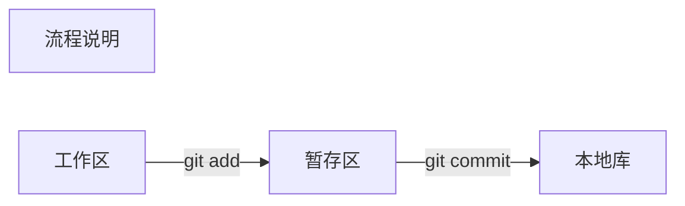
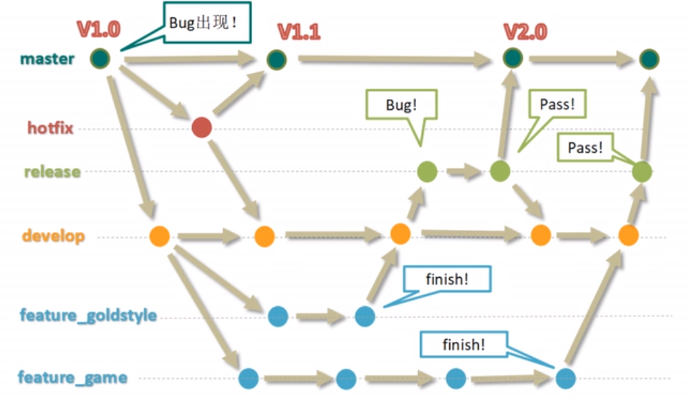

# Git学习笔记

## 第一章  版本控制工具应该具有的功能

**协同修改、数据备份、版本管理、权限控制、历史记录、分支管理**

## 第二章  版本控制介绍

### 2.1、版本控制工具介绍

**集中式版本控制工具：**  

CVS、SVN、VSS...  

**分布式版本控制工具：**  

Git、Mercurial、Bazaar、Darcs...   

### 2.2、Git的优势

1）大部分操作在本地完成，不需要联网  

2）完整性保证  

3）尽可能添加数据而不是删除或者修改数据  

4）分支操作非常快捷流畅  

5）与Linux命令全面兼容  

**3、流程**  



### 2.3  Git和代码托管中心

**局域网环境下：**  

GitLab服务器、gitblit服务器  

**外网环境下：**  

GitHub、码云  

### 2.4  本地库和远程库的交互方式  


## 第三章  Git  Bash相关操作

### 3.1  本地库

* **本地库初始化：**

  ```shell
  git init
  ```

  &emsp;&emsp;初始化时，一般选择一个空文件夹。执行上述命令后，会在文件内生成一个 .git 的隐藏文件夹，该目  

  录中存放的是本地库相关的子目录和文件，一般不需要进行改动。

* **设置签名：**    

  用户名：xianCan  

  Email：xianCan@xianCan.com  

  作用：区分不同开发人员的身份  

  辨析：这里设置的签名和登录远程库（代码托管中心）的账号、密码没有任何关系  

  命令：  

  &emsp;&emsp;项目级别/仓库级别：仅在当前本地库范围内有效  

  ```shell
  git config user.name xianCan
  git config user.email xianCan@xianCan.com
  ```

  &emsp;&emsp;系统用户级别：登录当前操作系统的用户范围  

  ```shell
  git config --global user.name xianCan
  git config --global user.email xianCan@xianCan.com
  ```

  &emsp;&emsp;级别优先级：项目级别优先于系统级别用户  

* **查看状态操作：**  

  ```shell
  git status
  ```

* **添加新文件到git：**  

  ```shell
  git add xxx
  ```

  &emsp;&emsp;执行完上述命令后，指定文件只是被添加到暂存区，不会添加到本地库，只是标识文件会被git管理  

  ------

  ```shell
  git rm --cached xxx
  ```

  &emsp;&emsp;执行完上去命令后，可以将添加到暂存区的文件回退到原来的状态&emsp;

  ------

  ```shell
  git commit xxx
  git commit -m "commit message" xxx
  ```

  &emsp;&emsp;第一个命令会进入vim编辑器查看详细信息，并在编辑器里填写commit信息。第二个命令则是使用-m  

  填写提交信息来直接commit到本地，不再进入vim编辑器  

* **git版本历史信息：**

  ```shell
  git log
  
  #简洁信息
  git log --pretty=oneline
  ```

* **查看git的历史提交信息**

  ```shell
  git reflog
  ```

&emsp;&emsp;显示较为简短的版本信息，并且列出移动版本需要移动的步数

* **git版本后退前进：**  

  ```shell
  git reset --hard 版本索引
  ```

  &emsp;&emsp;根据版本索引号切换到对应的版本  

  ------

  ```shell
  git reset --hard HEAD^
  ```

  &emsp;&emsp;回退到HEAD当前版本的上一个版本，一个^代表回退一个版本，多个则代表回退多个（只能回退）

  ------

  ```shell
  git reset --hard HEAD~n
  ```

  &emsp;&emsp;回退到n个版本前（只能回退）

  ------

  **reset三个参数的说明：**  

  --soft：仅仅在本地库移动HEAD指针  

  --mixed：在本地库移动HEAD指针，重置暂存区  

  --hard：在本地库移动HEAD指针，重置暂存区，重置工作区  

* **删除文件并找回：**

  前提：删除前，文件存在时的状态提交到了本地库  

  操作：使用git的版本后退功能找回即可  

* **比较文件：**  

  ```shell
  git diff xxx
  ```

  &emsp;&emsp;将工作区中的文件和暂存区进行比较  

  ------

  ```shell
  git diff 本地库中的历史版本 文件名
  ```

  &emsp;&emsp;将工作区中的文件和本地库历史记录比较

### 3.2  分支管理  

* **常用分支：**master、hot_fix、develop、feature

* **分支操作：**  

  ```shell
  git branch 分支名
  ```

  &emsp;&emsp;创建分支，默认会以当前所在的分支创建一个新分支

  ------

  ```shell
  git branch -v
  ```

  &emsp;&emsp;查看分支  

  ------

  ```shell
  git checkout 分支名
  ```

  &emsp;&emsp;切换分支

  ------

  ```shell
  git merge 合过来的分支名
  ```

  &emsp;&emsp;分支合并：首先需要切换到被合并的分支，然后在被合并的分支的基础上执行merge操作。比如：我要  

  将develop分支合并到master，首先切换到master，然后执行git  merge develop命令即可

  ------

  ```shell
  aaaaaaaa
  <<<<<<< HEAD  #第2、3行为当前分支的内容
  bbbbbbbb
  =======       #第4行为分隔符
  cccccccc      #第5、6行为另一分支的内容
  >>>>>>> master
  ```

  &emsp;&emsp;上述为冲突的表现，需要人工进行选择编辑，解决后再执行下述操作解决冲突

  ```shell
  git add xxx
  git commit -m "resolve conflict"    #注意解决冲突的commit不能再带文件名
  ```

### 3.3  Git文件验证原理

* **哈希算法特点：** 

  1）不管输入数据的数据量多大，输入同一个哈希算法，得到的加密结果长度固定  

  2）哈希算法确定，输入数据确定，输出数据能够保证不变  

  3）哈希算法确定，输入数据有变化，输出数据一定有变化，而且通常变化很大  

  4）哈希算法不可逆  

  Git底层采用的是SHA-1算法  

### 3.4  远程库  

* **将远程分支绑定到本地：**  

  ```shell
  git remote add origin https://xxx
  ```

  &emsp;&emsp;将远程库添加到本地，并起一个别名origin

  ------

  ```shell
  git remote -v
  ```

  &emsp;&emsp;查看远程库的分支

  ------

  ```shell
  git push origin master
  ```

  &emsp;&emsp;推送到远程仓库，origin代表远程仓库别名，master代表要推送的本地分支

  ------

  ```shell
  git clone https://xxx
  ```

  &emsp;&emsp;将远程库克隆到本地  

  &emsp;&emsp;clone命令有三个效果：

  &emsp;&emsp;&emsp;&emsp;1）完整地将远程库下载到本地

  &emsp;&emsp;&emsp;&emsp;2）创建origin远程地址别名  

  &emsp;&emsp;&emsp;&emsp;3）初始化本地库

  ------

  ```shell
  git fetch [远程库地址别名] [远程分支名]
  ```

  ```shell
  git merge [远程库地址别名/远程分支名]
  ```

  ```shell
  git pull [远程库地址别名] [远程分支名]
  ```

  * pull = fetch + merge

### 3.5  跨团队协作

* **协作的团队先fork一份代码，然后独自完成任务后，然后新建一个pull  request等待源头确认**

## 第四章  Git在eclipse和IDEA中的操作

**略**

## 第五章  Git工作流

### 5.1  集中式工作流

&emsp;&emsp;向SVN一样，集中式工作流以中央仓库作为项目所有修改的单点实体。所有修改都提交到Master这个分  

上。这种方式与SVN的主要区别就是开发人员有本地库。Git的很多特性没有用到。  

### 5.2  GitFlow工作流（常用）

&emsp;&emsp;gitflow工作流通过为功能开发、发布准备和维护设立了独立的分支，让发布迭代过程更顺畅。严格的分  

支模型也为大型项目提供了一些非常必要的结构。  

------



###  5.3  Forking工作流

&emsp;&emsp;forking工作流是在GitFlow基础上，充分利用了Git的Fork和pull request的功能以达到代码审核的目的 。  

更适合安全可靠地管理大团队的开发者，而且能接收不信任贡献者的提交。

## 第六章  Git的安装

### 6.1  windows环境

&emsp;&emsp;从git官网下面下载exe文件安装即可。

### 6.2  Linux环境

* **yum方式：**

  ```shell
  yum -y install git
  ```

  &emsp;&emsp;在Linux安装GIt，非常简单，只需要执行上述命令即可。

  ------

  &emsp;&emsp;安装完成之后，yum安装的git被安装在 /usr/libexec/git-core 目录下。查看git版本号，会出现如下结果

  ```shell
  git  --version
  
  #git version 1.8.3.1
  ```

* **源码编译方式：**

  &emsp;&emsp;从上面git的版本号可以看出，yum方式安装的git版本非常旧，不适合使用，因此一般使用源码编译方式  

  进行git的安装。

  * 1、进入到git在GitHub上发布版本页面https://github.com/git/git/releases，选择较新版本的tar.gz包。

  * 2、将tar.gz包上传到Linux的/opt目录下（自己选即可）。

  * 3、解压压缩包。

    ```shell
    tar -zxvf xxx.tar.gz
    ```

  * 4、进入到解压后的文件夹。

    ```shell
    cd xxx
    ```

  * 5、在安装编译之前需要安装编译所需要的的依赖。

    ```shell
    yum install curl-devel expat-devel gettext-devel openssl-devel zlib-devel gcc perl-ExtUtils-MakeMaker
    ```

  * 6、安装编译源码所需依赖的时候，yum自动帮你安装了git，这时候你需要先卸载这个旧版的git。

    ```shell
    yum -y remove git
    ```

  * 7、编译git源码。

    ```shell
    make prefix=/usr/local/git all
    ```

  * 8、安装git至`/usr/local/git`路径

    ```shell
    make prefix=/usr/local/git install
    ```

  * 9、配置环境变量

    ```shell
    vim /etc/profile 
    
    #在底部加上
    export PATH=$PATH:/usr/local/git/bin
    ```

  * 10、刷新环境变量

    ```shell
    source /etc/profile
    ```

  * 11、查看Git是否安装完成

    ```shell
    #查看git的版本信息
    git --version
    
    #查询git的安装路径
    whereis git
    ```