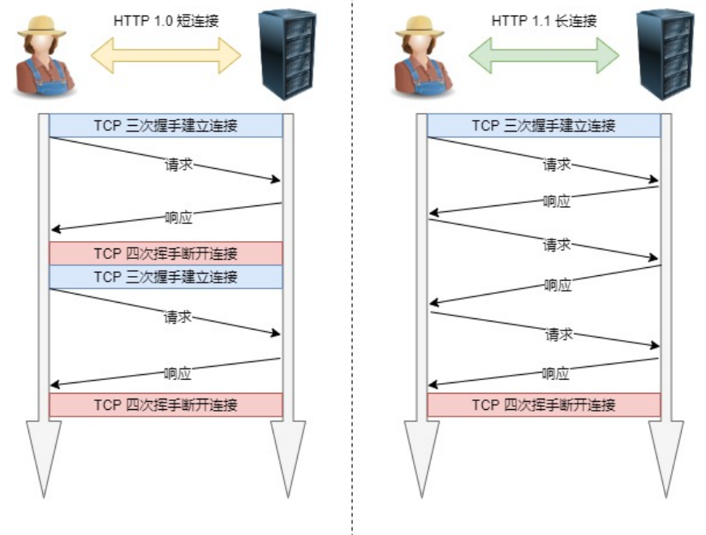
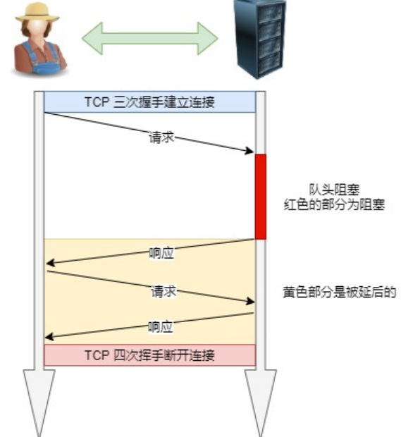
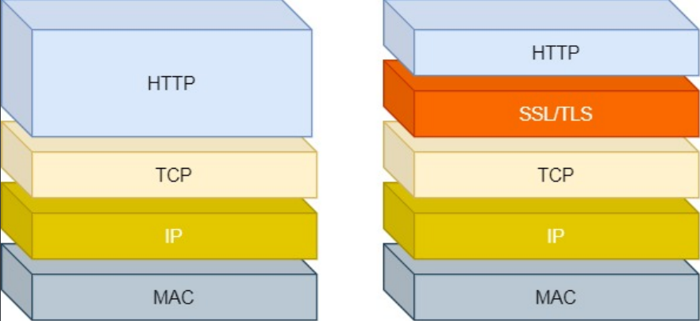

# Http学习笔记

## 第一章  HTTP的面试题

### 1.1  HTTP基本知识

* HTTP是什么
* HTTP常见的状态码有哪些
* HTTP常见字段有哪些

### 1.2  GET与POST

* GET与POST有哪些区别
* GET与POST方法都是安全和幂等的吗

### 1.3  HTTP特性

* HTTP有哪些优点
* HTTP有哪些缺点
* HTTP性能如何

### 1.4  HTTP与HTTPS

* HTTP与HTTPS有哪些区别
* HTTPS解决了HTTP哪些问题
* HTTPS是如何解决HTTP不安全问题
* HTTPS是如何简历连接的？其交互了什么？

### 1.5  HTTP/1.1、HTTP/2、HTTP/3演变

* 说说HTTP/1.1相比HTTP/1.0提高了什么性能
* HTTP/2针对HTTP/1.1做了哪些优化
* HTTP/2有哪些缺陷？HTTP/3做了哪些优化？

## 第二章  HTTP基本概念

### 2.1  HTTP是什么？描述一下

HTTP是**超文本传输协议**，也就是HyperText Transfer Protocol

* 超文本

  * 文本：在互联网早期的时候只是简单的字符文字，但现在文本的含义已经可以扩展为图片、视频、压缩包

    等静态资源，在HTTP眼里这些都算做文本

  * 超文本：就是**超越了普通文本的文字**，它是文字、图片、视频等的混合体，最关键有超链接，能从一个超

    文本跳转到另外一个超文本。HTML就是最常见的超文本，它本身只是纯文字文件，但内部用很多标签定

    义图片、视频等的链接，经过浏览器的解释呈现给我们的就是一个文字、有画面的网页了

* 传输

  * HTTP协议是一个双向协议。数据在A和B之间传递，但允许有**中转或接口**。在HTTP里，需要中间人遵从

    HTTP协议，只要不打扰基本的数据传输，就可以添加任意额外的东西

  * HTTP是一个在计算机世界里专门用来在**两点之间传输数据**的约定和规范

* 协议

  * HTTP是一个用在计算机世界里的协议。它使用计算机能够理解的语言确立了一种计算机之间交流通信的  

    规范（两个以上的参与者），以及相关的各种控制和错误处理方式

### 2.2  常见的状态码

|      | 具体含义                                               | 常见的状态码       |
| ---- | ------------------------------------------------------ | ------------------ |
| 1xx  | 提示信息，表示目前是协议处理的中间状态，还需要后续操作 |                    |
| 2xx  | 成功，报文已经收到并被正确处理                         | 200、204、206      |
| 3xx  | 重定向，资源位置发生变动，需要客户端重新发送请求       | 301、302、304      |
| 4xx  | 客户端错误，请求报文有误，服务器无法处理               | 400、403、404      |
| 5xx  | 服务器错误，服务器在处理请求时内不发生了错误           | 500、501、502、503 |

1xx

* 1xx类状态码属于提示信息，是协议处理中的一种中间状态，实际用到的比较少

2xx

* 200 ok：是最常见的成功状态码，表示一切正常。如果非head请求，服务器返回的响应头都会有body数据

* 204 No Content：与200 OK基本相同，但响应头没有body数据

* 206 Partial Content：是应用于HTTP分块下载或断点续传，表示响应返回的body数据并不是资源的全部，而

  是其中一部分，也是服务器处理成功的状态

3xx

* 301 Moved Permanently：表示永久重定向，说明请求的资源已经不存在了，需改用新的URL再次访问

* 302 Found：表示临时重定向，说明请求的资源还在，但暂时需要用另一个URL来访问

**301和302都会在响应头里使用字段Location，说明后续要跳转的URL，浏览器会自动重定向新的URL**

* 304 Not Modified：不具有跳转的含义，表示资源未修改，重定向已存在的缓冲文件，也称缓存重定向，用于

  缓存控制

4xx

* 400 Bad Request：表示客户端请求的报文有错误，但只是一个笼统的错误
* 403 Forbidden：表示服务器禁止访问资源，并不是客户端的请求出错
* 404 Not Found：表示请求的资源在服务器上不存在或未找到，所以无法提供给客户端

5xx

* 500 Internal Server Error：服务器发生了错误，但只是一个笼统的错误

* 501 Not Implemented：表示客户端请求的功能还不支持

* 502 Bad Gateway：通常是服务器作为⽹关或代理时返回的错误码，表示服务器⾃身⼯作正常，访问

  后端服务器发⽣了错误

* 503 Service Unavailable：表示服务器当前很忙，暂时无法响应服务器

### 2.3  HTTP常见字段

* Host

  * 客户端发送请求时，用来指定服务器的域名。有了Host字段，就可以将请求发往同一台服务器上的不同网

    站

* Content-Length

  * 服务器在返回数据时，会用Content-Length字段，表明本次回应的数据长度

* Connection

  * 常用于客户端要求服务器使用TCP持久连接，以便其他请求复用

  * HTTP/1.1默认连接都是持久连接，但为了兼容老版本的HTTP，需要指定Connection首部字段为Keep-

    Alive，一个可以复用的TCP连接就建立了，直到客户端或服务器主动关闭连接

* Content-Type

  * 告诉客户端，本次数据是什么格式

    ```shell
    Content-Type:text/html;charset=utf-8
    #表明发送的是网页，而且编码是UTF-8
    ```

  * 客户端请求的时候，可以使用Accept字段声明自己可以接收哪些数据格式。使用Accept:\*/\*表明自己可以

    接收任何格式的数据

* Content-Encoding

  * 说明数据的压缩方法，表明服务器返回的数据使用了什么压缩格式

    ```shell
    #客户端，表示客户端可以接受哪些压缩方法
    Accept-Encoding:gzip,deflate
    
    #服务器，返回的数据采用了gzip压缩
    Content-Encoding:gzip
    ```

### 2.4  GET与POST

**区别？**

> GET方法的含义是请求从服务器获取资源，这个资源可以使静态的文本、页面、图片视频等
>
> POST方法则是相反操作，它向URI指定的资源提交数据，数据就放在报文的body里
>
> * 留言点击提交，浏览器就会执行一次POST请求，把留言的文字放进了报文body里，然后
>
>   拼接好POST请求头，通过TCP协议发送给服务器

**GET与POST方法都是安全和幂等的吗？**

* 在HTTP协议里，所谓的「安全」是指请求方法不会「破坏」服务器上的资源

* 所谓的幂等，意思就是多次执行相同的操作，结果是「相同」的

> GET方法明显就是安全且幂等的，因为它是「只读」操作，无论操作多少次，服务器上的数据都是安全的，且每次的结果都是相同的
>
> POST因为是「新增或提交数据」的操作，会修改服务器上的资源，所以是**不安全的**，且多次提交数据就会创建多个资源，所以**不是幂等**的

### 2.5  HTTP特性

**你知道HTTP/1.1的优点有哪些，怎么体现得？**

> HTTP最突出的优点「简单、灵活和易于扩展、应用广泛和跨平台」
>
> 1、简单
>
> HTTP基本的报文格式就是header+body，头部信息也是key-value简单文本的形式，易于理解，降低了学习和使用的门槛
>
> 2、灵活和易于扩展
>
> HTTP协议里的各类请求方法、URI/URL、状态码、头部字段等每个组成要求都没有被固定死，都允许开发人员自定义和扩充
>
> 同时HTTP是由于工作在应用层（OSI第七层），则它**下层可以随意变化**
>
> HTTPS也就是在HTTP与TCP层之间增加了SSL/TLS安全传输层，HTTP/3甚至把TCP层换成了基于UDP的QUIC
>
> 3、应用广泛和跨平台

**它的缺点呢？**

> HTTP协议里有优缺点一体的**双刃剑**，分别是「无状态、明文传输」，同时还有一大缺点「不安全」
>
> 1、无状态双刃剑
>
> 无状态的**好处**，因为服务器不回去记忆HTTP状态，所以不需要额外地资源来记录状态信息，真能减轻服务器的负担，能够把更多的CPU和内存用来对外提供服务
>
> 无状态的**坏处**，既然服务器没有记忆能力，它在完成有关联性操作时会非常麻烦。对于这种情况，一般会用Cookie和Session来解决，Cookie通过在请求和响应报文中写入Cookie信息来控制客户端的状态
>
> 2、明文传输双刃剑
>
> 明文意味着在传输过程中的信息，是可方便阅读的，通过浏览器的F12控制台或Wireshark赵都可以直接肉眼查看，方便我们开发调试。但正是因为这样相当于信息裸奔，很容易被窃取
>
> 3、不安全
>
> HTTP比较严重的缺点就是不安全
>
> * 通信使用明文（不加密），内容可能会被窃听
> * 不验证通信方的身份，因此有可能遭遇伪装
> * 无法证明报文的完整性，所以有可能已遭篡改
>
> HTTP安全问题一般用HTTPS来解决

**HTTP/1.1的性能如何？**

> HTTP协议基于TCP/IP，并且使用了「请求-应答」的通信模式，所以性能的关键就在这两点
>
> 1、长连接
>
> 早期HTTP/1.0性能上的一个很大的问题，那就是每发起一个请求，都要新建一次TCP连接（三次握手），而且是串行请求，做了无谓的TCP连接建立和断开，增加了通信开销
>
> 为了解决上述TCP连接问题，HTTP/1.1提出了长连接的通信方式，也叫持久连接。这种方式的好处在于减少TCP连接的重复建立和断开所造成的额外开销，减轻了服务器端的负载
>
> 持久连接的一个特点是，只要任意一端没有明确提出断开连接，则保持TCP连接状态
>
> 
>
> 2、管道网络传输
>
> HTTP/1.1采用了长连接的方式，这使得管道网络传输成为了可能。
>
> 即可在同一个TCP连接里面，客户端可以发起多个请求，只要第一个请求发出去了，不必等其回来，就可以发第二个请求出去，可以**减少整体的响应时间**。但是服务器还是按照顺序，先回应A请求，完成后在回应B请求。要是前面的回应特别慢，后面就会有许多请求排队等着。这成为「队头阻塞」
>
> 3、队头阻塞
>
> 「请求-应答」的模式加剧了HTTP的性能问题
>
> 因为当顺序发送的请求序列中的一个请求因为某种原因被阻塞时，在后面排队的所有请求也一同被阻塞了，会导致客户端一只请求不到数据，这也就是「队头阻塞」，好比上班路上堵车
>
> 因此HTTP/1.1的性能一般般，后续的HTTP/2和HTTP/3就是在优化HTTP的性能
>
> 

### 2.6  HTTP与HTTPS

**HTTP与HTTPS有哪些区别？**

> 1、HTTP是超文本传输协议，信息是明文传输，存在安全风险的问题。HTTPS则解决HTTP不安全的缺陷，在TCP和HTTP网络层之间加入了SSL/TLS安全协议，使得报文能够加密传输
>
> 2、HTTP连接建立相对简单，TCP三次握手之后便可进行HTTP的报文传输。而HTTPS在TCP三次握手之后，还需要进行SSL/TLS的握手过程，才可进入加密报文传输
>
> 3、HTTP的端口号是80，HTTPS的端口号是443
>
> 4、HTTPS协议需要向CA（证书权威机构）申请数字证书，来保证服务器的身份是可信的

**HTTPS解决了HTTP的哪些问题？**

> 窃听风险，比如通信链路上可以获取通信内容
>
> 篡改风险，比如植入垃圾广告，视觉污染
>
> 冒充风险，比如冒充淘宝网站



HTTPS在HTTP与TCP层之间加入了SSL/TLS协议，可以很好的解决了上述的风险

* **信息加密**：交互信息无法被窃取，但你的号会因为「自身忘记」账号而没
* **校验机制**：无法篡改通信内容，篡改了就不能正常显示，但百度「竞价排名」依然可以搜索垃圾广告
* **身份证书**：证明淘宝是真的淘宝

**HTTPS是如何解决上面的三个风险的？**

> **混合加密**的方式实现信息的**机密性**，解决了窃听的风险
>
> **摘要算法**的方式来实现**完整性**，它能够为数据生成独一无二的「指纹」，指纹用于校验数据的完整性，解决了篡改的风险
>
> 将服务器公钥放入到**数字证书**中，解决了冒充的风险

* 1、混合加密

  


