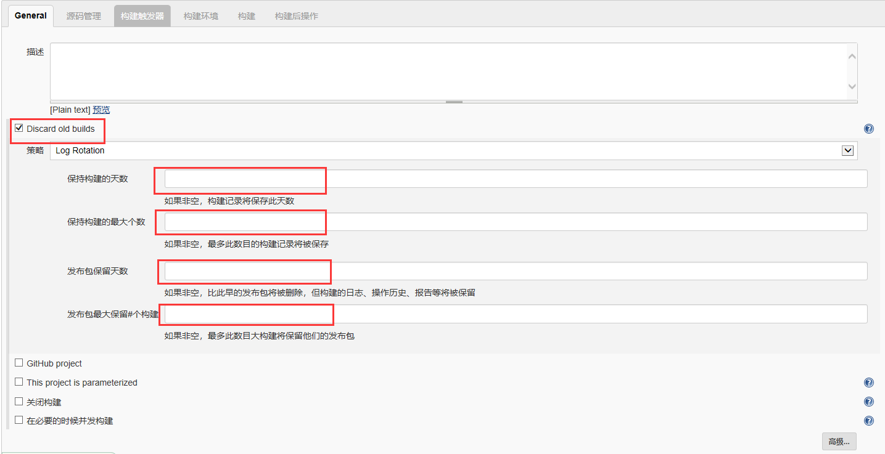

# Jenkins学习笔记

## 第一章  持续集成

### 1.1  持续集成简介

&emsp;&emsp;持续集成，即Continuous  Integration，简称 CI。

### 1.2  持续集成的组成部分

* 版本控制系统，SVN/Git

* CI  Server

* Web服务器，Tomcat等

  

## 第二章   Jenkins安装及配置

### 2.1  Jenkins的安装

* **方式一：war包+web容器方式**  

  &emsp;&emsp;Jenkins是基于java开发的一款web应用，因此只需要把Jenkins的war包放进Tomcat的webapps目录下，  

  启动Tomcat即可。  

* **方式二：rpm方式**

  &emsp;&emsp;下载jenkins的rpm安装包，运行安装即可。

* **方式三：war包方式**  

  ```shell
  java -jar jenkins.war
  ```

  &emsp;&emsp;下载war包后，直接使用上述命令运行war包即可。

* **方式四：windows安装方式**

  &emsp;&emsp;官网下载zip包解压运行jenkins.exe即可。

### 2.2  插件管理

* &emsp;&emsp;登录进jenkins后，进入到Manager  Jenkins，选择Manager  Plugins，即可进入插件管理界面。从可选  

  插件中选择插件安装即可。

  **常用插件：**

  * Git Plugin  

  * Deploy to container Plugin  
  * Maven Intergration

### 2.3  系统配置

* &emsp;&emsp;进入到Manager  Jenkins后，选择Configure  System可以进入到系统配置页面。在这里可以看到Jenkins  

  工作的主目录、Jenkins的外部访问地址、邮件通知等配置。

### 2.4  全局工具配置

* &emsp;&emsp;进入到Manager  Jenkins狗，选择Global  Tool  Configuration可以进入到全局工具配置。

* **Maven配置：**

  &emsp;&emsp;这里用于指定Maven的settings配置，可以不用设置。如果要设置，指定一下Maven的settings.xml文件  

  路径即可。如下：

  ```shell
  /usr/maven/apache-maven-3.3.9/conf/settings.xml
  ```

* **JDK:**

  &emsp;&emsp;用于指定JDK环境，将JDK的安装路径填到JAVA_HOME即可，别名可以随便选。注意不要勾选自动安装，  

  勾选了找不到JAVA_HOME时会帮你自定安装JDK。

  ```shell
  Name       jdk1.8
  JAVA_HOME  /usr/java/jdk1.8.0_11
  ```

* **Git：**

  &emsp;&emsp;用于指定git的安装路径，填入git的安装路径即可，同样注意不要勾选自动安装。

  ```shell
  Name                    git
  Path to Git executable  /usr/git/git-2.23.1/git
  ```

* **Maven:**

  &emsp;&emsp;同理

  ```shell
  Name  		Maven
  MAVEN_HOME  /usr/maven/apache-maven-3.3.9
  ```

### 2.5  用户管理

* &emsp;&emsp;进入到Manager  Jenkins后，选择Manager  Users可以进入到用户管理页面。可以在这里修改admin账  

  号的密码，也可以在这里新建用户，删除用户等。

## 第三章  创建任务

### 3.1  向导1

* &emsp;&emsp;进入到Jenkins后，选择新建item，输入一个任务名称（随便起即可），然后选择一个Maven  Project，  

  如果没有Maven  Project可选，选择一个Freestyle  Project即可。点击确定后进入到任务的配置页面。

  

  

* &emsp;&emsp;进入到任务的配置后，首先是General配置。可以再此处添加任务描述。在此处常用的配置为丢弃旧的构  

  建（Discard  old  builds），由于Jenkins每次构建都会将数据文件保存下来，因此构建次数多了以后，会非  

  常占用磁盘空间，因此需要设置一下该选项，根据实际填写即可。

  

### 3.2  向导2

* &emsp;&emsp;配置Git，在Repository URL中填写Git仓库的项目地址，如果需要账号，在Credentials中填写Git的账号  

  和密码，接着在Branchs to build中填写需要构建的分支。  

  

* 在配置仓库地址时，有可能会出现如下情况，有两种解决方案。

  

  * **1、将git仓库地址开头的https换成git即可**

  * **2、原因是GitHub前一段时间开始不支持老的SSL加密方式，升级一下即可**

    ```shell
    yum update -y nss curl libcurl
    ```

### 3.3  向导3

* **构建触发器：**

  &emsp;&emsp;相当于一个定时器，什么时候触发一次构建。

### 3.4  向导4

* **构建：**

  &emsp;&emsp;目前来说常用的是Maven构建，当然你也可以选择Execute  shell来执行脚本构建。

  * **Maven构建：**

    

### 3.5  向导5

* **构建后操作：**

  &emsp;&emsp;可以选择Deploy war/ear to a container对打包后的war/jar包进行部署  

  1）WAR/EAR files：指定打包后的war文件，以jenkins的workspace作为根路径填写即可  

  2）Content path：部署完成后的访问路径，一般选择短名称

  3）Containers：选择部署的容器

  * Credentials：tomcat的账号密码，可以在conf中配置
  * Tomcat URL：tomcat的地址，如http://192.168.25.130:8080


