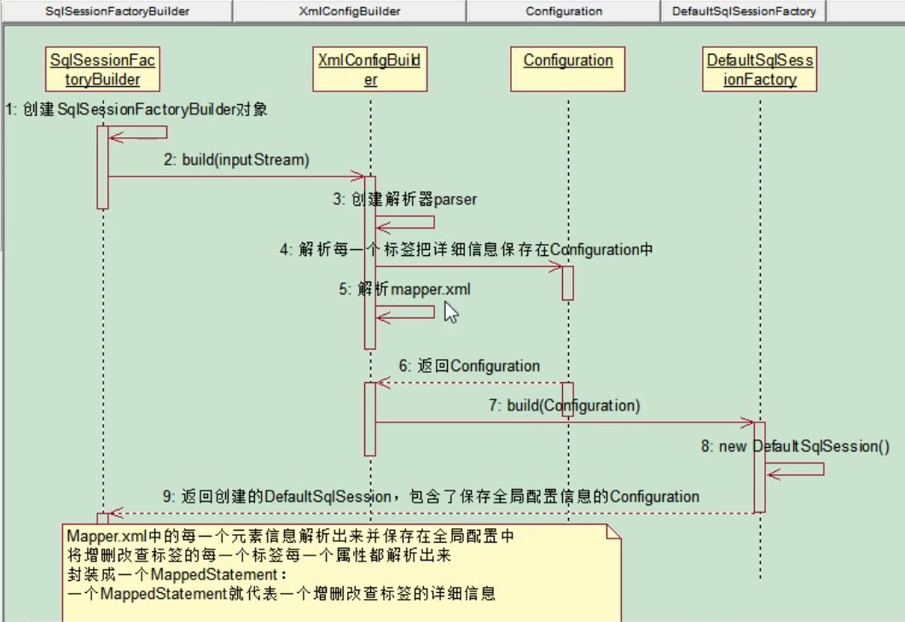

# MyBatis学习笔记

## 第一章  发展历程

**JDBC ==》Dbutils（QueryRunner） ==》JdbcTemplate ==》 Hibernate ==》Mybatis、String Data JPA**

## 第二章  HelloWorld

### 2.1  入门级案例

* 在maven中引入springboot的单元测试相关包

  ```xml
  <dependency>
      <groupId>org.springframework.boot</groupId>
      <artifactId>spring-boot-starter-web</artifactId>
  </dependency>
  <dependency>
      <groupId>org.mybatis.spring.boot</groupId>
      <artifactId>mybatis-spring-boot-starter</artifactId>
  </dependency>
  <dependency>
      <groupId>org.springframework.boot</groupId>
      <artifactId>spring-boot-starter-jdbc</artifactId>
  </dependency>
  <dependency>
      <groupId>mysql</groupId>
      <artifactId>mysql-connector-java</artifactId>
      <scope>runtime</scope>
  </dependency>
  <!--单元测试-->
  <dependency>
      <groupId>org.springframework.boot</groupId>
      <artifactId>spring-boot-starter-test</artifactId>
  </dependency>
  
  ```

* 引入xml的配置文件（全局配置文件）创建一个SqlSessionFactory对象

  ```xml
  <?xml version="1.0" encoding="UTF-8" ?>
  <!DOCTYPE configuration
          PUBLIC "-//mybatis.org//DTD Config 3.0//EN"
          "http://mybatis.org/dtd/mybatis-3-config.dtd">
  <configuration>
      <environments default="development">
          <environment id="development">
              <transactionManager type="JDBC" />
              <dataSource type="POOLED">
                  <property name="driver" value="com.mysql.cj.jdbc.Driver"/>
                  <property name="url" value="jdbc:mysql://localhost:3306/mybatis?serverTimezone=GMT%2B8"/>
                  <property name="username" value="root"/>
                  <property name="password" value="root"/>
              </dataSource>
          </environment>
      </environments>
  
      <mappers>
          <mapper resource="mybatis/mapper/EmployeeMapper.xml" />
      </mappers>
  </configuration>
  ```

* sql映射文件，配置了每一个sql，以及sql的封装规则

  ```xml
  <?xml version="1.0" encoding="UTF-8" ?>
  <!DOCTYPE mapper
          PUBLIC "-//mybatis.org//DTD Mapper 3.0//EN"
          "http://mybatis.org/dtd/mybatis-3-mapper.dtd">
  <mapper namespace="com.xianCan.springboot.mapper.EmployeeMapper">
  
      <select id="getEmpById" parameterType="java.lang.Integer" resultType="com.xianCan.springboot.bean.Employee">
          select id,last_name lastName,gender,email,dId from tb_employee where id = #{id}
      </select>
  
  </mapper>
  ```

* 将sql映射文件注册到全局配置文件中

* 测试代码

  ```java
  package com.xianCan.springboot.test;
  
  import com.xianCan.springboot.bean.Employee;
  import org.apache.ibatis.io.Resources;
  import org.apache.ibatis.session.SqlSession;
  import org.apache.ibatis.session.SqlSessionFactory;
  import org.apache.ibatis.session.SqlSessionFactoryBuilder;
  import org.junit.Test;
  import org.springframework.boot.test.context.SpringBootTest;
  
  import java.io.IOException;
  import java.io.InputStream;
  
  /**
   * @author xianCan
   * @date 2020/3/14 12:05
   */
  @SpringBootTest
  public class MybatisTest {
  
      @Test
      public void test() throws IOException {
          String resource = "mybatis/mybatis-config.xml";
          InputStream resourceAsStream = Resources.getResourceAsStream(resource);
          SqlSessionFactory sessionFactory = new SqlSessionFactoryBuilder().build(resourceAsStream);
          SqlSession sqlSession = sessionFactory.openSession();
  
          Employee employee = sqlSession.selectOne("getEmpById", 1);
          System.out.println(employee);
      }
  }
  
  ```

### 2.2  接口式编程

* 一个mapper和一个xml文件对应，xml文件中namespace填入对应的mapper全路径

  ```java
  EmployeeMapper mapper = sqlSession.getMapper(EmployeeMapper.class);
  Employee employee = mapper.getEmpById(1);
  System.out.println(employee);
  ```

* 接口式编程

  原生	Dao	===》	DaoImpl

  myBatis	Mapper	===》	xxxMapper.xml

* SqlSession代表和数据库的一次会话，用完必须关闭

* SqlSession和connection一样都是非线程安全的，不能放在成员变量  

* mapper接口没有实现类，但是mybatis会为这个接口生成一个代理对象

* 两个重要的配置文件

  * myBatis的全局配置文件（文件不一定有，有可能直接写在yml配置文件或者直接用配置类替换）：包  

    含数据库连接池信息，事务管理器信息，系统运行环境信息等

  * sql映射文件，保存了每一个sql语句的映射信息

## 第三章   全局配置文件

### 2.1  properties

* **mybatis可以使用使用properties来引入外部properties配置文件的内容**

* **properties**：引入外部资源

  * **resource**：引入类路径下的资源

  * **url**：引入网络路径或者磁盘路径下的资源

* 在mybatis路径下新建外部配置文件dbconfig.properties

  ```
  jdbc.driver=com.mysql.cj.jdbc.Driver
  jdbc.url=jdbc:mysql://localhost:3306/mybatis?serverTimezone=GMT%2B8
  jdbc.username=root
  jdbc.password=root
  ```

* 修改mybatis-config.xml文件，引入properties标签，将数据库链接的value值换成通配符取值

  ```xml
  <?xml version="1.0" encoding="UTF-8" ?>
  <!DOCTYPE configuration
          PUBLIC "-//mybatis.org//DTD Config 3.0//EN"
          "http://mybatis.org/dtd/mybatis-3-config.dtd">
  <configuration>
  
      <!--引入类路径下的配置资源-->
      <properties resource="mybatis/dbconfig.properties" />
  
      <environments default="development">
          <environment id="development">
              <transactionManager type="JDBC" />
              <dataSource type="POOLED">
                  <!--value改为动态获取-->
                  <property name="driver" value="${jdbc.driver}"/>
                  <property name="url" value="${jdbc.url}"/>
                  <property name="username" value="${jdbc.username}"/>
                  <property name="password" value="${jdbc.password}"/>
              </dataSource>
          </environment>
      </environments>
  
      <mappers>
          <mapper resource="mybatis/mapper/EmployeeMapper.xml" />
      </mappers>
  
  </configuration>
  ```

### 2.2  settings

* **用于设置一些mybatis的运行时行为**

* **settings**：设置配置项

  * **name**：设置项名（可取官网查询具体名称）
  * **value**：设置值

* 在mybatis的全局配置文件mybatis-config.xml中开启驼峰命名与下划线互转（举例）

  ```xml
  <settings>
      <setting name="mapUnderscoreToCamelCase" value="true" />
  </settings>
  ```

### 2.3  typeAliases

* **别名处理器，可以为java类型起别名**

* **typeAliases**：为类起别名，别名不区分大小

  * **typeAlias**：为某个java类起别名

    * **type**：指定要起别名的类全类名
    * **name**：指定新的别名，不填写该项默认类名小写

  * **package**：为某个包下的所有类批量起别名

    * **name**：指定包名（为当前包以及下面所有子包的每一个类都起一个类名小写的别名）

    * 注意：使用package时如果包下及子包出现同名类，运行时会产生冲突报错，可以使用@Alias注解  

      在类上指定别名

* 为Employee类起别名（建议resultType还是全类名，全类名容易找到返回值的数据结构）

  ```xml
  <typeAliases>
  	<typeAlias type="com.xianCan.springboot.bean.Employee" alias="employee" />
  </typeAliases>
  ```

### 2.4  typeHandler

* **将java类型和数据库类型进行匹配**

### 2.5  plugins

* **可以使用插件对mybatis运行时的一些核心步骤进行拦截，如下为mybatis四大对象**
  * Executor(update,query,flushStatements,commit,rollback,getTransaction.close,isClosed)
  * ParameterHandler(getParameterObject,setParameters)
  * ResultSetHandler(handleResultSets,handleOutputParameters)
  * StatementHandler(prepare,parameterize,batch,update,query)


### 2.6  environments

* **可以配置多种mybatis环境变量，default指定使用某种环境，可以达到快速切换环境的目的**

* **environments**：有一个id属性，可以用于指定当前环境id

  * **transactionManager**：事务管理器

    * **type**：事务管理器的类型， 

      JDBC(JdbcTransactionFactory)|MANAGED(ManagerTransactionFactory)，也可以自定义事务管理  

      器：实现TransactionFactory接口，type指定为全类名

  * **dataSource**：数据源

    * **type**：数据源类型，UNPOOLED(UnpooledDataSourceFactory)|  

      |POOLED(PooledDataSourceFactory)（连接池技术）|JNDI(JndiDataSourceFactory)  

      自定义数据源：实现DataSourceFactory接口，type指定为全类名

### 2.7  Mappers

* **将sql映射注册到全局配置中**
* **mapper**：注册一个sql映射
  * **resource**：引用类路径下的sql文件
  * **url**：引用网络或磁盘路径下的sql映射文件
  * **class**：引用注册接口（少用）
    * 有sql映射文件，映射文件名必须和接口同名，并且放在与接口同一目录下
    * 没有sql映射，所有sql都利用注解写在接口上

## 第三章  sql映射文件

### 3.1  insert、update、delete

* 对于**单体**的增改方法，parameterType可写可不写，但建议写上，能够快速知道入库类型的数据接口

* **mybatis允许增删改直接定义以下类型返回值**

  * **Integer(int)**：返回变更的条数
  * **Long(long)**：返回变更的条数
  * **Boolean(boolean)**：非0返回true，0则返回false
  * **void**

* 对于mysql可以使用一些配置来获取自增的主键，将useGeneratedKeys设置为true，keyProperty填入参数  

  类Employee的主键，mybatis入库完成后会自动将主键值set到Emplyee的id

  ```xml
  <insert id="addEmp" parameterType="com.xianCan.springboot.bean.Employee"
      useGeneratedKeys="true" keyProperty="id">
      INSERT INTO TB_EMPLOYEE (LAST_NAME,EMAIL,GENDER,DID) VALUES
      (#{lastName}, #{email}, #{gender}, #{dId})
  </insert>
  ```

* 对于Oracle不支持主键自增，但是可以使用序列来模拟自增

  ```sql
  #查询用户的所有表序列
  select * from user_sequences;
  ```

  * BEFORE：先将自增的主键序列set到javaBean对象再进行insert操作

    ```xml
    <insert id="addEmp" databaseId="oracle" parameterType="com.xianCan.springboot.bean.Employee">
            <!--
            keyProperty：查出的主键值封装给javaBean的哪个属性
            order="BEFORE"：当前sql是在插入sql之前运行
            resultType：查出的数据的返回值类型
            -->
            <selectKey keyProperty="id" order="BEFORE" resultType="java.lang.Integer">
                <!--先从虚表中查询序列的下一个值-->
                SELECT TB_EMPLOYEE_SEQ.nextval FROM dual
            </selectKey>
            <!--插入时的主键是从序列中拿到的-->
            INSERT INTO TB_EMPLOYEE (ID,LAST_NAME,EMAIL,GENDER,DID) VALUES
            (#{id}, #{lastName}, #{email}, #{gender}, #{dId})
    </insert>
    ```

  * AFTER：先进行insert操作再将自增的主键序列set到javaBean（不建议使用，因为如果插入多条数据时，  

    从TB_EMPLOYEE_SEQ.currval中得到的id会是最后一次的值，前面的都获取不到）

### 3.2  参数处理

* **单个参数**：mybatis不会做特殊处理，parameterType可以省略

  #{参数名}：取出参数值

* **多个参数**：mybatis会做特殊处理，多个参数会被封装成一个map

  * key：param1...paramN，或者参数的索引也可以，或者@Param注解指定key
  * value：传入的参数值

  ------

  * #{param1...paramN}就是从map中获取指定的key值（不推荐）

    ```java
    Employee getEmpById(Integer id, String lastName)
    ```

    ```xml
    <select id="getEmpById" resultType="employee">
    	select * from tb_employee where id = #{param1} AND last_name=#{param2}
    </select>
    ```

  ------

  * 指定参数名做法（推荐）

    ```java
    Employee getEmpById(@Param("id") Integer id, @Param("lastName") String lastName);
    ```

    ```xml
    <select id="getEmpById" resultType="employee">
    	select * from tb_employee where id = #{id} AND last_name=#{lastName}
    </select>
    ```

  * 如果多个参数正好是我们业务逻辑的数据模型，直接传入pojo

    #{属性名}：取出传入的pojo的属性值

  ------

  * 如果多个参数不是业务模型中的数据，没有赌赢的pojo，可以传入map代替

    #{key}：取出map中的值

  * **注意点：**

    ```java
    public Employee getEmp(@Param("id")Integer id, String lastName)
    //取值：id==》#{id/param1}	lastName==》#{param2}
        
    public Employee getEmp(Integer id, @Param("e")Employee emp)
    //取值：id==》#{param1}		lastName==》#{param2.lastname/e.lastName}
        
    /*特别注意：如果是Collection(List、Set)类型或者是数组也会特殊处理，就是把传入的List或者数组		封装在map中
        key：Collection(collection)，如果是List还可以使用这个key(list)、数组key(array)
    */
    public Employee getEmpById(List<Integer> ids)
    //取出第一个id的值，#{list[0]}
    ```

* **结合源码了解mybatis怎么处理参数**

  ```java
  Employee getEmpById(@Param("id") Integer id, @Param("lastName") String lastName);
  ```

  * 对于上述方法，会进入到ParamNameResolver这个类里面处理ParamNameResolver里面有一个有参  

    构造器，最终会得到一个names的SortedMap<Integer, String> 。也就是names:{0=id,1=lastName}

    ------

  * 有参构造如下

    ```java
    public ParamNameResolver(Configuration config, Method method) {
            Class<?>[] paramTypes = method.getParameterTypes();
            Annotation[][] paramAnnotations = method.getParameterAnnotations();
            SortedMap<Integer, String> map = new TreeMap();
            int paramCount = paramAnnotations.length;
    
            for(int paramIndex = 0; paramIndex < paramCount; ++paramIndex) {
                if (!isSpecialParameter(paramTypes[paramIndex])) {
                    String name = null;
                    Annotation[] var9 = paramAnnotations[paramIndex];
                    int var10 = var9.length;
    
                    for(int var11 = 0; var11 < var10; ++var11) {
                        Annotation annotation = var9[var11];
                        if (annotation instanceof Param) {
                            this.hasParamAnnotation = true;
                            name = ((Param)annotation).value();
                            break;
                        }
                    }
    
                    if (name == null) {
                        if (config.isUseActualParamName()) {
                            name = this.getActualParamName(method, paramIndex);
                        }
    
                        if (name == null) {
                            name = String.valueOf(map.size());
                        }
                    }
    
                    map.put(paramIndex, name);
                }
            }
    
            this.names = Collections.unmodifiableSortedMap(map);
        }
    ```

  * 1、获取每个标了param注解的参数@Param的值：id、lastName：赋值给name

  * 2、每次解析一个参数给map中保存信息：（key：参数索引，value：name的值）

    * name的值
      * 标注了param注解：注解的值
      * 没有标注：
        * 1、全局配置：useActualParamName(jdk1.8)：name=参数名
        * 2、name=map.size()：相当于当前元素的索引

  * ------

    然后进到ParamNameResolver类里面的getNamedParams去获取对应的参数值

    ```java
    //传进来args数据结构为：args[1, "Tom"]
    public Object getNamedParams(Object[] args) {
            int paramCount = this.names.size();
            if (args != null && paramCount != 0) {
    //          1、如果只有一个元素，并且没有@Param注解，取出args[0]：单个参数直接返回
                if (!this.hasParamAnnotation && paramCount == 1) {
                    return args[((Integer)this.names.firstKey()).intValue()];
    //          2、多个元素或者有@Param注解
                } else {
                    Map<String, Object> param = new ParamMap();
                    int i = 0;
    //              3、遍历names集合：{0=id, 1=lastName}  
                    for(Iterator var5 = this.names.entrySet().iterator(); var5.hasNext(); ++i) {
    //                  4、names集合的value作为key；namse集合的key有座位取值args的索引值，  					args[0]:args[1, "Tom"]
    //                  {id=args[0]:1, lastName=args[1]:Tom}  
                        Entry<Integer, String> entry = (Entry)var5.next();
                        param.put((String)entry.getValue(), args[((Integer)entry.getKey()).intValue()]);
    //                  5、额外地将每一个参数也保存到map中，使用新的key：param1...paramN  
                        String genericParamName = "param" + String.valueOf(i + 1);
                        if (!this.names.containsValue(genericParamName)) {
                            param.put(genericParamName, args[((Integer)entry.getKey()).intValue()]);
                        }
                    }
    
                    return param;//最终返回结果：{id=1, lastName=Tom, param1=1, param2=Tom}
                }
            } else {
                return null;
            }
        }
    ```

* **参数值的获取**

  * #{}：可以获取map中的值或者pojo对象属性的值

  * ${}：可以获取map中的值或者pojo对象属性的值

  * **区别：**

    * #{}是以预编译的形式，将参数设置到sql语句中，相当于原生jdbc中的PreparedSatement
    * ${}取出的值直接拼装在sql语句中，会有sql注入问题

  * 大多数情况下，我们取参数的值都应该去使用#{}，原生jdbc不支持占位符的地方我们就可以使用${}进行  

    取值

    * 比如分表，员工的薪水按照年份分表拆分，2019_salary、2020_salary等等，我要查询某年的表就可  

      以用${}限定年份去对应不同的表

      ```sql
      select * from ${year}_salary where xxx
      ```

    * 比如对某列进行排序

      ```sql
      select * from tb_employee order by ${orderName} ${order}
      ```

*  **#{}更丰富的用法**

  * 规定参数的一些规则

    * javaType、jdbcType、mode（存储过程）、numericScale、resultType、typeHandler、  

      jdbcTypeName、expression（未来准备支持的功能）

  * 上面的规则除了mode存储过程，一般只需要注意jdbcType即可。jdbcType通常需要在某种特定的条件下    

    被设置：在我们数据位null的时候，有些数据库可能不能识别mybatis对null的默认处理，如Oracle（报  

    错）

  * 会报JdbcType OTHER：无效的类型：因为mybatis会对所有的null都映射的是原生jdbc的OTHER类型，  

    即jdbcTypeForNull=OTHER，而Oracle不能正确处理（Oracle不遵循sql规范）

  * **两种解决办法**

    * 1、指定jdbcType为非OTHER

      ```xml
      #{email, jdbcType=VARCHAR/NULL}
      ```

    * 2、在settings中设置mybatis的全局属性

      ```xml
      <settings>
          <setting name="jdbcTypeForNull" value="NULL" />
      </settings>
      ```


### 3.3  select

* **resultType：如果返回的是一个集合，要写集合中元素的类型**

  ```xml
  <select id="getEmp" resultType="com.xianCan.springboot.bean.Employee">
          select * from tb_employee
   </select>
  ```

* **返回map**

  * 返回一条记录的map

    ```java
    Map<String, Object> getEmpById(Integer id)
    ```

    ```xml
    <!--mybatis已经为我们封装好常用类型的别名，如map-->
    <select id="getEmpById" resultType="map">
    	select * from tb_employee where id =#{id}
    </select>
    ```

  * 多条记录封装成一个map：Map<Integer,  Employee>，键为主键id，值为对应的  

    javaBean对象

    ```java
    @MapKey("id")
    Map<Integer, Employee> getEmpMap(String id)
    ```

    ```xml
    <select id="getEmpMap" resultType="com.xianCan.springboot.bean.Employee">
    	select * from tb_employee where id =#{id}
    </select>
    ```

* **resultMap**

  * 自定义某个javaBean的封装规则

    ```xml
    <resultMap type="com.xianCan.springboot.bean.Employee" 
               id="myEmp">
        <!--id：定义主键底层会有优化
    		column：指定列
    		property：指定对应的javaBean属性-->
        <id column="id" property="id"/>
        <result column="last_name" property="lastName"/>
        <result column="email" property="email"/>
        <!--其它不指定的列会自动封装，但建议全部写上-->
    </resultMap>
    
    <select id="getEmpById" resultMap="myEmp">
    	select * from tb_employee where id =#{id}
    </select>
    ```

* **关联查询**

  * resultMap里的collection标签、association标签，具体略

### 3.4  动态sql

* **if**

  * if里面的test表达式用的是OGNL表达式

    ```xml
    <select id="getEmpList" resultType="com.xianCan.springboot.bean.Employee">
            select * from tb_employee
            where
            <if test="id != null">
                id = #{id}
            </if>
            <if test="lastName != null and lastName != ''">
                and last_name like #{lastName}
            </if>
            <if test="email != null and email.trim() != ''">
                and email = #{email}
            </if>
            <if test="gender==0 or gender==1">
                and gender = #{gender}
            </if>
        </select>
    ```

* **where**

  * 查询的时候如果某些条件没带可能sql拼装会有问题，如上述的表达式中id为null，则会有如下情况出现

    ```sql
    select * from tb_employee where and last_name like xxx
    ```

  * 有两种解决方案：

    * 1、给where后面加上1=1，以后的条件都and xxx

      ```xml
      <select id="getEmpList" resultType="com.xianCan.springboot.bean.Employee">
              select * from tb_employee
              where 1=1
              <if test="id != null">
                  and id = #{id}
              </if>
              <if test="lastName != null and lastName != ''">
                  and last_name like #{lastName}
              </if>
              <if test="email != null and email.trim() != ''">
                  and email = #{email}
              </if>
              <if test="gender==0 or gender==1">
                  and gender = #{gender}
              </if>
          </select>
      ```

    * 2、where标签给所有条件包裹。mybatis就会将where标签中拼装的sql，多出来的第一个and或者  

      or去掉。注意：**where标签只能去掉前and或or不能去掉后and或or**

      ```xml
      <select id="getEmpList" resultType="com.xianCan.springboot.bean.Employee">
              select * from tb_employee
              <where>
                  <if test="id != null">
                      id = #{id}
                  </if>
                  <if test="lastName != null and lastName != ''">
                      and last_name like #{lastName}
                  </if>
                  <if test="email != null and email.trim() != ''">
                      and email = #{email}
                  </if>
                  <if test="gender==0 or gender==1">
                      and gender = #{gender}
                  </if>
          	</where>
      </select>
      ```

* **trim**

  * trim用于截取，可以用于解决where标签不能解决的后面多出来and或or情况

    * prefix：前缀，给拼串后的整个字符串加一个前缀
    * prefixOverrides：前缀覆盖，去掉整个字符串前面多余的字符
    * suffix：后缀，给拼串后的整个字符串加一个后缀
    * suffixOverrides：后缀覆盖，去掉整个字符串后面多余的字符

    ```xml
    <select id="getEmpList" resultType="com.xianCan.springboot.bean.Employee">
        select * from tb_employee
        <trim prefix="where" suffixOverrides="and">
            <if test="id != null">
                id = #{id} and
            </if>
            <if test="lastName != null and lastName != ''">
                last_name like #{lastName} and
            </if>
            <if test="email != null and email.trim() != ''">
                email = #{email} and
            </if>
            <if test="gender==0 or gender==1">
                gender = #{gender}
            </if>
        </trim>
    </select>
    ```

* **choose**

  * choose(when, otherwise)：分支选择，相当于带了break的switch-case

    ```xml
    <select id="getEmpList" resultType="com.xianCan.springboot.bean.Employee">
        select * from tb_employee
        <where>
            <choose>
                <when test="id != null and id != ''">
                    id = #{id}
                </when>
                <when test="lastName != null and lastName != ''">
                    last_name like #{lastName}
                </when>
                <!--两个when都不中，全查-->
                <otherwise>
                    1 = 1
                </otherwise>
            </choose>
        </where>
    </select>
    ```

* **set**

  * set标签用于更新操作，可结合if标签只更新不为空的字段，可以去掉后面多余的逗号

    ```xml
    <update id="updateEmp" parameterType="com.xianCan.springboot.bean.Employee">
        UPDATE TB_EMPLOYEE
        <!--set标签可以去掉多余的逗号-->
        <set>
            <if test="lastName != null and lastName != ''">
                last_name = #{lastName},
            </if>
            <if test="email != null and email != ''">
                email = #{email},
            </if>
            <if test="gender != null and gender != ''">
                gender = #{gender}
            </if>
        </set>
    </update>
    ```

  * 也可以用trim标签代替

    ```xml
    <update id="updateEmp" parameterType="com.xianCan.springboot.bean.Employee">
        UPDATE TB_EMPLOYEE
        <trim prefix="set" suffixOverrides=",">
            <if test="lastName != null and lastName != ''">
                last_name = #{lastName},
            </if>
            <if test="email != null and email != ''">
                email = #{email},
            </if>
            <if test="gender != null and gender != ''">
                gender = #{gender}
            </if>
        </trim>
    </update>
    ```

* **foreach**

  * collection：指定遍历的集合。list类型的参数会特殊处理封装在map中，map的key就叫**list**

  * item：将当前遍历出的元素复制给指定的变量

  * separator：每个元素之间的分隔符

  * open：遍历出所有结果拼接一个开始的字符

  * close：遍历出所有结果拼接一个结束的字符

  * index：索引。遍历list的时候index就是索引；遍历map的时候index表示的是map的key，item就是map  

    的value

    ```xml
    <select id="getEmpList" resultType="com.xianCan.springboot.bean.Employee">
        SELECT * FROM tb_employee WHERE id IN 
        <foreach collection="list" separator="," item="item" open="(" close=")" index="index">
            #{item}
        </foreach>
    </select>
    ```

* **foreach批量保存（mysql）**

  ```java
  int addEmps(@Param("emps")List<Employee> emps);
  ```

  ```xml
  <insert id="addEmps">
      INSERT INTO tb_employee (id, last_name, email, gender)
      VALUES
      <foreach collection="emps" item="emp" separator=",">
          (#{id}, #{emp.lastName}, #{emp.email}, #{emp.gender})
      </foreach>
  </insert>
  ```

* **foreach批量保存（oracle）**

  ```xml
  <!--利用虚表 + union-->
  <insert id="addEmps">
      INSERT INTO tb_employee (id, last_name, email, gender)
      <foreach collection="emps" item="emp" separator="union">
          select #{id}, #{emp.lastName}, #{emp.email}, #{emp.gender} from dual
      </foreach>
  </insert>
  ```

* **两个内置参数**

  * 不只是方法传递过来的参数可以被用来判断，取值。mybatis默认还有两个内置参数

  * _paramater：代表整个参数

    * 单个参数：_paramater就是这个参数
    * 多个参数：参数会被封装成一个map：_paramater代表整个map

  * _databaseId：如果配置了databaseIdProvider标签

    * 代表当前数据库的别名，如oracle

    ```xml
    <select id="getEmpsTestInnerParameter" 		         		resultType="com.xianCan.springboot.bean.Employee">
    	<if test="_databaseId=='mysql'">
        	select * from employee_mysql
            <if test="_parameter!=null">
            	where last_name = #{_parameter.lastName}
            </if>
        </if>
        <if test="_databaseId=='oracle'">
        	select * from employee_oracle
            <if test="_parameter!=null">
            	where last_name = #{_parameter.lastName}
            </if>
        </if>
    </select>
    ```

* **like模糊查询的几种写法**

  * '%${name}%'    不推荐

  * CONCAT('%', #{name}, '%')    推荐

  * '%'||#{name}||'%'    推荐

  * 使用bind

    ```xml
    <bind name="_username" value="'%' + _parameter.username + '%'" />
    where name like #{_username}
    ```

* **sql标签**

  * 用于抽取可重用的sql片段，方便后面引用

    ```xml
    <insert id="addEmp" parameterType="com.xianCan.springboot.bean.Employee"
            useGeneratedKeys="true" keyProperty="id">
        INSERT INTO TB_EMPLOYEE <include refid="columnName"/>  VALUES 
        (#{id}, #{lastName}, #{email}, #{gender}, #{dId})
    </insert>
    
    <sql id="columnName">
        (ID,LAST_NAME,EMAIL,GENDER,DID)
    </sql>
    ```


## 第四章  缓存

* **mybatis总共有两级缓存**

  * **一级缓存（本地缓存）：**

    与数据库用一次会话期间查询到的数据会放到本地缓存中，以后如果要获取相同的数据，直  

    接从缓存拿，没必要再去查询数据库

  * **二级缓存（全局缓存）：**

    基于namespace级别的缓存，一个namespace对应一个二级缓存

### 4.1  一级缓存

* sqlSession级别的缓存，一级缓存是一直开启的。

* 一级缓存失效情况（没有使用到当前一级缓存的情况，交过就是还需要再向数据库发起查询）

  * 1、sqlSession不同

  * 2、sqlSession相同，查询条件不同

  * 3、sqlSession相同，两次查询之间执行了增删改操作（这次增删改可能对当时数据有影  

    响）

  * 4、sqlSession相同，手动清除一级缓存（清空缓存）

### 4.2  二级缓存

* 工作机制

  * 1、一个会话，查询一条数据，这个数据就会被放在当前会话的一级缓存中

  * 2、如果会话关闭，一级缓存中的数据会被保存到二级缓存中：新的会话查询信息，就可  

    以参照二级缓存

## 第五章  MyBatis工作原理

* **接口层（我们主要操作这一层）**
  * 数据的增删改查接口
  * 配置信息维护接口
  * 接口调用方式：基于StatementId、基于Mapper接口
* **数据处理层**
  * 参数映射配置（ParameterHandler）：参数映射配置、参数映射解析、参数类型解析
  * SQL解析（SqlSource、StatementHandler）：SQL语句配置、SQL语句解析、SQL语句动态生成
  * SQL执行（Executor）：SimpleExecutor、BatchExecutor、ReuseExecutor
  * 结果处理和映射（ResultSetHandler）：结果映射配置、结果类型转换
* **框架支撑层**
  * sql语句配置方式
    * 基于XML配置
    * 基于注解配置
  * 事务管理
  * 连接池管理
  * 缓存机制
* **引导层**
  * 基于XML配置方式
  * 基于Java API方式

### 5.1  SqlSessionFactory的初始化

* **Configuration对象封装了所有配置文件的详细信息**

* **把配置文件的信息解析并保存在Configuration对象中返回DefaultSqlSession对象**

  


