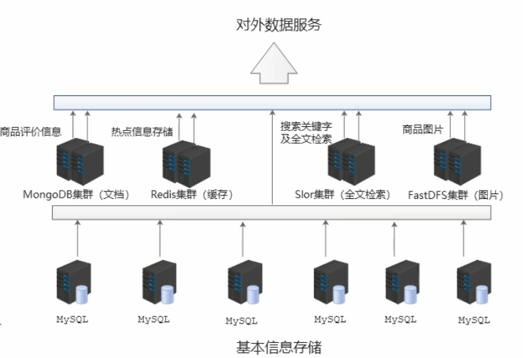

# Redis学习笔记

## 序章

### 0.1  问题现象

* **海量用户**
* **高并发**

### 0.2  罪魁祸首——关系型数据库

* 性能瓶颈：磁盘IO性能低下
* 扩展瓶颈：数据关系复杂，扩展性差，不便于大规模集群

### 0.3  结局思路

* 降低磁盘IO次数，越低越好	——	内存存储
* 去除数据间的关系，越简单越好    ——    不存储关系，仅存储数据

### 0.4  Nosql

NoSQL：即Not-Only SQL（泛指非关系型数据库），作为关系型数据库的补充  

作用：应对基于海量用户和海量数据前提下的数据处理问题  

特征：

* 可扩展，可伸缩  
* 大数据量下高性能  
* 灵活的数据模型  
* 高可用

常见NoSQL数据库：  

* Redis
* memcache
* HBase
* MongoDB

### 0.5  解决方案（电商场景）

* 商品基本信息：名称、价格、厂商
  * mysql
* 商品附加信息：描述、详情、评论
  * mongodb
* 图片信息
  * 分布式文件系统
* 搜索关键字
  * ES、lucene、solr
* **热点信息，高频、波段性**
  * Redis



## 第一章  Redis简介

### 1.1  什么是Redis

* Redis是完全开源免费的，遵循BSD协议，是一个高性能（NOSQL）的key-vakue数据库，Redis是一个开源的  

  使用ANSI C语言编写、支持网络，科技与内存亦可持久化的日志型、key-value数据库，并提供多种语言API

* 特征
  * 数据间没有必然的关联关系
  * 内部采用单线程机制进行工作
  * 高性能
  * 多数据类型支持
  * 持久化支持，可以进行数据灾难恢复

### 1.2  NoSql的类别

**键值（Key-Value）存储数据库**

> ​		这一类数据库主要会使用一个哈希表，这个表中有一个特定的键和一个指针指向特定的数据。key-value模型对于IT系统来说的优势在于简单、易部署。但是如果DBA只对部分值进行查询或更新的时候，key-value就显得效率低下
>
> 相关产品：Redis
> 典型应用：内容缓存，主要用于处理大量数据的高访问负载
> 数据模型：一系列键值对
> 优势：快速查询
> 劣势：存储的数据缺少结构化

**列存储数据库**

> ​		这部分数据库通常用来应对分布式存储的海量数据。键仍然存在，但是它们的特点是指向了多列。这些列是由列家族来安排的
>
> 相关产品：HBase、Riak
> 典型应用：分布式的文件系统
> 数据模型：以列簇式存储，将同一列数据存在一起
> 优势：查找速度快、可扩展性强，更容易进行分布式扩展
> 劣势：功能相对局限

**文档型数据库**

>​		文档型数据库的灵感来源于Lotus Notes办公软件的，而且它同第一种键值存储相类似。该类型的数据模板是版本化的文档，半结构化的文档以特定的格式存储，比如JSON。文档型数据库可看作是键值数据库的升级版，允许之间嵌套键值。而且文档型数据库比键值数据库的查询效率更高
>
>相关产品：MongoDB
>典型应用：Web应用（与key-value类型，value是结构化的）
>数据模型：一系列键值对
>优势：数据结构要求不严格
>劣势：查询性能不高，而且缺乏统一的查询语法

**图形数据库**

### 1.3  Redis总结

* **Redis常用的场景如下：**

  > 1、缓存
  > 		缓存现在几乎是所有中大型网站都在用的技术，合理的利用缓存不仅能够提升网站访问速度，还能大大降低数据库的压力。Redis提供了键过期功能，也提供了灵活的键淘汰策略。所以，现在Redis用在缓存的场合非常多。

  > 2、排行榜
  > 		很多网站都有排行榜应用，如京东的月销量榜单、商品按时间的上新排行榜等。Redis提供的有序集合数据结构能实现各种复杂的排行榜应用。

  > 3、计数器
  > 		什么是计数器，如电商网站商品的浏览量、视频网站的播放数等。为了保证数据实时效，每次浏览都得给+1，并发量高时如果每次都请求数据库操作无疑是各种挑战和压力。Redis提供的incr命令来实现计数器功能，内存操作，性能非常好，非常适用于这些计数场景。

  > 4、分布式会话
  > 		集群模式下，在应用不多的情况下一般使用容器自带的session复制功能就能满足，当应用增多相对复杂的系统中，一般都会搭建以Redis等内存数据库为中心的session服务，session不再由容器管理，而是由session服务以及内存数据库管理。

  > 5、分布式锁
  > 		在很多互联网公司都使用了分布式技术，分布式技术带来的技术挑战是对同一个资源的并发访问，如全局ID、减库存、秒杀等场景，并发量不大的场景可以使用数据库的悲观锁、乐观锁来实现，但在并发量高的场合中，利用数据库锁来控制资源的并发访问是不太理想的，大大影响了数据库的性能。可以利用Redis的setnx功能来编写分布式锁，如果设置返回1说明获取锁成功，否则获取锁失败，实际应用中要考虑的细节还要更多。

  > 6、社交网络
  > 		点赞、踩、关注/被关注、共同好友等是社交网络的基本功能，社交网络的访问量通常来说是比较大的，而且传统的关系数据库类型并不适合存储这种类型的数据库，Redis提供的哈希、集合等数据结构能很方便的实现这些功能。

  > 7、最新列表
  > 		Redis列表结构，LPUSH可以在列表头部插入一个内容ID作为关键字，LTRIM可用来限制列表的数量，这样列表永远为N个ID，无需查询最新的列表，直接根据ID去到对应的内容页即可。

  > 8、消息系统
  > 		消息队列是大型网站必用中间件，如ActiveMQ、RabbitMQ、Kafka等流行的消息中间件，主要用于业务解耦、削峰和异步处理实时性低的业务。Redis提供了发布/订阅及阻塞队列功能，能实现一个简单的消息队列系统。另外，这个不能和专业的消息中间件相比。

* **优势：**

  * **性能极高：**读的速度是110000次/s，写的速度是81000次/s

  * **丰富的数据类型：**String、Hash、List、Set及Zset等

  * **原子性：**Redis的所有操作都是原子性的，意思是要么成功执行要么失败完全不执行。单个操作是原子  

    性的。多个操作也支持事务，通过MULTI和EXEC指令包起来

  * **丰富的特性：**Redis支持public/subscribe，通知，key过期等特性

  * **高速读写：**redis使用自己实现的分离器，代码量很短，没有使用lock，因此效率非常高

* **劣势：**

  * **持久化：**Redis直接将数据存储到内存中，要将数据保存在磁盘上，Redis可以使用两种方式实现持久化过  

    程。定制快照（RDB）：每隔一段时间将整个数据库写到磁盘上，每次均是写全部数据，**代价非常高**。第  

    中方式基于语句追加（AOF）：只追踪变化的数据，但是追加的log可能过大，同时所有的操作均重新执  

    行一遍，**恢复速度慢**  

  * **耗内存：**占用内存过高

### 1.4  Redis的应用

* 为热点数据加速查询（主要场景）：热点商品、热点新闻、热点资讯、推广类等高访问信息等

* 任务队列，如秒杀、抢购、购票排队等

* 即时信息查询，如各类排行榜、各类网站访问统计、公交到站信息、在线人数信息（聊天室、网站）、设备信  

  号等

* 时效性信息控制，如验证码控制、投票控制等

* 分布式数据共享，如分布式集群架构中的session分离

* 消息队列

* 分布式锁

### 1.5  Redis的安装

* **Redis安装**

  Redis是C语言开发，安装Redis需要先将官网下载的源码进行编译，编译依赖gcc环境，如果没有gcc环境，需  

  要先安装gcc

* **编译**

  ```shell
  tar zxvf redis-5.0.8.tar.gz -C /opt  #解压到opt目录#
  cd redis-5.0.8.tar.gz
  make
  ```

* **安装**

  ```shell
  make PREFIX=/usr/local/redis install  #安装到指定目录
  ```

* **运行**

  ```shell
  cd /usr/local/redis/bin
  ./redis-server		#启动服务器
  ./redis-cli -h IP地址 -p 端口 -a 密码 -u 用户名		#默认本机IP地址，端口6379
  ```

## 第二章  Redis配置详解

### 2.1  配置Redis

* 命令：解压目录下的redis.conf配置文件复制到安装文件的目录下

  ```shell
  cp /opt/redis-5.0.8/redis.con /usr/local/redis
  ```

### 2.2  Redis.conf

```bat
1.Redis默认不是守护进程的方式运行，可以通过该哦诶之项修改，使用yes启用守护进程
daemonize no

2.当Redis以守护进程方式运行时，redis默认会吧pid写入/var/run/redis.pid文件，可以通过pidfile指定
pidfile /var/run/redis.pid

3.指定redis监听端口，默认端口为6379
port 6379

4.绑定的主机地址
bind 127.0.0.1

5.当客户端闲置多长时间后关闭连接，如果只定位0，表示关闭该功能
timeout 300

6.指定日志记录级别，Redis总共支持四个级别：debug、verbose、notice、warning，默认为verbose
loglevel verbose

7.日志记录方式，默认为标准输出，如果配置Redis为守护进程方式运行，而这里又配置为日志记录方式为标准输出，则日志将发送给/dev/null
logfile stdout

8.设置数据库的数量 默认数据库为0，可以使用SELECT <dbid>命令在连接上指定数据库id
database 16

9.指定多长时间内，有多少次更新操作，就将数据同步到数据文件，可以多个条件配置
save <seconds> <changes>
redis 默认文件中提供了三个条件
save 900 1
save 300 10
save 60 10000
分别表示900s内有一个更改，300s内有10个更改以及60s内有10000个更改

10.指定存储至本地数据库时是否压缩数量，默认为yes，Redis采用LZF（压缩算法）压缩，如果为了节省CPU时间，可以关闭该选项，但会导致数据库文件变得巨大
rdbcompression yes
```

```bat
11.指定本地数据库文件名，默认值为dump.rdb
dbfilename dump.rdb

12.指定本地数据库存放目录，包含日志文件、持久化文件等 
dir ./

13.设置当本机为slave服务时，设置master服务的IP地址及端口，在Redis启动时，它会自动从master进行数据同步
slaveof <masterip> <masterport>

14.当master服务设置了密码保护时，slave服务连接master的密码
masterauth <master-password>

15.设置redis连接密码，如果配置了连接密码，客户端在连接Redis时需要AUTH <password>命令提供密码，默认关闭
requirepass xianCan

16.设置同一时间最大客户端连接数，默认无限制，Redis可以同时打开的客户端连接数为Redis进程可以打开的最大文件描述符数，如果设置 maxClient 0，表示不作限制，当客户端连接数到达最大限制时，Redis会关闭新的连接并向客户端返回max number of clients reached错误信息
maxClient 128

17.指定Redis最大内存限制，Redis在启动时会把数据加载到内存中，达到最大内存后，Redis会先尝试清除已到期或即将到期的Key，当此方法处理后，仍然到达最大内存设置，将无法再进行写入操作，但仍然可以进行读取操作。Redis新的mv机制，会把key存放内存，Value会存放在swap区
maxmemory <bytes>

18.指定是否在每次更新操作后进行日志记录，Redis在默认情况下是异步的把数据写入磁盘，如果不开启，可能会在断电时导致一段时间内的数据丢失，因为Redis本身同步数据文件是按上面save条件来同步的，所以有的数据会在一段时间内只存在于内存中。默认为no
appendonly no

19.指定更新日志文件名，默认为appendonly.aof
appendfilename appendonly.aof

20.指定更新日志条件，共有3个可选值
no：表示等操作系统进行数据缓存同步到磁盘（快）
always：表示每次更新操作后手动调用fsync()将数据写到磁盘（慢，安全）
everysec：表示每秒同步一次（折中，默认值）
```

```bat
21.指定是否启用虚拟内存机制，默认值为no，简单介绍：vm机制将数据分页存放，由Redis将访问量较少的页即冷数据swap到磁盘上，访问多的页面由磁盘自动换出到内存中
vm-enabled no

22.虚拟内存文件路径，默认值为/tmp/redis.swap，不可多个Redis实例共享
vm-swap-file /tmp/redis.swap

23.将所有大于vm-max-memory的数据存入虚拟内存，无论vm-max-memory设置多小，所有索引数据都是内存存储的（Redis的索引数据就是keys），也就是说，当vm-max-memory设置为0的时候，其实是所有value都存于磁盘。默认值为0
vm-max-memory 0

24.Redis swap文件分成了很多的page，一个对象可以保存在多个page上面，但一个page上不能被多个对象共享，vm-max-memory是要根据存储的数据大小来设定的，作者建议如果存储很多小对象，page大小最好设置为32或者64bytes，如果存储大对象，则可以使用更大的page，如果不确定，就是用默认值
vm-page-size 32

25.设置swap文件的page数量，由于页表（一种表示页面空闲使用的bitmap）是存放在内存中的，在磁盘上每8个pages会消耗1byte的内存
vm-pages 134217728

26.设置访问swap文件的线程数，最好不要超过机器的核数，如果设置为0，那么所有对swap文件的操作都是串行的，可能会造成较长时间的延迟，默认值为4
vm-max-threads 4

27.设置项客户端应答时，是否把较小的包合并为一个包发送，默认为开启
glueoutputbuf yes

28.指定在超过一定的数量或者最大的元素超过某一临届值时，采用一种特殊的哈希算法
hash-max-zipmap-entries 64
hash-max-zipmap-value 512

29.指定是否激活重置哈希，默认值为开启
activerehashing yes

30.指定包含其他的配置文件，可以再同一主机上多个Redis实例之间使用同一份配置文件，而同时各个实例又拥有自己的特定配置文件
include /path/to/local.conf
```

### 2.3  Redis中的内存维护策略

* **设置过期时间**

  ```shell
  expire key time #以秒为单位，最常用
  setex(String key, int seconds, String value) #字符串独有的方式
  ```

  * 除了字符串自己独有设置过期时间的方法外，其它方法都需要依赖expire方法来设置时间
  * 如果有设置时间，那缓存就是永不过期
  * 如果设置了过期时间，之后又想让缓存永不过期，使用 persist key

***

* **采用LRU算法动态将不用的数据删除**

  > ​		LRU为内存管理的一种页面置换算法，对于在内存中但又不用的数据块叫做LRU，操作系统会根据哪些属于LRU而将其移出内存从而腾出空间来加载其它数据

  * 1、**volatile-lru**：设置超时时间的数据中心，删除最不常用的数据
  * 2、**allkeys-lru**：查询所有的key中最近最不常使用的数据进行删除，这是应用最广泛的策略
  * 3、volatile-random：在已经设定了超时的数据中心随即删除
  * 4、allkeys-random：查询所有的key之后随即删除
  * 5、volatile-ttl：查询全部设定超时的数据，之后排序，将马上将要过期的数据进行删除操作
  * 6、noeviction：如果设置为该属性，则不会进行删除操作，如果内存溢出则报错返回

### 2.4  简单配置

**进入对应的安装目录 /usr/local/redis**

修改redis.conf配置文件  vim redis.conf

```shell
daemonize no	#修改为 daemonize yes 守护进程启动
bind 127.0.0.1	#注释掉 允许除本机外的机器访问redis服务
requirepass 密码	#设置密码 有些时候不设置密码是无法进行远程登录的
```

> Redis采用的是IO多路复用的模式，当Redis.conf中选项daemonize设置为yes时，代表开启守护进程模式。在该模式下，redis会在后台运行，并将进程pid写入redis.conf选项pidfile设置的文件中，此时redis将一直运行，除非手动kill该进程。但当daemonize选项设置为no时，当前界面将进入redis的命令行界面，exit强制退出或者关闭连接工具都会导致redis进程退出
>
> 服务端开发的大部分应用都是采用后台运行的模式

> requirepass设置密码，因为redis速度相当快，所以一台比较好的服务器下，一个外部用户在一秒内可以进行15w次密码尝试，这意味着你需要设定非常强大的密码来防止暴力破解

### 2.5  Redis关闭

* 1、非正常关闭：会造成未持久化的数据丢失

  ```shell
  ps -ef | grep redis  #查询redis的进程号
  kill -9 PID
  ```

* 2、正常关闭

  通过客户端可以进行关闭redis服务器

  ```shell
  #登录redis客户端
  exit/quit	#退出客户端
  shutdown	#关闭redis服务器
  ```

## 第三章  Redis数据类型

### 3.1  业务数据的特殊性

**作为缓存使用**

**1、原始业务功能设计**

* 秒杀
* 618活动
* 双11活动
* 排队购票

**2、运营平台监控到的突发高频访问数据**

* 突发时政要闻，被强势关注围观

**3、高频、复杂的统计数据**

* 在线人数

**附加功能**

**1、系统功能优化或升级**

* 单服务器升级集群
* Session管理
* token管理

### 3.2  Redis数据存储格式

* redis自身是一个map，其中所有数据都是采用key-value的形式存储
* 数据类型指的是存储的数据的类型，也就是value部分的类型，key部分永远都是字符串

### 3.3  Redis常用命令

* **常用命令key管理**

  ```shell
  keys *	#返回满足的所有键，可以模糊匹配，比如 keys abc*
  exists key	#是否存在指定的key，存在返回1，不存在返回0
  expire key second	#设置某个key的过期时间，时间为秒
  del key	#删除某个key
  ttl key	#查看剩余时间，当key不存在时，返回-2，当返回-1时代表无限时间，其它代表剩余的秒数
  persist key	#将key改为无限时间
  pexpire key millisecons	#修改key的过期时间为毫秒
  select num	#选择数据库，数据库从0到15。设置成多个数据库实际上是为了数据库安全和备份
  move key dbindex	#将当前数据中的key转移到其他库
  randomkey	#随机返回一个key
  rename key key2	#重命名key
  echo	#打印
  dbsize	#查看数据库的key数量
  info	#查看数据库信息
  config get *	#实时传储收到的请求，返回相关的配置
  flushdb	#清空当前数据库
  flushall	#清空所有数据库
  type key	#返回key的类型
  clear		#清除屏幕指令信息
  ```

* **应用场景**

  **expire key seconds**

  1、限时的优惠活动信息，配合**exists key**

  2、网站数据缓存（对于一些需要定时更新的数据，例如：积分排行榜）  

  3、手机验证码  

  4、限制网站访客访问频率（例如：1分钟最多访问10次）

  * 通过获取请求的ip，以ip作为key存活时间为1s，请求前先去查询redis，存在即不可发起请求

### 3.4  key的命名建议

* 1、key不要太长，尽量不要超过1024字节，不仅消耗内存，还会降低查找的效率
* 2、key也不要太短，太短的话，key的可读性会降低
* 3、在一个项目中，key最好使用统一的命名模式，例如：user:123:password
* 4、key名称区分大小写
* 5、redis单个key最大限制为512M
* 6、**建议用冒号分隔key的字段**

### 3.5  String类型

> 简介：
>
> String类型是Redis最基本的数据类型，一个键最大能存储512M
>
> String数据结构是简单的key-value类型，value不仅可以使String，也可以是数字，是包含很多种类型的特殊类型，相当于一个Map<String, Object>
>
> String类型是二进制安全的，意思是redis的String可以包含任何数据。比如说序列化的对象进行存储，一张图片进行二进制存储，一个简单的字符串、数值等

**String命令**

``` shell
#设值
set key value	#赋值语句，多次set同一个key则会覆盖
setnx key value	# nx：not exist。如果key不存在，则设置并返回1。如果key存在，则不设置并返回0（解决 分布式锁 的方案之一，只有在key不存在时设置key的值。setnx(set if not exists)命令在指定的key不存在是，为key设置指定的值）
setex key 10 value	#设置key的值为value，过期时间为10秒，是String类型特有的设置过期时间命令
setrange string range value	#替换字符串

#取值
get key	#取值，如果key不存在，返回nil
getrange key start end	#用于获取存储在指定key中字符串的子字符串，字符串的截取范围为start和end两个偏移量决定（包括start和end在内），相当于java的subString
gitbit key offset	#对key所存储的字符串值，获取指定偏移量上的位（bit）
getset key value	#设置key的值，并返回key的旧值，当key不存在时，返回nil
strlen key	#返回key所存储的字符串值长度

#删值
del key	#删除指定的key，如果存在，返回数字类型

#批量写
MSET k1 v1 k2 v2

#批量读
MGET k1 k2

#自增/自减
incr key	#命令将key中存储的值+1，如果key不存在，那么key的值会被初始化为0，然后自增，返回自增后的值
decr key	#自减1
incrby key val	#对key进行自增，增量为val
decrby key val	#对key进行自减，减少量为val

#追加
append key value #在key对应的值后面追加value，返回追加完的长度
```

* **应用场景**

  * 1、String通常用于保存单个字符串或JSON字符串数据
  * 2、因String是二进制安全的，所以你完全可以把一个图片文件的内容作为字符串来存储
  * 3、计数器（常规key-value缓存应用。常规计数：微博数、粉丝数）

  > incr等指令本身就具有原子操作的特性，所以我们完全可以利用redis的incr、incrby、decr、decrby等指令来实现原子计数的效果。假如，在某种场景下有3个客户端同时读取了mynum的值（值为2），然后对其同时进行加1的操作，那么最后mynum的值一定是5。不少网站都是利用redis的特性来实现业务上的统计计数需求。
  
* **单数据操作与多数据操作的选择之惑**

  * set	vs	mset

  * 单指令3条指令的执行过程：传输时间*6 + set执行时间\*3

  * 多指令3条指令的执行过程：传输时间*2 + set执行时间\*3

  * 因此多数据set时，可以考虑用mset。但是也有一个问题：数据大了，传输的时间也会增加，不会和单个  

    的传输时间一样，因此需要找到合适的批量数

* **String类型数据的扩展操作**

  >  业务场景：
  >
  > ​		大型企业级应用中，分表操作时基本操作，使用多张表存储同类型数据，但是对应的组件id必须保证统一性，不能重复。Oracle数据库具有sequence设定，可以解决该问题，但是mysql数据库不具有类似的机制，那么怎么解决？

  **解决方案**

  * 设置数字数据增加指定范围的值

    ```shell
    incr key
    incrby key val
    incrbyfloat key incrment
    ```

  * 设置数据数据减少指定范围的值

    ```shell
    decr key
    decrby key val
    ```

* **String类型作为数值操作**

  * String在redis内部存储默认就是一个字符串，当遇到增减类操作incr，decr时会转为数值类进行计算

  * redis所有的操作都是原子性的，采用单线程处理所有业务，命令是一个一个执行的，因此无需考虑并发  

    带来的数据影响

  * **注意：按数值进行操作的数据，如果原始数据不能转为数值，或超越了redis数值上限范围，将报错。上**  

    **限和java中的long最大值相同**

### 3.6  Hash类型

> 简介：
>
> Hash类型是String类型的field和value的映射表，或者说是一个String的集合。hash特别适合用于存储对象，相比较而言，将一个对象类型存储在Hash类型要存储在String类型占用更少的内存空间，并对整个对象的获取可以看成是具有key和value的Map容器
>
> 如 uname，upass，age等，该类型的数据仅占用很少的磁盘空间（相比于json）。redis中每个hash可以存储2的32次方 - 1键值对（40多亿）

**Hash存储结构优化**

* 如果field数量较小，存储结构优化成类数组结构
* 如果field数量较多，存储结构使用HashMap结构

**Hash命令**

```shell
#设值
hget key field value #为指定的key，设置field value
hmset key field1 value1 field2 value2	#设定多个值

#取值
hget key field	#获取某一个字段
hmget key field1 field2	#获取几个字段
hgetall key	#获取key下的所有field和value

hkeys key  #获取hash中所有的field
hvals key	#获取hash中所有的value
hlen key	#获取hash中字段的数量

#删除
hdel key field #删除对应的field

hsetnx key field value	#只有在字段field不存在时，设置hash字段的值

hincrby key field incrment	#为hash表key中field字段加上增量incrment

hincrbyfloat key field incrment	#为hash表key中的field字段加上浮点增量

hexists key field	#查看hash表中对应的field字段是否存在
```

* **注意事项**

  * hash类型下的value只能存储字符串，不循序存储其他数据类型，不存在嵌套现象。如果数据未获取到，  

    对应的值为nil

  * 每个hash可以存储2的32次方-1个键值对
  
  * hash类型十分贴近对象的数据存储形式，并且可以灵活添加删除对象属性。但hash设计初衷不是为了存  
  
    储大量对象设计的，切记不可滥用，更不可将hash作为对象列表使用
  
  * hgetall操作可以获取全部属性，如果内部field过多，遍历整体数据效率就会很低下，有可能成为数据访问  

    瓶颈

  * 为什么不用String存储一个对象
  
    > hash是最接近关系数据库结构的数据类型，可以讲数据库一条记录或程序中的一个对象转换成hashmap存放在redis中。
    >
    > 假设不用hash类型，用户id为查找的key，存储的value用户对象包含姓名，年龄，生日等信息，如果用普通的key/value结构来存储，主要有以下两种存储方式：
    >
    > ​	1.将用户id作为查找的key，吧其他信息封装成一个对象以序列化的方式存储，这种方式的缺点是增加了序列化/反序列化的开销，并且在需要修改其中一项时，需要把整个对象取回，并且修改操作需要对并发进行保护，引入CAS等复杂问题
    >
    > ​	2.这个用户信息对象有多少成员就存成多少个key/value对，用用户id+对应属性的名称作为唯一标识来取得对应属性的值，虽然省去了序列化/反序列化和并发问题，但是用户id为重复存储，如果存在大量这样的数据，内存浪费还是非常可观的
  
  * **总结**
  
    redis提供的hash很好的解决了这个问题，redis的hash实际是内部存储的value作为一个hashmap
  
* **Hash类型应用场景**

  **业务场景**

  > 电商网站购物车设计与实现

  **业务分析**

  > 仅分析购物车的redis存储模型：添加、浏览、更改数据、删除、清空
  >
  > 购物车与数据库间持久化同步
  >
  > 购物车与订单建关系：提交购物车、商家临时价格调整
  >
  > 未登录用户购物车信息存储：cookie存储

  **解决方案**

  > 以客户id作为key，每位客户创建一个hash存储结构存储对象
  >
  > 将商品编号作为field，购买数量作为value进行存储
  >
  > 添加商品：追加全新的field与value
  >
  > 浏览：遍历hash
  >
  > 更改数量：自增/自减，设置value值
  >
  > 删除商品：删除field
  >
  > 清空：删除key

  **当前设计是否加速了购物车的呈现？**

  > 当前仅仅是将数据存储到redis中，并没有起到加速的作用，商品信息还需要二次查询数据库
  >
  > * 每条购物车中的商品记录保存成两条field
  > * field1专用于白村购买数量
  >
  > * field2专用于保存购物车中显示的信息，包含文字描述，图片地址，所属商家信息等

  ------

  **业务场景**

  > 双11活动日，销售手机充值卡的商家对移动、联通、电信的30元、50元、100元商品推出抢购活动，每种商品抢购上限1000张

  **解决方案**

  > 以商家id作为key
  >
  > 将参与抢购的商品id作为field
  >
  > 将参与抢购的商品数量作为对应value
  >
  > 抢购时使用降值得方式控制产品数量
  >
  > 实际业务中海油超卖等实际问题，这里不做讨论

### 3.7  List类型

> 简介：
>
> List类型是一个链表结构的集合，其主要功能有push、pop、获取元素等。更详细的说，List类型是一个双端链表，我们可以通过相关的操作进行集合的头部和尾部添加和删除元素，List的设计非常简单精巧，既可以作为栈，又可以作为队列，满足绝大多数需求
>
> 按照插入顺序排序。你可以添加一个元素到列表的头部或者尾部，一个列表最多可以包含2的32次方-1个元素，类似于Java中的LinkedList

**List命令**

```shell
#赋值
lpush key value1 value2 ... #将一个或多个值插入到列表头部
rpush key value1 value2 ... #将一个或多个值插入到列表尾部
lpushx key value	#将一个值插入到已存在的列表头部，如果列表不存在，操作无效
rpushx key value	#将一个值插入到已存在的列表尾部，如果列表不存在，操作无效

#取值
llen key	#获取队列长度
lindex key index	#通过索引获取列表中的值
lrange key start stop	#获取列表指定范围内的元素
#返回列表中指定区间内的元素，区间偏移量start和end指定
#其中0表示列表的第一个元素，1代表列表的第二个元素，以此类推
#也可以使用负数下标，以-1表示列表的最后一个元素，-2代表列表的倒数第二个元素，以此类推

#删除
lpop key	#移出并获取列表的第一个元素（从左侧删除）
rpop key	#移出并获取列表的第一个元素（从右侧删除）
blpop key timeout	#移出并获取列表的第一个元素，如果列表没有元素会阻塞列表知道等待超时或发现可弹出元素为止，brpop一样，从右边开始
brpop key timeout
ltrim key start stop	#对一个列表进行修剪，只保留指定区间的元素

#实例：
blpop list 100
#在上述的实例中，操作会被阻塞，如果指定的列表 key list存在数据则返回第一个元素，否则在等待100秒后会返回nil

#修改
lset key index value	#设置指定索引的值
linsert key before|after world value	#在列表的元素前或后参入元素，位置在world的前或后

rpoplpush source destination	#将source右侧的值放到destination的左侧
rpoplpush key key		#将key的右侧放到左侧去
brpoplpush a1 a2 timeout	#阻塞队列
```

* **应用场景**

  * **1、对数据量大的集合数据删减**

    列表数据显示、关注列表、粉丝列表、留言评价等...分页、热点新闻等。利用lrange还可以很方便的实  

    现分页的功能，在博客系统中，每篇博文的评论也可以存入一个单独的list中

  * **2、任务队列**

    list通常用来实现一个消息队列，而且可以确保先后顺序，不必像mysql那样还需要通过order by来进行  

    排序。举例：用户系统登录注册短信实名认证等、订单系统的下单流程等

    ```bat
    任务队列介绍（生产者和消费者模式）
    	在处理web客户端发送的命令请求时，某些操作的执行时间可能会比我们预期的更长一些，通过将待执行任务的相关信息放入队列里面，并在之后对队列进行处理，用户可以推迟执行那些需要一段时间才能完成的操作，者共将工作交给任务处理器来执行的做法被称为任务队列（task queue）
    	
    rpoplpush source destination
    移出列表的最后一个元素，并将该元素添加到另外一个列表并返回
    ```

* **List类型应用场景**

  **业务场景**

  > 微信朋友圈点赞，要求按照点赞顺序显示点赞好友信息，如果取消点赞，移除对应的好友信息

  **解决方案**

  > 移除指定数据
  >
  > lrem key count value

  ------

  **业务场景**

  > twitter、新浪微博、腾讯微博中个人用户的关注列表需要按照用户的关注顺序进行展示，粉丝列表需要将最近关注的粉丝列在前面

  **解决方案**

  > 依赖list的数据具有顺序的特征对信息进行管理
  >
  > 使用队列模型解决多路信息汇总合并的问题
  >
  > 使用栈模型解决最新消息的问题

### 3.8  Set类型

> 简介：
>
> redis的集合对象set感知上特别像java中的HashSet，但底层数据结构却像java的HashTable。底层使用了intset和hashtable两种数据结构存储，intset我们可以理解为数组，hashtable就是普通的哈希表（key为set，value为null）。intset内部其实是一个数组（int8_t coentents[]数组），而且存储数据的时候是有序的，因为查找数据的时候是通过二分查找来实现的

**Set命令**

```shell
#赋值
sadd key value1 value2 ...	#向集合添加一个或多个元素

#取值
scard key	#获取key的成员数量
smembers key	#返回集合中的所有成员
sismember key member	#判断member元素是否是集合key的成员
srandmember key [count]		#返回集合中一个或多个随机数

#删除语法
srem key mamber1 member2	#移除集合中一个或多个城公园
spop key [count]	#移除并返回集合中的一个随机元素
smove source destination mamber #将member元素从source集合移动到destination集合

#差集语法
sdiff key1 key2		#返回给定所有几何的差集，相当于key1-key2
sidffstore destination key1 [key2]		#返回给定所有集合的差集并存储在destination中

#交集
sinter key1 key2	#返回给定所有几何的差集
sinterstore destination key1 key2		#返回给定所有集合的交集并存储在destination中

#并集
sunion	key1 key2	#返回给定所有几何的并集，以左侧为主
sunionstore destination key1 key2	#返回给定所有集合的并集并存储在destination中
```

* **应用场景**

  **对两个集合间的数据进行交集、并集、差集运算**

  * 以非常方便的实现如共同关注、共同系好、二度好友等功能。对上面的所有集合操作，你还可以使用不同  

    的命令选择将结果返回给客户端还是存集到一个新的集合中

  * 利用唯一性，可以统计访问网站的所有独立IP
  
  **随机推荐类信息检索，例如热点歌单推荐，热点新闻推荐，热卖旅游线路，应用APP推荐，大V推荐等**
  
  **redis应用于同类信息的关联搜索，二度关联搜索，深度关联搜索等**
  
* **Set类型应用场景**

  **业务场景**

  > 每位用户首次使用今日头条时会设置3项爱好的内容，但是后期为了增加用户的活跃度、情趣店，必须让用户对其他信息类别逐渐产生兴趣，增加用户留存度，如何实现？

  **业务分析**

  > 系统分析出各个分类的最新或最热点信息条目并组织成set集合
  >
  > 随机挑选其中部分信息
  >
  > 配合用户关注信息分类中的热点信息组织成展示的全部信息集合

  ------

  **业务场景**

  >  公司对旗下新的网站做推广，统计网站的PV（访问量）、UV（独立访问）、IP（独立IP）
  >
  > PV：网站被访问的次数，可通过刷新页面提高访问量
  >
  > UV：网站被不同用户访问的次数，可通过cookie统计访问量，相同用户切换IP地址，UV不变
  >
  > IP：网站被不同IP地址访问的总次数，可通过IP地址统计访问量，相同IP不同用户访问，IP不变

  **解决方案**

  > 建立String类型数据，利用incr统计日访问量（PV）
  >
  > 建立set模型，记录不同cookie数量（UV）
  >
  > 建立set模型，记录不同IP数量（IP）

  ------

  **业务场景**

  > 黑名单：
  >
  > ​		资讯类信息类网站追求高访问量，但是由于其信息的价值，往往容易被不法分子利用，通过爬虫技术，快速获取信息，个别特种行业网站信息通过爬虫获取分析后，可以转换成商业机密进行出售。例如第三方火车票、酒店、机票刷票代购软件，电商刷评论，刷好评。
  >
  > ​		同时爬虫带来的伪流量也会让经营者带来错觉，产生错误的决策，有效避免网站被爬虫反复爬取成为每个网站都要考虑的问题。在基于技术层面区分出爬虫用户后，需要将此类用户进行有效的屏蔽，这就是黑名单。
  >
  > 白名单：
  >
  > ​		对于安全性更高的应用访问，仅仅靠黑名单是不能解决安全问题的，此时需要设定可访问的用户群体，依赖白名单做更为苛刻的访问验证。

### 3.9  ZSet类型

> 简介：
>
> 1、Redis有序集合和集合一样也是String类型元素的集合，且不允许重复的成员
>
> 2、不同的是每个元素都会关联一个double类型的分数。rdis正式通过分数来为集合中的成员进行从小到大的排序
>
> 3、有序集合的成员是唯一的，但分数（score）却可以重复
>
> 4、集合是通过哈希表实现的，默认从小到大排序

**ZSet命令**

```shell
#赋值
zadd key score1 member1 score2 member2 ...	#向有序集合添加一个或多个成员，或者更新已存在成员的分数

#取值
zcard key	#获取有序集合的成员数
zcount key min max	#计算在有序集合中指定区间分数的成员数
zrank key member	#返回有序集合中指定成员的索引
zscore key member	#返回该成员的score值
zrange key start stop	#通过索引区间返回有序集合指定区间内的成员（低到高）
zrangebyscore key min max	#通过分数返回有序集合指定区间内的成员
zrevrange key start stop	#返回有序集合中指定区间的成员，分数从高到低
zrevrangebyscore key max min	#返回有序集合中指定分数区间内的成员，分数从高到低排序

#删除语法
del key		#移除集合
zrem key member		#移除有序集合中的一个或多个成员
zremrangebyrank key start stop	#移除有序集合中给定排名区间的所有成员（低到高排序，第一名排序是0）
zremrangebyscore key min max	#移除有序集合中给定的分数区间的所有成员

zincrby key incrment member		#增加member元素的分数incrment，返回值是更改后的分数
```

* **注意**

  * **min和max用于限定搜索查询的条件**
* **strat和stop用于限定查询范围，作用于索引，表示开始和结束索引**
  
* **offset和count用于限定查询范围，作用于查询结果，表示开始位置和数据总量**
  
* **应用场景**

  排行榜、销量排名、积分排名等

  * 1、twitter的public timeline可以以发表时间作为score来存储，这样获取时就是自动按时间排好序的

  * 2、比如一个存储全班同学成绩的Sorted Set，其集合value可以使同学的学号，而score就可以是其考试 

    得分，这样在数据插入集合时，就已经进行了天然的排序

  * 3、还可以用Sorted Set来做带权重的队列，比如普通消息的score为1，重要消息的score为2，然后工作  

    线程可以按score的倒序来获取工作任务，让重要的任务优先执行
  
* **Zset应用场景**

  **业务场景**

  > ​		基础服务+增值服务类网站会设定各位会员的试用，让用户充分体验会员有事。例如观影试用VIP、游戏VIP体验、云盘下载体验VIP、数据查看体验VIP。当VIP体验到期后，如果有效管理此类信息，即便对于正式VIP用户也存在对应的管理方式
  >
  > ​		网站会顶起开放投票、讨论，限时进行，逾期作废。如何有效管理此类过期信息

  **解决方案**

  > 对于基于时间线限定的任务处理，将处理时间记录为score值，利用排序功能区分处理的先后顺序
  >
  > 记录下一个要处理的时间，当到期后处理对应的任务，移除redis中的记录，并记录下一个要处理的时间
  >
  > 当新任务加入时，判定并更新当前下一个要处理的任务时间
  >
  > 为提升zset的性能，通常将任务根据特征存储成若干个zset。例如1小时，1天内，周内月内，季内，年度等，操作时逐级提升，将即将操作的若干个任务纳入到1小时内处理的队列中

  ------

  **业务场景**

  > 任务/消息权重设定应用
  >
  > ​		当任务或者消息待处理，形成了任务队列或消息队列时，对于高优先级的任务要保障对其优先处理，如何实现任务权重管理

  **解决方案**

  > 对于带有权重的任务，优先处理权重高的任务，采用score记录权重即可
  >
  > 多条件任务权重设定
  >
  > ​		如果权重条件过多时，需要对排序score值进行处理，保障score值能够兼容2条件或者多条件，例如外貌订单优先于国内订单，总裁订单优先于员工订单，经理订单优先于员工订单
  >
  > 因score长度受限，需要对数据进行截断处理，尤其是时间设置为小时或分钟即可
  >
  > 先设定订单类别，后设定订单发起角色类别，整体score长度必须是统一的，不足位补0.第一排序规则首位不能是0
  >
  > 例如外貌101、国内102、经理004、员工008
  >
  > 员工下的外貌订单score值为101008（优先）
  >
  > 经理下的国内订单score值为102004

### 3.10  HyperLogLog类型

> 简介：
>
> Redis在2.8.9版本添加了HyperLogLog结构，Redis的HyperLogLog是用来做基数统计的算法，优点是在输入元素的数量或体积非常非常大时，计算基数所需的空间总是固定的，并且是很小的
>
> 在Redis里面，每个HyperLogLog键只需要花费12KB内存，就可以计算接近2^64个不同元素的基数，这和计算基数时，元素越多耗费内存就越多的集合形成鲜明对比。但是，因为HyperLogLog只会根据输入元素来计算基数，而不会存储输入元素本身，所以HyperLogLog不能像集合那样，返回输入的各个元素

* **什么是基数：比如数据集{1,3,5,7,5,7,8}，那么这个数据集的基数集为{1,3,5,7,8}，基数为5。基数估计就是**  

  **在误差可接受的范围内，快速计算基数**
  
* **PV（Page View）：即页面浏览量或点击量**

* **UV（Unique Visitor）：独立访客，单位时间内多少用户量访问了页面**

* **IP（Internet Protocol）：独立IP数，单位时间内多少个ip访问了页面**

**HyperLogLog命令**

```shell
pfadd key element ...	#添加元素到hyperloglog中
pfcount key		#返回给定hyperloglog的基数估算值
pfmerge destkey sourcekey1 sourcekey2 ...	#将多个hyperloglog合并为一个hyperloglog
```

* **应用场景**

  **基数不大，数据量不大就用不上，会有点大材小用的感觉**

  **有局限性，就是只能统计基数数量，而没办法去知道具体的内容是什么**

  * 1、统计注册IP数
  * 2、统计每日访问IP数
  * 3、统计页面实时UV数
  * 4、统计在线用户数
  * 5、统计用户每天搜索不同词条的个数
  * 6、统计真实文章阅读数

* **总结**

  > HyperLogLog是一种算法，并非redis独有。目的是做基数统计，故不是集合，不会保存元数据，只记录数量而不是数值。耗空间极小，支持输入非常体积的数据量
  >
  > 核心是基数估算算法，主要表现为计算时内存的使用和数据合并的处理，最终数值存在一定误差
  >
  > redis中每个hyperloglog key占用了12k的内存用于标记基数，pfadd命令并不会一次性分配12k内存，而是随着基数的增加而逐渐增加内存分配，而pfmerge操作则会将sourcekey合并后存储在12k大小的key中，这由hyperloglog合并操作的原理（两个hyperloglog合并时需要单独比较每个桶的值）
  >
  > 误差说明：基数估计的结果是一个带有0.81%标准错误的近似值，是可接受的范围。redis对hyperloglog的存储进行了优化，在计数比较小时，它的存储空间采用稀疏矩阵存储，空间占用很小，仅仅在计数慢慢增大，稀疏矩阵占用空间渐渐超过了阈值才会一次性转变为稠密矩阵，才会占用12k空间
  
* **HyperLogLog的原理**

  * **给定一系列的随机整数，我们记录下地位连续零位的最大长度k，通过这个k可以估算出随机数的数量**
  * **N=2^K，其中N是随机数的数量，K是连续零位的最大长度**

* **pf的内存占用为什么是12k？**

  * Redis的HyperLogLog实现中用到的是16384个桶，也就是2^14次方，每个桶的maxbits需要6个bits来存  

    储，最大可以表示maxbits=63，于是总共占用内存就是2^14*6/8=12k字节

### 3.11  Bitmap类型

> 简介：
>
> ​		位图不是特殊的数据结构，它的内容其实就是普通的字符串，也就是byte数组。我们可以使用普通的get/set直接获取和设置整个位图的内容，也可以使用位图操作getbit/setbit等将byte数组看成位数组来处理。

**Bitmap命令**

```shell
setbit key offset 0/1		#将key的第offset位置为0或1
get key			#由于本质还是String类型，所以可以使用String的所有命令
bitcount key [start end]		#统计指令，注意：start和end是字节索引，也就是说指定的范围必须是8的倍数。		bitcount key 0 1 意思是统计前16位中1的位数
bitpos key bit [start] [end]	#统计从start开始，end结束的第一个bit位
			 #bitpos key 1 1 从第二个字符算起，第一个1位
			 #bitpos key 0 2 2 从第三个字符算起，第一个0位
bitop and/or/xor/not destkey key1 ...key2 #对key1及key2求位运算，并将结果保存在destkey中
```

### 3.12  Geo类型

## 第四章  Redis与Spring

### 4.1  常用的redis客户端

> 在SPringBoot2.0之后，对redis连接的支持，默认采用了lettuce，这就一定程度说明了lettuce和jedis的优劣

**概念**

>Jedis：是老牌的redis的java实现客户端，提供了比较全面的redis命令的支持
>
>redisson：实现了分布式和可扩展的java数据结构
>
>lettuce：高级redis客户端，用于线程安全同步，异步和响应使用，支持集群，sentinel，管理和编码器

**优点**

> jedis：比较全面的提供了redis的操作特性
>
> redisson：促使使用者对redis的关注分离，提供了很多分布式相关操作服务。例如：分布式锁，分布式事务，可通过redis支持延迟队列
>
> lettuce：基于netty框架的事件驱动的通信层，其方法的调用是异步的。lettuce的api是线程安全的，所以操作单个lettuce连接来完成各种操作

**可伸缩**

> jedis：使用阻塞的I/O，且其方法调用都是同步的，程序流需要等到sockets处理完I/O才能执行，不支持异步
>
> jedis客户端实例不是线程安全的，所以需要通过连接池来使用jedis
>
> redisson：基于netty框架的事件驱动的通信层，其方法调用都是异步的。redisson的api是线程安全的，所以操作单个redisson连接来完成各种操作
>
> lettuce：基于netty框架的事件驱动的通信层，其方法调用都是异步的。lettuce的api是线程安全的，所以操作单个lettuce连接来完成各种操作
>
> lettuce能够支持redis4，需要java8及以上
>
> lettuce是基于netty实现的与redis进行同步和异步的通信

**lettuce和jedis的比较**

> jedis直接连接redis server，如果在多线程环境下是非线程安全的，这个时候只有使用线程池，为每个jedis实例增加物理连接
>
> lettuce的连接基于netty，连接实例（statefulRedisConnection）可以再多个线程间并发访问，statefulRedisConnection是线程安全的，所以一个连接实例可以满足多线程环境下的并发访问，当然这也是可伸缩的设计，一个连接实例不够的情况下也可以按需增加连接实例
>
> redisson实现了分布式锁和可扩展的java数据结构，和jedis相比，功能较为简单，不支持字符串操作，不支持排序、事务、管道、分区等redis特性。

**总结**

> 优先使用lettuce，如果需要使用分布式锁，分布式集合等分布式高级特性，添加redisson结合使用，因为redisson本身对字符串的操作支持很差
>
> 在一些高并发的场景中，比如秒杀，抢票，抢购等场景，都存在对核心资源，商品库存的争夺，控制不好，库存数量可能会被减少到负数，出现超卖的情况，或者产生一个递增的ID，由于Web应用部署在多个机器上，简单的同步加锁是无法实现的，给数据库加锁，对于高并发，1000/s的并发，数据库可能由行锁变成表锁，性能下降会很厉害。那相对而言，redis的分布式锁，是一个很好的选择，redis官方推荐使用redisson来进行分布式锁和相关服务

### 4.2  两个使用场景

#### 4.2.1  手机验证功能

> 用户在客户端输入手机号，点击发送后随机生成4位数字码。设置对应的有效期。输入验证码，点击验证，返回成功或者失败。且每个手机号在5分钟内只能验证3次，并给出相应的提示

#### 4.2.2  限制登录功能

> 用户在2分钟内，仅允许输入错误密码5次，如果超过次数，限制登录1小时。

* **分析逻辑**

  ```bat
  1 判断当前登录的用户是否被限制登录
  1.1 如果没有被限制，执行登录功能
  	2 判断是否登陆成功
  	2.1 登陆成功 》 清除输入密码错误次数信息
  	2.2 登录不成功
  		3 记录登录错误次数（判断redis中对应的key是否存在）
  		3.1 不存在，是第一次登录且失败，记录+1，并且设置失效期
  		3.2 如果存在
  		查询登录失败的key的结果
  		if(结果<4) +1
  		else 创建限制登录的key，同时有效期设为1小时
  1.2 如果被限制
  做出相应提示
  ```


## 第五章  Redis知识点

### 5.1  Redis多数据库

> redis下，数据库是由一个整数索引标识，而不是由一个数据库名称。默认情况下，一个客户端连接到数据库0

**redis配置文件中面参数来控制数据库总数**

```shell
database 16	#0-15
select num	#切换数据库
move key num	#移动数据，将当前key移动到num数据库
flushbd		#清除当前数据库的所有key
flushall	#清除整个redis数据库所有kei
```

### 5.2  Redis事务

> Redis事务可以一次执行多个任务，按顺序地串行化执行，执行中不会被其他命令插入，不许加塞
>
> 批量操作在发送EXEC命令前被放入队列缓存，收到EXEC命令后进入事务执行，事务中任意命令执行失败，其余命令依然被执行。在事务执行过程，其他客户端提交的命令请求不会插入到事务执行命令序列中

**常用命令**

```shell
multi	#标记一个事务块的开始
exec	#执行所有事务块的命令
discard		#取消事务，放弃执行事务块内的所有命令
unwatch		#取消watch命令对所有key的监控
watch key1 key2 ...		#监视一个key，如果在事务执行之前这个key被其他命令所改动，那么事务会被打断
```

* **一个事务从开始到执行会经历以下三个阶段：**
  * 开始事务
  * 命令入队
  * 执行事务

#### 5.2.1  MULTI EXEC DISCARD

> 转账功能，a向b转账50元

**1、输入multi命令开始事务，输入的命令都会依次进入命令队列中，不会执行**  

**2、直到输入exec后，redis会将之前的命令队列中的命令依次执行。或者执行discard取消执行**

```shell
multi
get account:a
get account:b
decrby account:a 50
incrby account:b 50
get account:a
get account:b
exec/discard
```

#### 5.2.2  事务的错误处理

> 如果某个命令报出错误，则只有报错的命令不会被执行，而其它的命令都会被执行，不会回滚

```shell
CentOS:0>multi
"OK"

CentOS:0>set aa hello
"QUEUED"

CentOS:0>get aa
"QUEUED"

CentOS:0>incr aa
"QUEUED"

CentOS:0>exec
 1)  "OK"
 2)  "hello"
 3)  "ERR value is not an integer or out of range"	#报错了
 
CentOS:0>get aa		#但是aa还是设进去了，代表命令没有错误，只是开发人员的错误，因此不会回滚
"hello"
```

```shell
CentOS:0>multi
"OK"

CentOS:0>set bb hello
"QUEUED"

CentOS:0>get bb
"QUEUED"

CentOS:0>error task
"ERR unknown command `error`, with args beginning with: `task`, "	#没有这个命令

CentOS:0>exec
"EXECABORT Transaction discarded because of previous errors."	#事务中有不存在的命令，redis会放弃执行整个事务

CentOS:0>get bb		#bb没有设进去
null
```

#### 5.2.3  事务的WATCH

> watch key
>
> 监视一个或多个key，如果事务实行之前这个key被其他命令所改动，那么事务会被打断

```shell
CentOS:0>watch aa
"OK"

CentOS:0>multi
"OK"

CentOS:0>get aa
"QUEUED"

CentOS:0>incr aa
"QUEUED"

CentOS:0>exec		#如果aa被其他客户端修改了，事务将执行失败
(nil)
```

#### 5.2.4  应用场景

* 一组命令必须同时都执行，或者都不执行。我们想要保证一组命令在执行过程中不被其他命令插入

### 5.3  分布式锁

> 在分布式系统中，如果有大量相同的修改状态的操作，则非常容易出现并发问题，因为读取和保存状态这两个操作不是原子的。

**原子操作：指不会被线程调度机制打断的操作。这种操作一旦开始，就一直运行到结束，中间不会有任何content switch线程切换**

### 5.4  布隆过滤器

> ​		如果我们想知道某一个值是不是已经在HyperLogLog结构里面了，它就显得无能为力了，它只提供了pfadd和pfcount方法，没有提供pfcontains方法。
>
> ​		使用场景：比如我们在使用新闻客户端看新闻时，它会给我们不停地推荐新的内容，他每次推荐时要去重，去掉哪些已经看过的内容。问题来了，新闻客户端推荐系统如何实现推送去重。简单的方法就是在服务器记录了用户看过的所有历史记录，当推荐系统推荐新闻时会从每个用户的历史记录里进行筛选，过滤掉那些已经存在的记录。问题是当用户量很大时，每个用户看过的新闻又很多的情况下，这种情况下，性能会跟不上。如果存在数据库，每个都要exists查询，并发上来时，数据库压力非常大。存在缓存，则非常消耗空间。
>
> ​		这时，布隆过滤器就是撰文用来解决这种去重问题的。它在去重的同时，在空间上节省90%以上，只是有一定的误判率

* **布隆过滤器**
  * 1、布隆过滤器可以理解为一个不怎么精确的set结构
  * 2、当你使用它的contains方法判断某个对象是否存在时，它可能会误判
  * 3、布隆过滤器只要参数设置合理，误判的概率是非常低的
  * 4、当布隆过滤器说某个值存在时，这个值可能不存在，当它说不存在时，那就肯定不存在
  * 5、**布隆过滤器对于已经见过的元素肯定不会误判，它只会误判那些没见过的元素**

* **redis的布隆过滤器模块需要额外安装**

  ```shell
  tar zxvf RedisBloom-1.1.1.tar.gz
  cd RedisBloom-1.1.1
  make
  ./redis-server ./redis.conf --loadmodule ./redisbloom.so
  ```

* **误判率**

  * 1、redis里面默认使用的布隆过滤器误判率有点高，约为1%

  * 2、可以使用自定义参数的布隆过滤器降低误判率，需要在我们add之前使用bf.reserve指令显式创建

    ```shell
    bf.reserve key error_rate initial_size		#默认创建的布隆过滤器error_rate=0.01，
    #initial_size=100，错误率越低，需要的空间越大，initial_size参数表示预计放入的元素数量，当实际数量超过这个数值时，误判率就会上升
    ```

* **注意事项**

  * 1、布隆过滤器的initial_size估计的过大，会浪费存储空间，估计得过小，就会影像准确率，再用之前一

    定要尽可能精确地估计好元素数量

  * 2、布隆过滤器的error_rate越小，需要的存储空间就越大，对于不需要过于精确的场合，error_rate设置

    大一点也无妨

* **原理**

  > ​		每个布隆过滤器对应到 Redis 的数据结构里面就是一个大型的位数组和几个不一样的无偏 hash 函数。所谓无偏就是能够把元素的 hash 值算得比较均匀。
  >
  > ​		向布隆过滤器中添加key时，会使用多个hash函数对key进行hash算得一个正数索引值然后对数组长度进行取模运算得到一个位置，每个函数都会算得一个不同的位置。再把位数组的这几个位置都置为1就完成了add操作。
  >
  > ​		向布隆过滤器询问key是否存在时，跟add一样，也会把hash的几个位置都算出来，看看位数组这几个位置是否都为1，只要有一个位为0，那么说明布隆过滤器中这个key不存在。如果都为1，这并不能说明这个key就一定存在，只是极有可能存在，因为这些位置被置为1可能是因为其它的key存在所致。
  >
  > ​		使用时不要让实际元素远大于初始化大小，当实际元素开始超出初始化大小时，应该对布隆过滤器进行重建，重新分配一个 size 更大的过滤器，再将所有的历史元素批量 add 进去 (这就要求我们在其它的存储器中记录所有的历史元素)。因为 error_rate 不会因为数量超出就急剧增加，这就给我们重建过滤器提供了较为宽松的时间。
  
* **空间占用估计**

  > ​		布隆过滤器有两个参数，第一个是预计元素的数量 n，第二个是错误率 f。公式根据这两个输入得到两个输出，第一个输出是位数组的长度 l，也就是需要的存储空间大小 (bit)，第二个输出是 hash 函数的最佳数量 k。hash 函数的数量也会直接影响到错误率，最佳的数量会有最低的错误率。
  >
  > ​										k=0.7*(l/n) # 约等于
  >
  > ​										f=0.6185^(l/n) # ^ 表示次方计算，也就是 math.pow
  >
  > 从公式中可以看出
  >
  >  1、位数组相对越长 (l/n)，错误率 f 越低，这个和直观上理解是一致的
  >
  >  2、位数组相对越长 (l/n)，hash 函数需要的最佳数量也越多，影响计算效率
  >
  >  3、当一个元素平均需要 1 个字节 (8bit) 的指纹空间时 (l/n=8)，错误率大约为 2%
  >
  >  4、错误率为 10%，一个元素需要的平均指纹空间为 4.792 个 bit，大约为 5bit
  >
  >  5、错误率为 1%，一个元素需要的平均指纹空间为 9.585 个 bit，大约为 10bit
  >
  >  6、错误率为 0.1%，一个元素需要的平均指纹空间为 14.377 个 bit，大约为 15bit

* **注意点：计算机指针会占用4到8字节，取决于系统是32位还是64位**

## 第六章  应用常见现象

### 6.1  缓存预热

> 现象：服务器启动后迅速宕机
>
> 问题排查：
>
> 1、请求数量较高
>
> 2、主从之间数据吞吐量较大，数据同步操作频率较高

**解决方案：**

* 前置准备工作
  * 1、日常例行统计数据访问记录，统计访问频度较高的热点数据
  * 2、利用LRU数据删除策略，构建数据留存队列。如storm与kafka配合
* 准备工作
  * 1、将统计结果中的数据分类，根据级别，redis优先加载级别较高的热点数据
  * 2、利用分布式多服务器同时进行数据读取，提速数据加载过程
* 实施
  * 1、使用脚本程序固定触发数据预热过程
  * 2、如果条件允许，使用了CDN（内容分发网络），效果会更好

**总结：**

​		缓存预热就是启动系统前，提前将相关的缓存数据直接加载到缓存系统。避免在用户请求时，先查询数据库，然后再将数据缓存的问题。用户直接查询事先被预热的缓存数据

### 6.2  缓存雪崩

> 问题：
>
> 1、系统平稳运行过程中，忽然数据库连接量激增
>
> 2、应用服务器无法及时处理请求
>
> 3、大量408、500错误页面出现
>
> 4、客户反复刷新页面获取数据
>
> 5、数据库崩溃
>
> 6、应用服务器崩溃
>
> 7、重启应用服务器无效
>
> 8、Redis服务器崩溃
>
> 9、Redis集群崩溃
>
> 10、重启数据库后在此被瞬间流量放倒
>
> 根源：短时间范围内较多的key过期

**解决方案（道）**

* 1、更多的页面静态化处理
* 2、构建多级缓存架构：nginx缓存+redis缓存+ehcache缓存
* 3、检测Mysql严重耗时业务进行优化
  * 对数据库的瓶颈排查，例如超时严重、耗时较高事务等
* 4、灾难预警机制，监控redis服务器性能指标
  * CPU占用、CPU使用率
  * 内存容量
  * 查询平均时间
  * 线程数
* 5、限流、降级
  * 短时间范围内牺牲一些客户体验，限制一部分请求访问，降低应用服务器压力，待业务低速运转后再放开

**解决方案（术）**

* 1、LRU与LFU切换
* 2、数据有效期策略调整
  * 根据业务数据有效期进行分类错峰，A类90分钟，B类60分钟，C类70分钟
  * 过期时间使用固定时间+随机值的形式，稀释集中到期的key的数量
* 3、超热数据使用永久key
* 4、定期维护（自动+人工）
  * 对即将过期数据做访问量分析，确认是否延时，配合访问量统计，做热点数据的延时
* 5、加锁（慎用）

**总结：**

​		缓存雪崩就是瞬间过期数据量太大，导致对数据库服务器造成压力。如能够有效避免过期时间集中，可以有效解决雪崩现象的出现，配合其它策略一起使用，并监控服务器的运行数据，根据运行记录做快速调整

### 6.3  缓存击穿

>问题：
>
>1、系统平稳运行过程中
>
>2、数据库连接梁瞬间激增
>
>3、Redis服务器无大量key过期
>
>4、Redis内存平稳，无波动
>
>5、Redis服务器CPU正常
>
>6、数据库崩溃

**问题排查**

* 1、Redis中某个key过期，该key访问量巨大
* 2、多个数据请求从服务器直接压到Redis后，均未命中
* 3、Redis在短时间内发起了大量对数据库中同一数据的访问

**问题分析**

* 单个key高热数据
* key过期

**解决方案（术）**

* 1、预先设定

  * 以电商为例，每个商家根据店铺等级，指定若干款主打商品，在购物节期间，加大此类信息key的过期时  

    长。注意：购物节不仅仅指当天，以及后续若干天，访问峰值呈现逐渐降低的趋势

* 2、现场调整

  * 监控访问量，对自然流量激增的数据延长过期时间或设置为永久性key

* 3、后台刷新数据

  * 启动定时任务，高峰期来临之前，刷新数据有效期，确保不丢失

* 4、二级缓存

  * 设置不同的失效时间，保障不会被同时淘汰就行

* 5、加锁

  * 分布式锁，防止被击穿，但是要注意性能瓶颈，慎重

**总结：**

​		缓存击穿就是单个高热数据过期的瞬间，数据访问量较大，未命中redis后，发起了大量对同一数据的数据库访问，导致对数据库服务器造成压力。应对策略应该在业务数据分析与预防方面进行，配合运行监控测试与即时调整策略，毕竟单个key的过期监控难度较高，配合缓存雪崩处理策略即可

### 6.4  缓存穿透

> 问题：
>
> 1、系统平稳运行过程中
>
> 2、应用服务器流量随时间增量较大
>
> 3、Redis服务器命中率随时间逐步降低
>
> 4、Redis内存平稳，内存无压力
>
> 5、Redis服务器CPU占用激增
>
> 6、数据库服务器压力激增
>
> 7、数据库崩溃

**问题排查**

* 1、Redis中大面积出现未命中
* 2、出现非正常URL访问

**问题分析**

* 1、获取的数据在数据库中也不存在，数据库查询未得到对应数据
* 2、Redis获取到null数据均未进行持久化，直接返回
* 3、下次此类数据到达重复上述过程
* 4、出现黑客攻击服务器

**解决方案（术）**

* 1、缓存null

  * 对查询结果为null的数据进行缓存（长期使用，定期清理），设定短时限，例如30-60s，最长5min

* 2、白名单策略

  * 提前预热各种分类数据id对应的bitmap，id作为bitmap的offset，相当于进行了白名单设置。当加载正常  

    数据时，放行，加载异常数据时直接拦截（效率偏低）

  * 使用布隆过滤器

* 3、实施监控，实时监控redis命中率（业务正常范围内，通常会有一个波动值）与null数据的占比

  * 非活动时段波动：通过检测3-5倍，超过5倍纳入重点排查对象
  * 活动时段波动：通过检测10-50倍，超过50倍纳入重点排查对象

* 4、key加密

  * 问题出现后，临时启动防灾业务key，对key进行业务层传输加密服务，设定校验程序，过来的key检验。  

    例如每天随机分配60个加密串，挑选2到3个，混淆到页面数据id中，发现访问key不满足规则，驳回数据 

    访问

**总结**

​		缓存击穿访问了不存在的数据，跳过了合法数据的redis数据缓存阶段，每次访问数据库，导致对数据库服务造成压力。通常此类数据的出现量是一个较低的值，当出现此类情况时以毒攻毒

