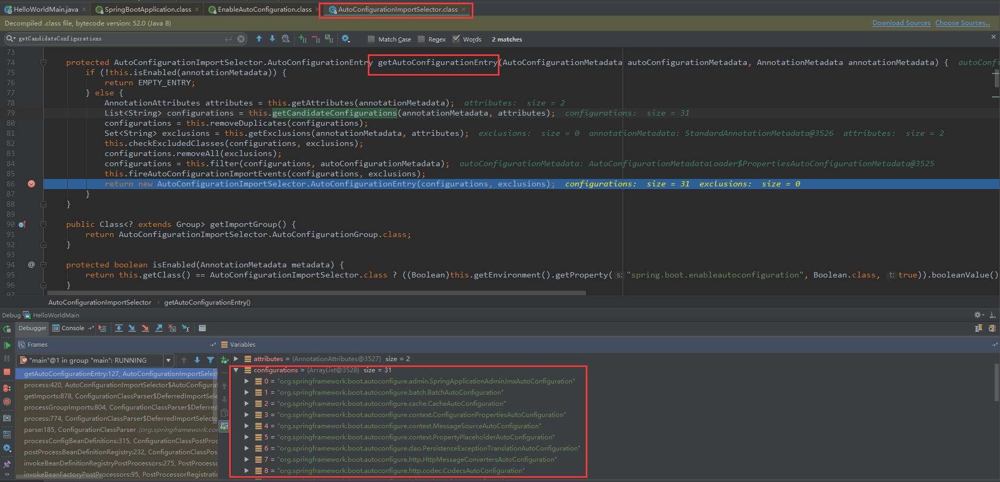

# SpringBoot学习笔记

## 第一章  Spring  Boot入门

### 1.1 Spring  Boot简介

* **简化**Spring应用开发的一个框架，整个Spring技术栈的一个大整合，J2EE开发一站式解决方案

### 1.2  Hello  World程序

* 略

### 1.3  打包

* Spring Boot支持将应用达成一个可执行的jar包，在Pom文件导入springBoot的插件。然后在执行maven中的  

  package命令将应用程序打成一个jar包。再直接java -jar运行即可

  ```xml
  <build>
      <plugins>
          <plugin>
              <groupId>org.springframework.boot</groupId>
              <artifactId>spring-boot-maven-plugin</artifactId>
          </plugin>
      </plugins>
  </build>
  ```

### 1.4  POM文件

#### 1、父项目

* 父项目作为Spring Boot的版本仲裁中心：

  * 以后我们导入依赖默认是不需要写版本。没有在dependencies里面管理的依赖自然需要声明版本号

  ```xml
  <parent>
      <groupId>org.springframework.boot</groupId>
      <artifactId>spring-boot-starter-parent</artifactId>
      <version>2.1.0.RELEASE</version>
  </parent>
  
  <!--它的父项目是-->
  <parent>
      <groupId>org.springframework.boot</groupId>
      <artifactId>spring-boot-dependencies</artifactId>
      <version>2.1.0.RELEASE</version>
      <relativePath>../../spring-boot-dependencies</relativePath>
  </parent>
  
  <!--再点进spring-boot-dependencies，就可以看到依赖的版本号-->
  <properties>
          <activemq.version>5.15.7</activemq.version>
          <antlr2.version>2.7.7</antlr2.version>
          <appengine-sdk.version>1.9.67</appengine-sdk.version>
          <artemis.version>2.6.3</artemis.version>
          <aspectj.version>1.9.2</aspectj.version>
          <assertj.version>3.11.1</assertj.version>
          <atomikos.version>4.0.6</atomikos.version>
          <bitronix.version>2.1.4</bitronix.version>
          <build-helper-maven-plugin.version>3.0.0</build-helper-maven-plugin.version>
          <byte-buddy.version>1.9.3</byte-buddy.version>
          <caffeine.version>2.6.2</caffeine.version>
          <cassandra-driver.version>3.6.0</cassandra-driver.version>
          <classmate.version>1.4.0</classmate.version>
          <commons-codec.version>1.11</commons-codec.version>
          <commons-dbcp2.version>2.5.0</commons-dbcp2.version>
          <commons-lang3.version>3.8.1</commons-lang3.version>
          <commons-pool.version>1.6</commons-pool.version>
          <commons-pool2.version>2.6.0</commons-pool2.version>
          <couchbase-cache-client.version>2.1.0</couchbase-cache-client.version>
          <couchbase-client.version>2.7.0</couchbase-client.version>
          <derby.version>10.14.2.0</derby.version>
          <dom4j.version>1.6.1</dom4j.version>
      	......
  </properties>
  ```

#### 2、导入的依赖

* spring-boot-starter-web：可以分成两个部分来看

  * spring-boot-starter：spring-boot场景启动器
  * web：帮我们导入了web模块正常运行所依赖的组件

  ```xml
  <dependency>
      <groupId>org.springframework.boot</groupId>
      <artifactId>spring-boot-starter-web</artifactId>
  </dependency>
  ```

* spring boot将所有的功能场景都抽取出来，做成对应的starter（启动器），只需要在项目里面引入这些  

  starter相关场景的所有依赖都会被导入进来

### 1.5  主程序类、主入口类

```java
/**
 * @author xianCan
 * @date 2019/5/28 23:52
 */
@SpringBootApplication
@EnableBatchProcessing
public class HelloWorldMain {

    public static void main(String[] args) {
        SpringApplication.run(HelloWorldMain.class);
    }
}
```

* **@SpringBootApplication**：SpringBoot应用标注在某个类上说明这个类是SpringBoot的主配置类，  

  SpringBoot就运行这个类的main方法来启东SpringBoot应用

```java
@Target({ElementType.TYPE})
@Retention(RetentionPolicy.RUNTIME)
@Documented
@Inherited
@SpringBootConfiguration
@EnableAutoConfiguration
@ComponentScan(
    excludeFilters = {@Filter(
    type = FilterType.CUSTOM,
    classes = {TypeExcludeFilter.class}
), @Filter(
    type = FilterType.CUSTOM,
    classes = {AutoConfigurationExcludeFilter.class}
)}
)
public @interface SpringBootApplication {
    ......
}
```

* **@SpringBootConfiguration**：SpringBoot的配置类。标注在某个类上，表示这是一个SpringBoot的配置类
  * **@Configuration**：配置类上标注这个注解。配置类------就是以前的配置文件
    * **@Component**：配置类也是容器中的一个组件

* **@EnableAutoConfiguration**：开启自动配置功能。以前我们需要配置的恭喜，SpringBoot帮我们自动配  

  置。@EnableAutoConfiguration告诉SpringBoot开启自动配置功能

  ```java
  @Target({ElementType.TYPE})
  @Retention(RetentionPolicy.RUNTIME)
  @Documented
  @Inherited
  @AutoConfigurationPackage
  @Import({AutoConfigurationImportSelector.class})
  public @interface EnableAutoConfiguration {
      ......
  }
  ```

  * **@AutoConfigurationPackage**：自动配置包

    * **@Import({Registrar.class})**：Spring的底层注解，给容器中导入一个组件。导入的组件由  

      Registrar.class进行控制，点进Registrar类即可看到如下的方法

      ```java
      PackageImport(AnnotationMetadata metadata) {
      	//打断点进来看到 this.packageName = "com.xianCan"，即我们定义的groupId
          this.packageName = ClassUtils.getPackageName(metadata.getClassName());
      }
      ```

    * **作用**：将主配置类（@SpringBootConfiguration标注的类）的所在包及下面所有子包里面包含的所  

      有组件扫描到Spring容器中。**如果将类定义在主配置类的外面，启动SpringBoot是扫描不到的，因  **

      **此，要将类定义在主配置类里面。**

  * **@Import({AutoConfigurationImportSelector.class})**：给容器中导入组件

    * **AutoConfigurationImportSelector**：导入哪些组件的选择器。将所有需要导入的组件以全类名的  

      方式返回，这些组件就会被添加到容器中，会给容器中导入非常多的自动配置类xAutoConfiguration  

      。就是给容器中导入这个场景需要的所有组件，并配置好这些组件  

    

