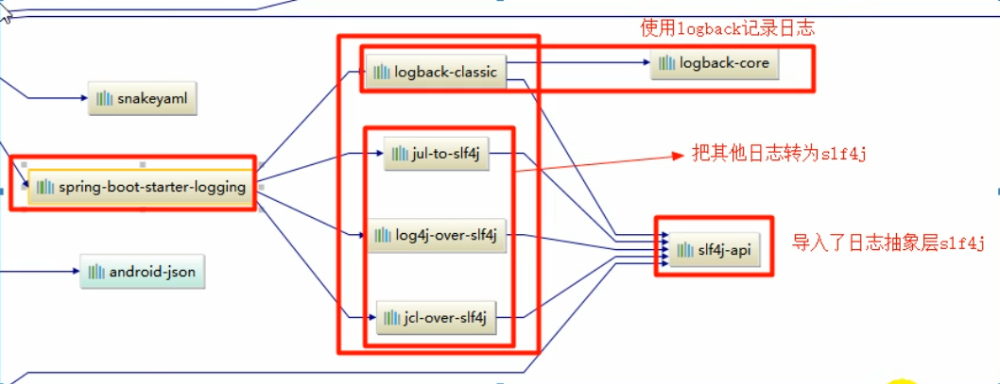

# SpringBoot学习笔记

## 第一章  Spring  Boot入门

### 1.1 Spring  Boot简介

* **简化**Spring应用开发的一个框架，整个Spring技术栈的一个大整合，J2EE开发一站式解决方案

### 1.2  Hello  World程序

* 略

### 1.3  打包

* Spring Boot支持将应用达成一个可执行的jar包，在Pom文件导入springBoot的插件。然后在执行maven中的  

  package命令将应用程序打成一个jar包。再直接java -jar运行即可

  ```xml
  <build>
      <plugins>
          <plugin>
              <groupId>org.springframework.boot</groupId>
              <artifactId>spring-boot-maven-plugin</artifactId>
          </plugin>
      </plugins>
  </build>
  ```

### 1.4  POM文件

#### 1、父项目

* 父项目作为Spring Boot的版本仲裁中心：

  * 以后我们导入依赖默认是不需要写版本。没有在dependencies里面管理的依赖自然需要声明版本号

  ```xml
  <parent>
      <groupId>org.springframework.boot</groupId>
      <artifactId>spring-boot-starter-parent</artifactId>
      <version>2.1.0.RELEASE</version>
  </parent>
  
  <!--它的父项目是-->
  <parent>
      <groupId>org.springframework.boot</groupId>
      <artifactId>spring-boot-dependencies</artifactId>
      <version>2.1.0.RELEASE</version>
      <relativePath>../../spring-boot-dependencies</relativePath>
  </parent>
  
  <!--再点进spring-boot-dependencies，就可以看到依赖的版本号-->
  <properties>
          <activemq.version>5.15.7</activemq.version>
          <antlr2.version>2.7.7</antlr2.version>
          <appengine-sdk.version>1.9.67</appengine-sdk.version>
          <artemis.version>2.6.3</artemis.version>
          <aspectj.version>1.9.2</aspectj.version>
          <assertj.version>3.11.1</assertj.version>
          <atomikos.version>4.0.6</atomikos.version>
          <bitronix.version>2.1.4</bitronix.version>
          <build-helper-maven-plugin.version>3.0.0</build-helper-maven-plugin.version>
          <byte-buddy.version>1.9.3</byte-buddy.version>
          <caffeine.version>2.6.2</caffeine.version>
          <cassandra-driver.version>3.6.0</cassandra-driver.version>
          <classmate.version>1.4.0</classmate.version>
          <commons-codec.version>1.11</commons-codec.version>
          <commons-dbcp2.version>2.5.0</commons-dbcp2.version>
          <commons-lang3.version>3.8.1</commons-lang3.version>
          <commons-pool.version>1.6</commons-pool.version>
          <commons-pool2.version>2.6.0</commons-pool2.version>
          <couchbase-cache-client.version>2.1.0</couchbase-cache-client.version>
          <couchbase-client.version>2.7.0</couchbase-client.version>
          <derby.version>10.14.2.0</derby.version>
          <dom4j.version>1.6.1</dom4j.version>
      	......
  </properties>
  ```

#### 2、导入的依赖

* spring-boot-starter-web：可以分成两个部分来看

  * spring-boot-starter：spring-boot场景启动器
  * web：帮我们导入了web模块正常运行所依赖的组件

  ```xml
  <dependency>
      <groupId>org.springframework.boot</groupId>
      <artifactId>spring-boot-starter-web</artifactId>
  </dependency>
  ```

* spring boot将所有的功能场景都抽取出来，做成对应的starter（启动器），只需要在项目里面引入这些  

  starter相关场景的所有依赖都会被导入进来

### 1.5  主程序类、主入口类

```java
/**
 * @author xianCan
 * @date 2019/5/28 23:52
 */
@SpringBootApplication
@EnableBatchProcessing
public class HelloWorldMain {

    public static void main(String[] args) {
        SpringApplication.run(HelloWorldMain.class);
    }
}
```

* **@SpringBootApplication**：SpringBoot应用标注在某个类上说明这个类是SpringBoot的主配置类，  

  SpringBoot就运行这个类的main方法来启东SpringBoot应用

```java
@Target({ElementType.TYPE})
@Retention(RetentionPolicy.RUNTIME)
@Documented
@Inherited
@SpringBootConfiguration
@EnableAutoConfiguration
@ComponentScan(
    excludeFilters = {@Filter(
    type = FilterType.CUSTOM,
    classes = {TypeExcludeFilter.class}
), @Filter(
    type = FilterType.CUSTOM,
    classes = {AutoConfigurationExcludeFilter.class}
)}
)
public @interface SpringBootApplication {
    ......
}
```

* **@SpringBootConfiguration**：SpringBoot的配置类。标注在某个类上，表示这是一个SpringBoot的配置类
  * **@Configuration**：配置类上标注这个注解。配置类------就是以前的配置文件
    * **@Component**：配置类也是容器中的一个组件

* **@EnableAutoConfiguration**：开启自动配置功能。以前我们需要配置的恭喜，SpringBoot帮我们自动配  

  置。@EnableAutoConfiguration告诉SpringBoot开启自动配置功能

  ```java
  @Target({ElementType.TYPE})
  @Retention(RetentionPolicy.RUNTIME)
  @Documented
  @Inherited
  @AutoConfigurationPackage
  @Import({AutoConfigurationImportSelector.class})
  public @interface EnableAutoConfiguration {
      ......
  }
  ```

  * **@AutoConfigurationPackage**：自动配置包

    * **@Import({Registrar.class})**：Spring的底层注解，给容器中导入一个组件。导入的组件由  

      Registrar.class进行控制，点进Registrar类即可看到如下的方法

      ```java
      PackageImport(AnnotationMetadata metadata) {
      	//打断点进来看到 this.packageName = "com.xianCan"，即我们定义的groupId
          this.packageName = ClassUtils.getPackageName(metadata.getClassName());
      }
      ```

    * **作用**：将主配置类（@SpringBootConfiguration标注的类）的所在包及下面所有子包里面包含的所  

      有组件扫描到Spring容器中。**如果将类定义在主配置类的外面，启动SpringBoot是扫描不到的，因  **

      **此，要将类定义在主配置类里面。**

  * **@Import({AutoConfigurationImportSelector.class})**：给容器中导入组件

    * **AutoConfigurationImportSelector**：导入哪些组件的选择器。将所有需要导入的组件以全类名的  

      方式返回，这些组件就会被添加到容器中，会给容器中导入非常多的自动配置类xAutoConfiguration  

      。就是给容器中导入这个场景需要的所有组件，并配置好这些组件  

    

### 1.6  使用Spring Initializer快速创建Spring  Boot项目

* IDE都支持使用Spring的项目创建向导快速创建一个SpringBoot项目，选择我们需要的模块，向导会联网创建  

  SpringBoot项目

* 默认生成的SpringBoot项目

  * 主程序已经生成好了，我们只需要编写自己的逻辑

  * resources文件夹中目录结构

    * static：保存所有的静态资源：js、css、images

    * templates：保存所有的模板页面（SpringBoot默认jar包使用嵌入式的Tomcat，默认不支持JSP页面  

      ，可以使用模板引擎（freemarker、thymeleaf））

    * application.properties：SpringBoot的默认配置文件

## 第二章  Spring Boot配置

### 2.1  配置文件

* SpringBoot使用一个全局的配置文件，配置文件是固定的：
  * application.properties
  * application.yml

* YAML（YAML Ain't Markup Language）
  * YAML A Markup Language：是一个标记语言
  * YAML isn't Markup Language：不是一个标记语言

### 2.2  YAML语法

#### 2.2.1  基本语法

* k:(空格)v：表示一对键值对（空格必须有）
* 以空格的缩进来控制层级关系；只要左边对齐的一列数据，都是同一个层级

#### 2.2.2  值的写法

* 字面量：普通的值（数字，字符串，布尔）

  k: v：字面直接来写  

  字符串默认不用加上单引号或者双引号；

  ""：双引号，不会转移字符串里面的特殊字符，特殊字符会作为本身想表示的意思  

  * name: "zhangshan \n lisi"  输出：zhangsan 换行 lisi

  ''：单引号；会转义特殊字符，特殊字符最终只是一个普通的字符串数据

  * name: "zhangshan \n lisi"  输出：zhangsan \n lisi

#### 2.2.3  对象、Map

* k: v：再下一行写对象的属性和值得关系，注意缩进

  ```yaml
  #正常写法
  friends: 
  	lastName: zhangsan
  	age: 20
  	
  #行内写法
  friends: {lastName: zhangsan, age: 20}
  ```

#### 2.2.4  数组（List、Set）

* 用-值来表示组中的一个元素

  ```yaml
  pets: 
  	- cat
  	- dog
  	- pig
  	
  #行内写法
  pets: [cat, dog, pig]
  ```

### 2.3  自定义属性类

* @ConfigurationProperties：告诉SpringBoot将本类中的所有属性和配置文件中相关的配置进行绑定
  
  - prefix = “person”：配置文件中哪个下面的所有属性进行一一映射
  
* @Component：告诉SpringBoot将本组件交给Spring容器进行管理

  ```java
  @Component
  @ConfigurationProperties(prefix = "person")
  public class Person{
  	
      private String lastName;
      private Integer age;
      private Boolean boss;
      private Date birth;
      
      private Map<String, Object> maps;
      private List<Object> lists;
      
      getter and setter...
  }
  ```

### 2.4  @ConfigurationProperties和@Value注解比较

|                      | @ConfigurationProperties | @Value     |
| -------------------- | ------------------------ | ---------- |
| 功能                 | 批量注入配置文件中的属性 | 一个个指定 |
| 松散绑定（松散语法） | 支持                     | 不支持     |
| SpEL                 | 不支持                   | 支持       |
| JSR303数据校验       | 支持                     | 不支持     |
| 复杂类型封装         | 支持                     | 不支持     |

### 2.5  @PropertiesSource和@ImportResource

* **@PropertiesSource**：加载指定的配置文件

  ```java
  @Component
  @PropertiesSource(value = "person.properties")
  public class Person{
  	
      private String lastName;
      private Integer age;
      private Boolean boss;
      private Date birth;
      
      private Map<String, Object> maps;
      private List<Object> lists;
      
      getter and setter...
  }
  ```

* **@ImportResource**：导入Spring的配置文件，让配置文件里面的内容生效。（主要用于兼容以前的xml）

  ```java
  @SpringBootApplication
  //在启动类中加入如下的注解，指定xml的路径
  @ImportResource(locations = {"location:beanx.xml"})
  public class HelloWorldMain {
  
      public static void main(String[] args) {
          SpringApplication.run(HelloWorldMain.class);
      }
  }
  ```

* SpringBoot常用配置类来代替以前的配置文件

  ```java
  /**
   * @author xianCan
   * @date 2019/12/20 23:17
   */
  @Configuration //指明当前类是一个配置类，就是用来替代之前的Spring配置文件
  public class JobDemo {
  
      @Bean
      public Person person(){
          return new Person();
      }
  ```


### 2.6  配置文件占位符

#### 2.6.1  RandomValuePropertySource：配置文件中可以使用随机数

* ${random.value}
* ${random.init}
* ${random.long}
* ${random.int(10)}
* ${random.int[1024,65536]}

#### 2.6.2  属性配置占位符

- 可以在配置文件中引用前面配置过的属性（优先级前面配置过得这里都能用）

- ${app.name:默认值}来指定找不到属性时的默认值

  ```properties
  app.name=MyApp
  app.description=${app.name} is a Spring Boot application
  ```

### 2.7  Profile

#### 2.7.1  多Profile文件

* 我们在主配置文件编写的时候，文件名可以是application-{profile}.properties/yml
* 默认使用application.properties的配置

#### 2.7.2  yml支持多文档块方式

```yaml
server:
  port: 9090
spring:
  profiles: dev
---
server:
  port: 9091
spring:
  profiles: test
---
server:
  port: 9092
spring:
  profiles: prod
```

#### 2.7.3  激活指定profile

* 在配置文件中指定

  ```properties
  spring.profiles.active=dev
  ```

* 在命令行中指定

  ```shell
  java -jar xxx.jar --spring.profiles.active=dev
  ```

* 虚拟机参数

  ```shell
  -Dspring.profiles.active=dev
  ```

### 2.8  配置文件加载位置

#### 2.8.1  文件位置

* SpringBoot启动会扫描一下位置的application.properties或者application.yml文件作为springBoot的默认配  

  置文件  

  * file:./config/

  * file:./

  * **classpath**:/config/

  * classpath:/

  * 以上按照**优先级从高到低**的顺序，所有位置的文件都会被加载，高优先级配置内容会覆盖低优先级配置内  

    容

### 2.9  外部配置加载顺序

* **SpringBoot也可以从以下位置加载配置，优先级从高到低，高优先级的配置覆盖低优先级的配置，所有的配**  

  **置形成互补配置**

* 1、**命令行参数**
  
  * 多个配置用空格分开：--配置项=值
* 2、来自java:comp/env的JNDI属性
* 3、Java系统属性（System.properties()）
* 4、操作系统环境变量
* 5、RandomValuePropertySource配置的random.*属性值
* 6、**jar包外部的application-{profile}.properties或application.yml（带spring.profile）配置文件**
* 7、**jar包内部的application-{profile}.properties或application.yml（带spring.profile）配置文件**
* 8、**jar包外部的application.properties或application.yml（不带spring.profile）配置文件**
* 9、**jar包内部的application.properties或application.yml（不带spring.profile）配置文件**
* 10、@Configuration注解类商的@PropertySource
* 11、通过SpringApplication.setDefaultProperties指定的默认属性

### 2.10  自动配置原理

#### 2.10.1  自动配置原理

* 1、SpringBoot启动时加载主配置类，开启了自动配置功能**@EnableAutoConfiguration**

* 2、@EnableAutoConfiguration作用

  * 利用AutoConfigurationImportSelector给容器导入一些配置  

  * **将类路径下META-INF/spring.properties里面配置的所有EnableAutoConfiguration的值加入到了  **

    **容器中**

    ```java
    protected List<String> getCandidateConfigurations(AnnotationMetadata metadata, AnnotationAttributes attributes) {
        //扫描所有jar包类路径下 META-INF/spring.factories    
        List<String> configurations = SpringFactoriesLoader.loadFactoryNames(this.getSpringFactoriesLoaderFactoryClass(), this.getBeanClassLoader());
        Assert.notEmpty(configurations, "No auto configuration classes found in META-INF/spring.factories. If you are using a custom packaging, make sure that file is correct.");
        return configurations;
    }
    
    protected Class<?> getSpringFactoriesLoaderFactoryClass() {
        return EnableAutoConfiguration.class;
    }
    ```

    ```java
    public static List<String> loadFactoryNames(Class<?> factoryClass, @Nullable ClassLoader classLoader) {
        String factoryClassName = factoryClass.getName();
        return (List)loadSpringFactories(classLoader).getOrDefault(factoryClassName, Collections.emptyList());
    }
    
    private static Map<String, List<String>> loadSpringFactories(@Nullable ClassLoader classLoader) {
        MultiValueMap<String, String> result = (MultiValueMap)cache.get(classLoader);
        if (result != null) {
            return result;
        } else {
            try {
                //扫描所有jar包类路径下 META-INF/spring.factories  
                Enumeration<URL> urls = classLoader != null ? classLoader.getResources("META-INF/spring.factories") : ClassLoader.getSystemResources("META-INF/spring.factories");
                LinkedMultiValueMap result = new LinkedMultiValueMap();
    
                while(urls.hasMoreElements()) {
                    URL url = (URL)urls.nextElement();
                    UrlResource resource = new UrlResource(url);
                    //把扫描到的这些文件的内容包装成properties对象
                    Properties properties = PropertiesLoaderUtils.loadProperties(resource);
                    Iterator var6 = properties.entrySet().iterator();
    				//从properties中获取到EnableAutoConfiguration.class类（类名）对应的值，然后把他们添加到容器中
                    while(var6.hasNext()) {
                        Entry<?, ?> entry = (Entry)var6.next();
                        String factoryClassName = ((String)entry.getKey()).trim();
                        String[] var9 = StringUtils.commaDelimitedListToStringArray((String)entry.getValue());
                        int var10 = var9.length;
    
                        for(int var11 = 0; var11 < var10; ++var11) {
                            String factoryName = var9[var11];
                            result.add(factoryClassName, factoryName.trim());
                        }
                    }
                }
    
                cache.put(classLoader, result);
                return result;
            } catch (IOException var13) {
                throw new IllegalArgumentException("Unable to load factories from location [META-INF/spring.factories]", var13);
            }
        }
    }
    
    ```

  * 可以查看META-INF/spring.factories下的内容，每一个这样的xxxAutoConfiguration类都是容器中的一个  

    组件，都加入到容器中；用他们来做配置。每一个自动配置类进行自动配置功能

#### 2.10.2  以HttpEncodingAutoConfiguration为例解释自动配置

```java
@Configuration	//表示这是一个配置类，和以前编写的配置文件一样，也可以给容器中添加组件
@EnableConfigurationProperties({HttpProperties.class}) //启动指定类的ConfigurationProperties功能，将配置文件中对应的值和HttpProperties绑定起来；并把HttpProperties加入到ioc容器中

@ConditionalOnWebApplication(
    type = Type.SERVLET  //Spring底层@Conditional注解，根据不同的条件，如果满足指定的条件，整个配置类里面的配置就会生效。判断当前应用是否是web应用，如果是的话就生效
)
@ConditionalOnClass({CharacterEncodingFilter.class}) //判断当前项目有没有这个类
@ConditionalOnProperty(
    prefix = "spring.http.encoding",  //判断配置文件中是否存在某个配置 
    value = {"enabled"},		//spring.http.encoding.enabled是否存在，存在则读取值
    matchIfMissing = true		//如果不存在，默认enabled的值为true
)
public class HttpEncodingAutoConfiguration {
    
    private final Encoding properties;
    
    //只有一个有参构造器。properties来源于上面的注解：			      @EnableConfigurationProperties({HttpProperties.class})
    public HttpEncodingAutoConfiguration(HttpProperties properties) {
        this.properties = properties.getEncoding();
    }
    
    @Bean  //给容器中添加一个组件，这个组件的某些值需要从properties中获取
    @ConditionalOnMissingBean
    public CharacterEncodingFilter characterEncodingFilter() {
        CharacterEncodingFilter filter = new OrderedCharacterEncodingFilter();
        filter.setEncoding(this.properties.getCharset().name());
   filter.setForceRequestEncoding(this.properties.shouldForce(org.springframework.boot.autoconfigure.http.HttpProperties.Encoding.Type.REQUEST));
        filter.setForceResponseEncoding(this.properties.shouldForce(org.springframework.boot.autoconfigure.http.HttpProperties.Encoding.Type.RESPONSE));
        return filter;
    }
}
```

* 所有在配置文件中能配置的属性都是在xxxProperties类中封装着。配置文件能配置什么就可以参照某个功能  

  对应的这个属性类

  ```java
  @ConfigurationProperties(
      prefix = "spring.http"  //从配置文件中获取指定的值和bean的属性进行绑定
  )
  public class HttpProperties {
      ...
  }
  ```

* 根据当前不同的条件判断，决定这个配置类是否生效

  * 一旦这个配置类生效，这个配置类就会给容器中添加各种组件。这些组件的属性是从对应的properties类  

    中获取的，这些类里面的每一个属性又是和配置文件绑定的

### 2.11  SpringBoot的精髓：配置

* **SpringBoot启动会加载大量的自动配置类**

* **看我们需要的功能有没有SpringBoot默认写好的自动配置类***

* **再来看这个自动配置类中到底配置了哪些组件（有我们要用的组件，我们就不需要再来配置）**

* **给容器中自动配置类添加组件的时候，会从properties类中获取某些属性。我们就可以在配置文件中指定这  **

  **些属性的值**

* **xxxAutoConfiguration：自动配置类给容器中添加组件**

* **xxxProperties：封装配置文件中相关属性**

### 2.12  细节

#### 2.12.1  @Conditional

* @Conditional是Spring注解版的原生注解，SpringBoot对此派生了很多注解
* 作用：必须是@Conditional指定的条件成立，才给容器中个添加组件，配置里的所有内容才生效

| @Conditional扩展注解            | 作用（判断是否满足当前指定条件）                 |
| ------------------------------- | ------------------------------------------------ |
| @ConditionalOnJava              | 系统的java版本是否符合要求                       |
| @ConditionalOnBean              | 容器中存在指定Bean                               |
| @ConditionalOnMissingBean       | 容器中不存在指定Bean                             |
| @ConditionalOnExpression        | 满足SpEL表达式指定                               |
| @ConditionalOnClass             | 系统中有指定的类                                 |
| @ConditionalOnMissingClass      | 系统中没有指定的类                               |
| @ConditionalOnSingleCandidate   | 容器中只有一个指定的Bean，或者这个Bean是首选Bean |
| @ConditionalOnProperty          | 系统中指定的属性是否有指定的值                   |
| @ConditionalOnResource          | 类路径下是否存在指定资源文件                     |
| @ConditionalOnWebApplication    | 当前是web环境                                    |
| @ConditionalOnNotWebApplication | 当前不是web环境                                  |
| @ConditionalOnJndi              | JNDI存在指定项                                   |

#### 2.12.2  自动配置报告

* 自动配置类必须在一定条件下才能生效，我们可以通过启动SpringBoot的debug模式获得自动配置报告

  ```yaml
  debug: true
  ```

  ```java
  ============================
  CONDITIONS EVALUATION REPORT
  ============================
  
  
  Positive matches:（自动配置类启用）
  -----------------
  
     BatchAutoConfiguration matched:
        - @ConditionalOnClass found required classes 'org.springframework.batch.core.launch.JobLauncher', 'javax.sql.DataSource', 'org.springframework.jdbc.core.JdbcOperations' (OnClassCondition)
        - @ConditionalOnBean (types: org.springframework.batch.core.launch.JobLauncher; SearchStrategy: all) found bean 'jobLauncher' (OnBeanCondition)
  
     BatchAutoConfiguration#batchDataSourceInitializer matched:
        - @ConditionalOnBean (types: javax.sql.DataSource; SearchStrategy: all) found bean 'dataSource'; @ConditionalOnMissingBean (types: org.springframework.boot.autoconfigure.batch.BatchDataSourceInitializer; SearchStrategy: all) did not find any beans (OnBeanCondition)
     ......
            
  Negative matches:（没有启动，没有匹配成功的）
  -----------------
  
     ActiveMQAutoConfiguration:
        Did not match:
           - @ConditionalOnClass did not find required class 'javax.jms.ConnectionFactory' (OnClassCondition)
  
     AopAutoConfiguration:
        Did not match:
           - @ConditionalOnClass did not find required class 'org.aspectj.lang.annotation.Aspect' (OnClassCondition)
     ......
  ```


## 第三章  日志

### 3.1  日志分类

| 日志的抽象层                                                 | 日志的实现                                           |
| ------------------------------------------------------------ | ---------------------------------------------------- |
| ~~JCL（Jakarta Commons Logging）~~、**SLF4J**（Simple Logging Facade forJava）、~~Jboss-logging~~ | Log4j、JUL（java.util.logging）、Log4j2、**Logback** |

### 3.2  SLF4J使用

* 日志记录方法的调用：不应该来直接调用日志的实现类，而是调用日志抽象层里面的方法

  ```java
  import org.slf4j.Logger;
  import org.slf4j.LoggerFactory;
  
  public class HelloWorld{
      public static void main(String[] args){
          private Logger logger = LoggerFactory.getLogger(HelloWorld.class);
          logger.info("hello world");
      } 
  }
  ```

### 3.3  SpringBoot日志关系

* 可以再IDEA的pom.xml文件中右键Diagrams选中Show dependencies看到整个项目的依赖关系



* 总结
  * 1、SPringBoot底层也是使用slf4j+logback的方式进行日志记录
  * 2、SpringBoot也把其他的日志都替换成slf4j
  * 3、中间有一些替换包

### 3.4  日志使用

#### 3.4.1  日志的级别（由低到高）

* trace < debug < info < warn < error

#### 3.4.2  调整输出的日志级别

* SpringBoot默认只输出info及以上级别的日志

* 可以在配置文件中进行配置

  ```yaml
  logging:
    level: trace
  ```

  