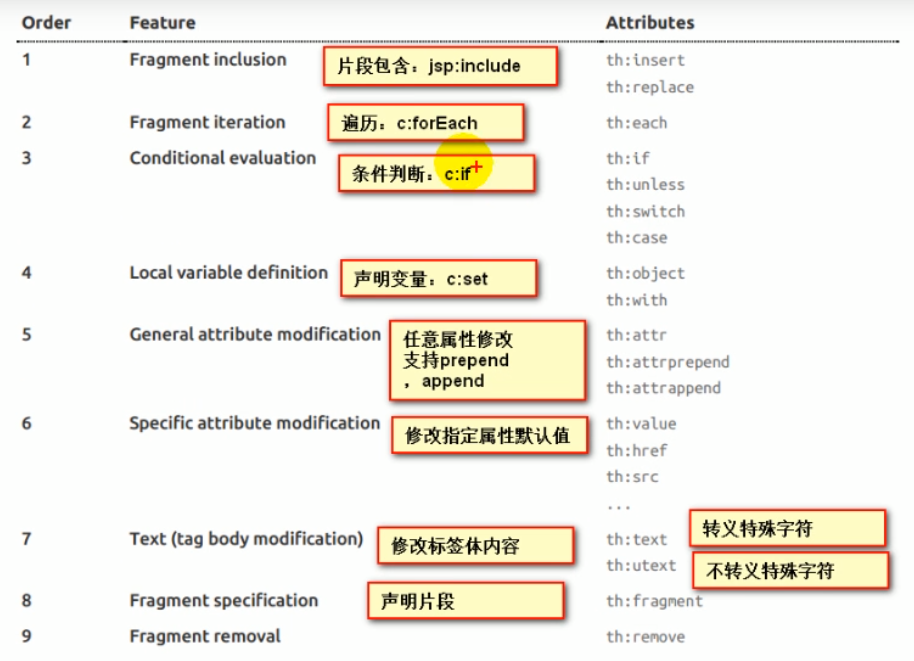
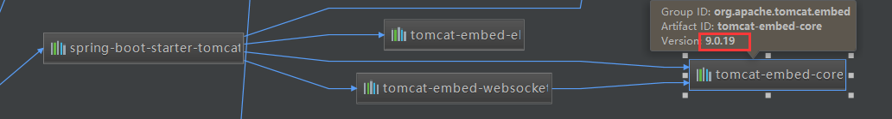
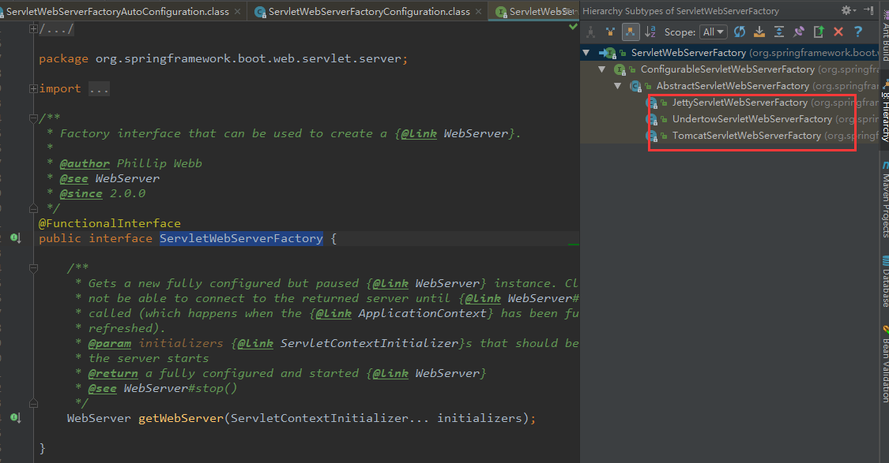
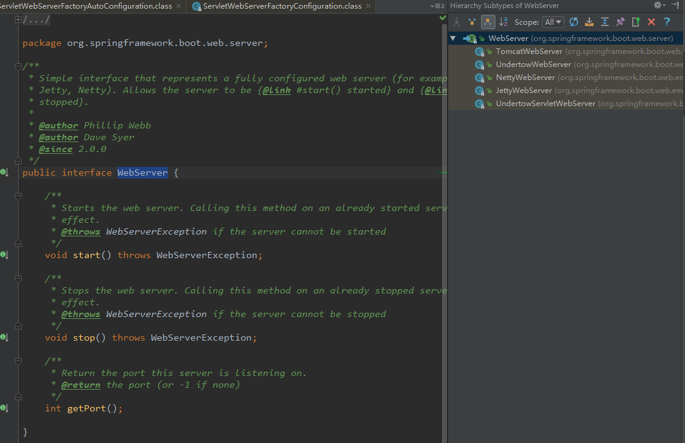
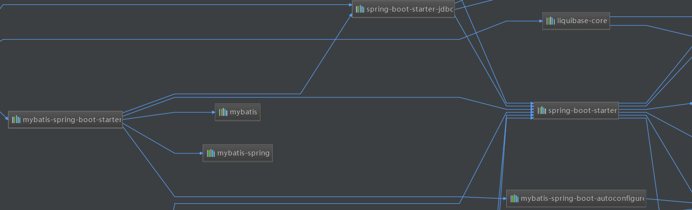

/2、

## 第一章  Spring  Boot入门

### 1.1 Spring  Boot简介

* **简化**Spring应用开发的一个框架，整个Spring技术栈的一个大整合，J2EE开发一站式解决方案

### 1.2  Hello  World程序

* 略

### 1.3  打包

* Spring Boot支持将应用达成一个可执行的jar包，在Pom文件导入springBoot的插件。然后在执行maven中的  

  package命令将应用程序打成一个jar包。再直接java -jar运行即可

  ```xml
  <build>
      <plugins>
          <plugin>
              <groupId>org.springframework.boot</groupId>
              <artifactId>spring-boot-maven-plugin</artifactId>
          </plugin>
      </plugins>
  </build>
  ```

### 1.4  POM文件

#### 1、父项目

* 父项目作为Spring Boot的版本仲裁中心：

  * 以后我们导入依赖默认是不需要写版本。没有在dependencies里面管理的依赖自然需要声明版本号

  ```xml
  <parent>
      <groupId>org.springframework.boot</groupId>
      <artifactId>spring-boot-starter-parent</artifactId>
      <version>2.1.0.RELEASE</version>
  </parent>
  
  <!--它的父项目是-->
  <parent>
      <groupId>org.springframework.boot</groupId>
      <artifactId>spring-boot-dependencies</artifactId>
      <version>2.1.0.RELEASE</version>
      <relativePath>../../spring-boot-dependencies</relativePath>
  </parent>
  
  <!--再点进spring-boot-dependencies，就可以看到依赖的版本号-->
  <properties>
          <activemq.version>5.15.7</activemq.version>
          <antlr2.version>2.7.7</antlr2.version>
          <appengine-sdk.version>1.9.67</appengine-sdk.version>
          <artemis.version>2.6.3</artemis.version>
          <aspectj.version>1.9.2</aspectj.version>
          <assertj.version>3.11.1</assertj.version>
          <atomikos.version>4.0.6</atomikos.version>
          <bitronix.version>2.1.4</bitronix.version>
          <build-helper-maven-plugin.version>3.0.0</build-helper-maven-plugin.version>
          <byte-buddy.version>1.9.3</byte-buddy.version>
          <caffeine.version>2.6.2</caffeine.version>
          <cassandra-driver.version>3.6.0</cassandra-driver.version>
          <classmate.version>1.4.0</classmate.version>
          <commons-codec.version>1.11</commons-codec.version>
          <commons-dbcp2.version>2.5.0</commons-dbcp2.version>
          <commons-lang3.version>3.8.1</commons-lang3.version>
          <commons-pool.version>1.6</commons-pool.version>
          <commons-pool2.version>2.6.0</commons-pool2.version>
          <couchbase-cache-client.version>2.1.0</couchbase-cache-client.version>
          <couchbase-client.version>2.7.0</couchbase-client.version>
          <derby.version>10.14.2.0</derby.version>
          <dom4j.version>1.6.1</dom4j.version>
      	......
  </properties>
  ```

#### 2、导入的依赖

* spring-boot-starter-web：可以分成两个部分来看

  * spring-boot-starter：spring-boot场景启动器
  * web：帮我们导入了web模块正常运行所依赖的组件

  ```xml
  <dependency>
      <groupId>org.springframework.boot</groupId>
      <artifactId>spring-boot-starter-web</artifactId>
  </dependency>
  ```

* spring boot将所有的功能场景都抽取出来，做成对应的starter（启动器），只需要在项目里面引入这些  

  starter相关场景的所有依赖都会被导入进来

### 1.5  主程序类、主入口类

```java
/**
 * @author xianCan
 * @date 2019/5/28 23:52
 */
@SpringBootApplication
@EnableBatchProcessing
public class HelloWorldMain {

    public static void main(String[] args) {
        SpringApplication.run(HelloWorldMain.class);
    }
}
```

* **@SpringBootApplication**：SpringBoot应用标注在某个类上说明这个类是SpringBoot的主配置类，  

  SpringBoot就运行这个类的main方法来启东SpringBoot应用

```java
@Target({ElementType.TYPE})
@Retention(RetentionPolicy.RUNTIME)
@Documented
@Inherited
@SpringBootConfiguration
@EnableAutoConfiguration
@ComponentScan(
    excludeFilters = {@Filter(
    type = FilterType.CUSTOM,
    classes = {TypeExcludeFilter.class}
), @Filter(
    type = FilterType.CUSTOM,
    classes = {AutoConfigurationExcludeFilter.class}
)}
)
public @interface SpringBootApplication {
    ......
}
```

* **@SpringBootConfiguration**：SpringBoot的配置类。标注在某个类上，表示这是一个SpringBoot的配置类
  * **@Configuration**：配置类上标注这个注解。配置类------就是以前的配置文件
    * **@Component**：配置类也是容器中的一个组件

* **@EnableAutoConfiguration**：开启自动配置功能。以前我们需要配置的恭喜，SpringBoot帮我们自动配  

  置。@EnableAutoConfiguration告诉SpringBoot开启自动配置功能

  ```java
  @Target({ElementType.TYPE})
  @Retention(RetentionPolicy.RUNTIME)
  @Documented
  @Inherited
  @AutoConfigurationPackage
  @Import({AutoConfigurationImportSelector.class})
  public @interface EnableAutoConfiguration {
      ......
  }
  ```

  * **@AutoConfigurationPackage**：自动配置包

    * **@Import({Registrar.class})**：Spring的底层注解，给容器中导入一个组件。导入的组件由  

      Registrar.class进行控制，点进Registrar类即可看到如下的方法

      ```java
      PackageImport(AnnotationMetadata metadata) {
      	//打断点进来看到 this.packageName = "com.xianCan"，即我们定义的groupId
          this.packageName = ClassUtils.getPackageName(metadata.getClassName());
      }
      ```

    * **作用**：将主配置类（@SpringBootConfiguration标注的类）的所在包及下面所有子包里面包含的所  

      有组件扫描到Spring容器中。**如果将类定义在主配置类的外面，启动SpringBoot是扫描不到的，因  **

      **此，要将类定义在主配置类里面。**

  * **@Import({AutoConfigurationImportSelector.class})**：给容器中导入组件

    * **AutoConfigurationImportSelector**：导入哪些组件的选择器。将所有需要导入的组件以全类名的  

      方式返回，这些组件就会被添加到容器中，会给容器中导入非常多的自动配置类xAutoConfiguration  

      。就是给容器中导入这个场景需要的所有组件，并配置好这些组件  

    

### 1.6  使用Spring Initializer快速创建Spring  Boot项目

* IDE都支持使用Spring的项目创建向导快速创建一个SpringBoot项目，选择我们需要的模块，向导会联网创建  

  SpringBoot项目

* 默认生成的SpringBoot项目

  * 主程序已经生成好了，我们只需要编写自己的逻辑

  * resources文件夹中目录结构

    * static：保存所有的静态资源：js、css、images

    * templates：保存所有的模板页面（SpringBoot默认jar包使用嵌入式的Tomcat，默认不支持JSP页面  

      ，可以使用模板引擎（freemarker、thymeleaf））

    * application.properties：SpringBoot的默认配置文件

## 第二章  Spring Boot配置

### 2.1  配置文件

* SpringBoot使用一个全局的配置文件，配置文件是固定的：
  * application.properties
  * application.yml

* YAML（YAML Ain't Markup Language）
  * YAML A Markup Language：是一个标记语言
  * YAML isn't Markup Language：不是一个标记语言

### 2.2  YAML语法

#### 2.2.1  基本语法

* k:(空格)v：表示一对键值对（空格必须有）
* 以空格的缩进来控制层级关系；只要左边对齐的一列数据，都是同一个层级

#### 2.2.2  值的写法

* 字面量：普通的值（数字，字符串，布尔）

  k: v：字面直接来写  

  字符串默认不用加上单引号或者双引号；

  ""：双引号，不会转移字符串里面的特殊字符，特殊字符会作为本身想表示的意思  

  * name: "zhangshan \n lisi"  输出：zhangsan 换行 lisi

  ''：单引号；会转义特殊字符，特殊字符最终只是一个普通的字符串数据

  * name: "zhangshan \n lisi"  输出：zhangsan \n lisi

#### 2.2.3  对象、Map

* k: v：再下一行写对象的属性和值得关系，注意缩进

  ```yaml
  #正常写法
  friends: 
  	lastName: zhangsan
  	age: 20
  	
  #行内写法
  friends: {lastName: zhangsan, age: 20}
  ```

#### 2.2.4  数组（List、Set）

* 用-值来表示组中的一个元素

  ```yaml
  pets: 
  	- cat
  	- dog
  	- pig
  	
  #行内写法
  pets: [cat, dog, pig]
  ```

### 2.3  自定义属性类

* @ConfigurationProperties：告诉SpringBoot将本类中的所有属性和配置文件中相关的配置进行绑定
  
  - prefix = “person”：配置文件中哪个下面的所有属性进行一一映射
  
* @Component：告诉SpringBoot将本组件交给Spring容器进行管理

  ```java
  @Component
  @ConfigurationProperties(prefix = "person")
  public class Person{
  	
      private String lastName;
      private Integer age;
      private Boolean boss;
      private Date birth;
      
      private Map<String, Object> maps;
      private List<Object> lists;
      
      getter and setter...
  }
  ```

### 2.4  @ConfigurationProperties和@Value注解比较

|                      | @ConfigurationProperties | @Value     |
| -------------------- | ------------------------ | ---------- |
| 功能                 | 批量注入配置文件中的属性 | 一个个指定 |
| 松散绑定（松散语法） | 支持                     | 不支持     |
| SpEL                 | 不支持                   | 支持       |
| JSR303数据校验       | 支持                     | 不支持     |
| 复杂类型封装         | 支持                     | 不支持     |

### 2.5  @PropertiesSource和@ImportResource

* **@PropertiesSource**：加载指定的配置文件

  ```java
  @Component
  @PropertiesSource(value = "person.properties")
  public class Person{
  	
      private String lastName;
      private Integer age;
      private Boolean boss;
      private Date birth;
      
      private Map<String, Object> maps;
      private List<Object> lists;
      
      getter and setter...
  }
  ```

* **@ImportResource**：导入Spring的配置文件，让配置文件里面的内容生效。（主要用于兼容以前的xml）

  ```java
  @SpringBootApplication
  //在启动类中加入如下的注解，指定xml的路径
  @ImportResource(locations = {"location:beanx.xml"})
  public class HelloWorldMain {
  
      public static void main(String[] args) {
          SpringApplication.run(HelloWorldMain.class);
      }
  }
  ```

* SpringBoot常用配置类来代替以前的配置文件

  ```java
  /**
   * @author xianCan
   * @date 2019/12/20 23:17
   */
  @Configuration //指明当前类是一个配置类，就是用来替代之前的Spring配置文件
  public class JobDemo {
  
      @Bean
      public Person person(){
          return new Person();
      }
  ```


### 2.6  配置文件占位符

#### 2.6.1  RandomValuePropertySource：配置文件中可以使用随机数

* ${random.value}
* ${random.init}
* ${random.long}
* ${random.int(10)}
* ${random.int[1024,65536]}

#### 2.6.2  属性配置占位符

- 可以在配置文件中引用前面配置过的属性（优先级前面配置过得这里都能用）

- ${app.name:默认值}来指定找不到属性时的默认值

  ```properties
  app.name=MyApp
  app.description=${app.name} is a Spring Boot application
  ```

### 2.7  Profile

#### 2.7.1  多Profile文件

* 我们在主配置文件编写的时候，文件名可以是application-{profile}.properties/yml
* 默认使用application.properties的配置

#### 2.7.2  yml支持多文档块方式

```yaml
server:
  port: 9090
spring:
  profiles: dev
---
server:
  port: 9091
spring:
  profiles: test
---
server:
  port: 9092
spring:
  profiles: prod
```

#### 2.7.3  激活指定profile

* 在配置文件中指定

  ```properties
  spring.profiles.active=dev
  ```

* 在命令行中指定

  ```shell
  java -jar xxx.jar --spring.profiles.active=dev
  ```

* 虚拟机参数

  ```shell
  -Dspring.profiles.active=dev
  ```

### 2.8  配置文件加载位置

#### 2.8.1  文件位置

* SpringBoot启动会扫描一下位置的application.properties或者application.yml文件作为springBoot的默认配  

  置文件  

  * file:./config/

  * file:./

  * **classpath**:/config/

  * classpath:/

  * 以上按照**优先级从高到低**的顺序，所有位置的文件都会被加载，高优先级配置内容会覆盖低优先级配置内  

    容

### 2.9  外部配置加载顺序

* **SpringBoot也可以从以下位置加载配置，优先级从高到低，高优先级的配置覆盖低优先级的配置，所有的配**  

  **置形成互补配置**

* 1、**命令行参数**
  
  * 多个配置用空格分开：--配置项=值
* 2、来自java:comp/env的JNDI属性
* 3、Java系统属性（System.properties()）
* 4、操作系统环境变量
* 5、RandomValuePropertySource配置的random.*属性值
* 6、**jar包外部的application-{profile}.properties或application.yml（带spring.profile）配置文件**
* 7、**jar包内部的application-{profile}.properties或application.yml（带spring.profile）配置文件**
* 8、**jar包外部的application.properties或application.yml（不带spring.profile）配置文件**
* 9、**jar包内部的application.properties或application.yml（不带spring.profile）配置文件**
* 10、@Configuration注解类商的@PropertySource
* 11、通过SpringApplication.setDefaultProperties指定的默认属性

### 2.10  自动配置原理

#### 2.10.1  自动配置原理

* 1、SpringBoot启动时加载主配置类，开启了自动配置功能**@EnableAutoConfiguration**

* 2、@EnableAutoConfiguration作用

  * 利用AutoConfigurationImportSelector给容器导入一些配置  

  * **将类路径下META-INF/spring.properties里面配置的所有EnableAutoConfiguration的值加入到了  **

    **容器中**

    ```java
    protected List<String> getCandidateConfigurations(AnnotationMetadata metadata, AnnotationAttributes attributes) {
        //扫描所有jar包类路径下 META-INF/spring.factories    
        List<String> configurations = SpringFactoriesLoader.loadFactoryNames(this.getSpringFactoriesLoaderFactoryClass(), this.getBeanClassLoader());
        Assert.notEmpty(configurations, "No auto configuration classes found in META-INF/spring.factories. If you are using a custom packaging, make sure that file is correct.");
        return configurations;
    }
    
    protected Class<?> getSpringFactoriesLoaderFactoryClass() {
        return EnableAutoConfiguration.class;
    }
    ```

    ```java
    public static List<String> loadFactoryNames(Class<?> factoryClass, @Nullable ClassLoader classLoader) {
        String factoryClassName = factoryClass.getName();
        return (List)loadSpringFactories(classLoader).getOrDefault(factoryClassName, Collections.emptyList());
    }
    
    private static Map<String, List<String>> loadSpringFactories(@Nullable ClassLoader classLoader) {
        MultiValueMap<String, String> result = (MultiValueMap)cache.get(classLoader);
        if (result != null) {
            return result;
        } else {
            try {
                //扫描所有jar包类路径下 META-INF/spring.factories  
                Enumeration<URL> urls = classLoader != null ? classLoader.getResources("META-INF/spring.factories") : ClassLoader.getSystemResources("META-INF/spring.factories");
                LinkedMultiValueMap result = new LinkedMultiValueMap();
    
                while(urls.hasMoreElements()) {
                    URL url = (URL)urls.nextElement();
                    UrlResource resource = new UrlResource(url);
                    //把扫描到的这些文件的内容包装成properties对象
                    Properties properties = PropertiesLoaderUtils.loadProperties(resource);
                    Iterator var6 = properties.entrySet().iterator();
    				//从properties中获取到EnableAutoConfiguration.class类（类名）对应的值，然后把他们添加到容器中
                    while(var6.hasNext()) {
                        Entry<?, ?> entry = (Entry)var6.next();
                        String factoryClassName = ((String)entry.getKey()).trim();
                        String[] var9 = StringUtils.commaDelimitedListToStringArray((String)entry.getValue());
                        int var10 = var9.length;
    
                        for(int var11 = 0; var11 < var10; ++var11) {
                            String factoryName = var9[var11];
                            result.add(factoryClassName, factoryName.trim());
                        }
                    }
                }
    
                cache.put(classLoader, result);
                return result;
            } catch (IOException var13) {
                throw new IllegalArgumentException("Unable to load factories from location [META-INF/spring.factories]", var13);
            }
        }
    }
    
    ```

  * 可以查看META-INF/spring.factories下的内容，每一个这样的xxxAutoConfiguration类都是容器中的一个  

    组件，都加入到容器中；用他们来做配置。每一个自动配置类进行自动配置功能

#### 2.10.2  以HttpEncodingAutoConfiguration为例解释自动配置

```java
@Configuration	//表示这是一个配置类，和以前编写的配置文件一样，也可以给容器中添加组件
@EnableConfigurationProperties({HttpProperties.class}) //启动指定类的ConfigurationProperties功能，将配置文件中对应的值和HttpProperties绑定起来；并把HttpProperties加入到ioc容器中

@ConditionalOnWebApplication(
    type = Type.SERVLET  //Spring底层@Conditional注解，根据不同的条件，如果满足指定的条件，整个配置类里面的配置就会生效。判断当前应用是否是web应用，如果是的话就生效
)
@ConditionalOnClass({CharacterEncodingFilter.class}) //判断当前项目有没有这个类
@ConditionalOnProperty(
    prefix = "spring.http.encoding",  //判断配置文件中是否存在某个配置 
    value = {"enabled"},		//spring.http.encoding.enabled是否存在，存在则读取值
    matchIfMissing = true		//如果不存在，默认enabled的值为true
)
public class HttpEncodingAutoConfiguration {
    
    private final Encoding properties;
    
    //只有一个有参构造器。properties来源于上面的注解：			      @EnableConfigurationProperties({HttpProperties.class})
    public HttpEncodingAutoConfiguration(HttpProperties properties) {
        this.properties = properties.getEncoding();
    }
    
    @Bean  //给容器中添加一个组件，这个组件的某些值需要从properties中获取
    @ConditionalOnMissingBean
    public CharacterEncodingFilter characterEncodingFilter() {
        CharacterEncodingFilter filter = new OrderedCharacterEncodingFilter();
        filter.setEncoding(this.properties.getCharset().name());
   filter.setForceRequestEncoding(this.properties.shouldForce(org.springframework.boot.autoconfigure.http.HttpProperties.Encoding.Type.REQUEST));
        filter.setForceResponseEncoding(this.properties.shouldForce(org.springframework.boot.autoconfigure.http.HttpProperties.Encoding.Type.RESPONSE));
        return filter;
    }
}
```

* 所有在配置文件中能配置的属性都是在xxxProperties类中封装着。配置文件能配置什么就可以参照某个功能  

  对应的这个属性类

  ```java
  @ConfigurationProperties(
      prefix = "spring.http"  //从配置文件中获取指定的值和bean的属性进行绑定
  )
  public class HttpProperties {
      ...
  }
  ```

* 根据当前不同的条件判断，决定这个配置类是否生效

  * 一旦这个配置类生效，这个配置类就会给容器中添加各种组件。这些组件的属性是从对应的properties类  

    中获取的，这些类里面的每一个属性又是和配置文件绑定的

### 2.11  SpringBoot的精髓：配置

* **SpringBoot启动会加载大量的自动配置类**

* **看我们需要的功能有没有SpringBoot默认写好的自动配置类***

* **再来看这个自动配置类中到底配置了哪些组件（有我们要用的组件，我们就不需要再来配置）**

* **给容器中自动配置类添加组件的时候，会从properties类中获取某些属性。我们就可以在配置文件中指定这  **

  **些属性的值**

* **xxxAutoConfiguration：自动配置类给容器中添加组件**

* **xxxProperties：封装配置文件中相关属性**

### 2.12  细节

#### 2.12.1  @Conditional

* @Conditional是Spring注解版的原生注解，SpringBoot对此派生了很多注解
* 作用：必须是@Conditional指定的条件成立，才给容器中个添加组件，配置里的所有内容才生效

| @Conditional扩展注解            | 作用（判断是否满足当前指定条件）                 |
| ------------------------------- | ------------------------------------------------ |
| @ConditionalOnJava              | 系统的java版本是否符合要求                       |
| @ConditionalOnBean              | 容器中存在指定Bean                               |
| @ConditionalOnMissingBean       | 容器中不存在指定Bean                             |
| @ConditionalOnExpression        | 满足SpEL表达式指定                               |
| @ConditionalOnClass             | 系统中有指定的类                                 |
| @ConditionalOnMissingClass      | 系统中没有指定的类                               |
| @ConditionalOnSingleCandidate   | 容器中只有一个指定的Bean，或者这个Bean是首选Bean |
| @ConditionalOnProperty          | 系统中指定的属性是否有指定的值                   |
| @ConditionalOnResource          | 类路径下是否存在指定资源文件                     |
| @ConditionalOnWebApplication    | 当前是web环境                                    |
| @ConditionalOnNotWebApplication | 当前不是web环境                                  |
| @ConditionalOnJndi              | JNDI存在指定项                                   |

#### 2.12.2  自动配置报告

* 自动配置类必须在一定条件下才能生效，我们可以通过启动SpringBoot的debug模式获得自动配置报告

  ```yaml
  debug: true
  ```

  ```java
  ============================
  CONDITIONS EVALUATION REPORT
  ============================
  
  
  Positive matches:（自动配置类启用）
  -----------------
  
     BatchAutoConfiguration matched:
        - @ConditionalOnClass found required classes 'org.springframework.batch.core.launch.JobLauncher', 'javax.sql.DataSource', 'org.springframework.jdbc.core.JdbcOperations' (OnClassCondition)
        - @ConditionalOnBean (types: org.springframework.batch.core.launch.JobLauncher; SearchStrategy: all) found bean 'jobLauncher' (OnBeanCondition)
  
     BatchAutoConfiguration#batchDataSourceInitializer matched:
        - @ConditionalOnBean (types: javax.sql.DataSource; SearchStrategy: all) found bean 'dataSource'; @ConditionalOnMissingBean (types: org.springframework.boot.autoconfigure.batch.BatchDataSourceInitializer; SearchStrategy: all) did not find any beans (OnBeanCondition)
     ......
            
  Negative matches:（没有启动，没有匹配成功的）
  -----------------
  
     ActiveMQAutoConfiguration:
        Did not match:
           - @ConditionalOnClass did not find required class 'javax.jms.ConnectionFactory' (OnClassCondition)
  
     AopAutoConfiguration:
        Did not match:
           - @ConditionalOnClass did not find required class 'org.aspectj.lang.annotation.Aspect' (OnClassCondition)
     ......
  ```


## 第三章  日志

### 3.1  日志分类

| 日志的抽象层                                                 | 日志的实现                                           |
| ------------------------------------------------------------ | ---------------------------------------------------- |
| ~~JCL（Jakarta Commons Logging）~~、**SLF4J**（Simple Logging Facade forJava）、~~Jboss-logging~~ | Log4j、JUL（java.util.logging）、Log4j2、**Logback** |

### 3.2  SLF4J使用

* 日志记录方法的调用：不应该来直接调用日志的实现类，而是调用日志抽象层里面的方法

  ```java
  import org.slf4j.Logger;
  import org.slf4j.LoggerFactory;
  
  public class HelloWorld{
      public static void main(String[] args){
          private Logger logger = LoggerFactory.getLogger(HelloWorld.class);
          logger.info("hello world");
      } 
  }
  ```

### 3.3  SpringBoot日志关系

* 可以再IDEA的pom.xml文件中右键Diagrams选中Show dependencies看到整个项目的依赖关系


* 总结
  * 1、SPringBoot底层也是使用slf4j+logback的方式进行日志记录
  * 2、SpringBoot也把其他的日志都替换成slf4j
  * 3、中间有一些替换包

### 3.4  日志使用

#### 3.4.1  日志的级别（由低到高）

* trace < debug < info < warn < error

#### 3.4.2  调整输出的日志级别

* SpringBoot默认只输出info及以上级别的日志

* 可以在配置文件中进行配置

  ```yaml
  logging:
    level: trace
  ```


#### 3.4.3  指定日志输出文件

* **不指定路径在当前项目下生成springboot.log日志，指定路径就在路径下生成**

  ```yaml
  logging:
  	file: springboot.log  #G:/springboot.log
  ```

* **在指定目录下生成spring.log默认日志文件**

  ```yaml
  logging:
  	path: /usr/log
  ```

* **在控制台输出的日志的格式**

  ```yaml
  logging:
  	pattern:
  		console: ...
  ```

* **指定文件中日志输出的格式**

  ```yaml
  logging:
  	pattern:
  		file: ...
  ```

### 3.5  自定义日志配置文件

* 在resources路径下放上每个日志框架自己的配置即可，默认名称：**logback-spring.xml**或  

  **logback.xml**

* logback.xml：直接就被日志框架识别了

* logback-spring.xml：日志框架就不直接加载日志的配置项，由SpringBoot解析日志配置，可以使用高级功  

  能区分开发和生产环境的日志

  ```xml
  <springProfile name="dev">
  	<!--可以让本段内容只在开发环境中生效-->
  </springProfile>
  ```


## 第四章  Web开发

### 4.1  使用SpringBoot

* 1、创建SpringBoot应用，选中我们需要的模块

* 2、SPringBoot已经默认将这些场景配置好了，只需要在配置文件中指定少量配置就可以运行起来

* 3、自己编写业务代码

* 4、自动配置原理

  * 这个场景SpringBoot帮我们配置了什么？能不能修改？能修改那些配置？能不能扩展？等

    ```
    XXXAutoConfiguration：帮我们给容器中自动配置组件
    xxxProperties：配置类来封装配置文件的内容
    ```

### 4.2  静态资源

* 可以使用jar包引入的方式引入静态资源，所有/webjars/**，都去classpath:/META-INF/resources/webjars/  

  找资源

  ```xml
  <dependency>
  	<groupId>org.webjars</groupId>
      <artifactId>jquery</artifactId>
      <version>3.3.1</version>
  </dependency>
  ```

* "/**"访问当前项目的任何资源。

  /*：是指所有文件夹，不包含子文件夹

  /**：所有文件夹及里面的子文件夹

  ```
  classpath:/META-INF/resources/
  classpath:/resources/
  classpath:/static/
  classpath:/public/
  "/":当前项目的根路径
  ```

* 欢迎页（首页）：静态资源文件夹下的所有index.html页面，被"/**"映射

  localhost:8080/    找到index页面

* 所有的 **/favicon.ico都是在静态资源文件下找

### 4.3  模板引擎ThymeLeaf

#### 4.3.1  使用

* 我们只要把html文件放在classpath:/templates/，thymeleaf就会自动渲染

* 导入thymeleaf的名称空间

  ```html
  <html lang="en" xmlns:th="http://www.thymeleaf.org">
  ```

#### 4.3.2  语法规则

* 1、th:text，改变当前元素里面的文本内容

  th:任意html属性，来替换原生属性的值

  

* 2、表达式

  ```properties
  Simple expressions:
      Variable Expressions: ${...}
      	1）、获取对象的属性、调用方法
      	2）、使用内置的基本对象
      		#ctx: the context object.
              #vars: the context variables.
              #locale: the context locale.
              #httpServletRequest: (only in Web Contexts) the HttpServletRequest object.
              #httpSession: (only in Web Contexts) the HttpSession object.
           3）、内置一些工具对象
      Selection Variable Expressions: *{...}  选择表达式，和${}基本一致，配合th:object使用
      Message Expressions: #{...}  获取国际化内容
      Link URL Expressions: @{...}  定义URL
  Literals（字面量）
      Text literals: 'one text', 'Another one!',…
      Number literals: 0, 34, 3.0, 12.3,…
      Boolean literals: true, false
      Null literal: null
      Literal tokens: one, sometext, main,…
  Text operations:（文本操作）
      String concatenation: +
      Literal substitutions: |The name is ${name}|
  Arithmetic operations:（数学运算）
      Binary operators: +, -, *, /, %
      Minus sign (unary operator): -
  Boolean operations:（布尔运算）
      Binary operators: and, or
      Boolean negation (unary operator): !, not
  Comparisons and equality:（比较运算）
      Comparators: >, <, >=, <= (gt, lt, ge, le)
      Equality operators: ==, != (eq, ne)
  Conditional operators:（条件运算）
      If-then: (if) ? (then)
      If-then-else: (if) ? (then) : (else)
      Default: (value) ?: (defaultvalue)
  ```

### 4.4  SpringMVC自动配置原理

#### 4.4.1  SpringMVC auto-configuration

Spring Boot provides auto-configuration for Spring MVC that works well with most applications.

SpringBoot自动配置好了SpringMVC

The auto-configuration adds the following features on top of Spring’s defaults:

以下是SPringBoot对SpringMVC的默认：

- Inclusion of `ContentNegotiatingViewResolver` and `BeanNameViewResolver` beans.

  * **自动配置了ViewResolver（视图解析器，根据方法的返回值得到视图对象（View），视图对象决定如**  

    **何渲染（转发，重定向））**

  * **ContentNegotiatingViewResolver：组合所有的视图解析器**

  * **如何定制？我们可以自己给容器中添加一个视图解析器，加上@Bean注解后**  

    **ContentNegotiatingViewResolver会自动将其组合进来**

- Support for serving static resources, including support for WebJars (covered [later in this document](https://docs.spring.io/spring-boot/docs/2.1.13.RELEASE/reference/html/boot-features-developing-web-applications.html#boot-features-spring-mvc-static-content))).

  * **静态资源文件夹路径，webjars**

- Automatic registration of `Converter`, `GenericConverter`, and `Formatter` beans.

  * **Converter：转换器。public String hello(User user)：类型转换使用Converter**
  * **Formatter：格式化器。2017-12-17==Date**
  * **自己添加的格式化转换器，我们只需要放在容器中即可（@Bean、@Component）**

- Support for `HttpMessageConverters` (covered [later in this document](https://docs.spring.io/spring-boot/docs/2.1.13.RELEASE/reference/html/boot-features-developing-web-applications.html#boot-features-spring-mvc-message-converters)).

  * **HttpMessageConverters：SpringMVC用来转换Http请求和响应的。User---json**

  * **自己给容器中添加HttpMessageConverters，只需要将自己的组件注册到容器中（@Bean、  **

    **@Component）**

- Automatic registration of `MessageCodesResolver` (covered [later in this document](https://docs.spring.io/spring-boot/docs/2.1.13.RELEASE/reference/html/boot-features-developing-web-applications.html#boot-features-spring-message-codes)).

  * **定义错误代码生成规则**

- Static `index.html` support.

  * **静态首页访问**

- Custom `Favicon` support (covered [later in this document](https://docs.spring.io/spring-boot/docs/2.1.13.RELEASE/reference/html/boot-features-developing-web-applications.html#boot-features-spring-mvc-favicon)).

  * **favicon.ico图标**

- Automatic use of a `ConfigurableWebBindingInitializer` bean (covered [later in this document](https://docs.spring.io/spring-boot/docs/2.1.13.RELEASE/reference/html/boot-features-developing-web-applications.html#boot-features-spring-mvc-web-binding-initializer)).

  * **初始化绑定器WebDataBinder。请求数据===JavaBean**

  * **我们可以配置一个ConfigurableWebBindingInitializer来替换默认的，添加到容器中（@Bean、**  

    **@Component）**

**org.springframework.boot.autoconfigure.web：web的所有自动场景**

If you want to keep Spring Boot MVC features and you want to add additional [MVC configuration](https://docs.spring.io/spring/docs/5.1.14.RELEASE/spring-framework-reference/web.html#mvc) (interceptors, formatters, view controllers, and other features), you can add your own `@Configuration` class of type `WebMvcConfigurer` but **without** `@EnableWebMvc`. If you wish to provide custom instances of `RequestMappingHandlerMapping`, `RequestMappingHandlerAdapter`, or `ExceptionHandlerExceptionResolver`, you can declare a `WebMvcRegistrationsAdapter` instance to provide such components.

If you want to take complete control of Spring MVC, you can add your own `@Configuration` annotated with `@EnableWebMvc`.

#### 4.4.2  扩展SpringMVC

```java
/**
 * @author xianCan
 * @date 2020/4/6 22:39
 */
@Configuration
public class MyMvcConfig implements WebMvcConfigurer {

    @Override
    public void addViewControllers(ViewControllerRegistry registry) {
        //浏览器发送 /xianCan 来到 success
        registry.addViewController("/xianCan").setViewName("/success");
    }
}
```

原理：

* 1、WebMVCAutoConfiguration是SpringMVC的自动配置类

* 2、在做其他配置时会导入如下配置：

  ```java
  @Import({WebMvcAutoConfiguration.EnableWebMvcConfiguration.class})
  ```

  ```java
  @Configuration
  public static class EnableWebMvcConfiguration extends DelegatingWebMvcConfiguration {
      
      private final WebMvcConfigurerComposite configurers = new WebMvcConfigurerComposite();
      
      //父类DelegatingWebMvcConfiguration的方法，从容器中获取所有的WebMvcConfigurer
      @Autowired(required = false)
      public void setConfigurers(List<WebMvcConfigurer> configurers) {
          if (!CollectionUtils.isEmpty(configurers)) {
              this.configurers.addWebMvcConfigurers(configurers);
              
              //一个参考实现
              /*private final List<WebMvcConfigurer> delegates = new ArrayList();
      			WebMvcConfigurerComposite() {
      			}
      		public void addWebMvcConfigurers(List<WebMvcConfigurer> configurers) {
          		if (!CollectionUtils.isEmpty(configurers)) {
              	this.delegates.addAll(configurers);
          	}*/
          }
     }
  }
  ```

* 3、容器中所有的WebMvcConfigurer都会一起起作用

* 4、我们的哦诶之类也会被调用：

  * 效果：SpringMVC的自动配置和我们的扩展配置都会起作用

#### 4.4.3  全面接管SpringMVC

* SpringBoot对SpringMVC的自动配置不需要了，都是我们自己来配。只需要加一个@EnableWebMvc，加上  

  之后，所有关于mvc的自动配置将失效

  ```java
  /**
   * @author xianCan
   * @date 2020/4/6 22:39
   */
  @EnableWebMvc
  @Configuration
  public class MyMvcConfig implements WebMvcConfigurer {
  
      @Override
      public void addViewControllers(ViewControllerRegistry registry) {
          //浏览器发送 /xianCan 来到 success
          registry.addViewController("/xianCan").setViewName("/success");
      }
  }
  ```

* 原理：

  * 1、@EnableWebMvc注解

    ```java
    @Retention(RetentionPolicy.RUNTIME)
    @Target({ElementType.TYPE})
    @Documented
    @Import({DelegatingWebMvcConfiguration.class})  //核心
    public @interface EnableWebMvc {
    }
    ```

  * 2、点进来DelegatingWebMvcConfiguration类会看到

    ```java
    @Configuration
    public class DelegatingWebMvcConfiguration extends WebMvcConfigurationSupport{
        
    }
    ```

  * 3、再回头看下WebMvcAutoConfiguration类上面的注解

    ```java
    @Configuration
    @ConditionalOnWebApplication(
        type = Type.SERVLET
    )
    @ConditionalOnClass({Servlet.class, DispatcherServlet.class, WebMvcConfigurer.class})
    /*原因在于该注解判断容器中是否包含WebMvcConfigurationSupport对象，而开启了EnableWebMvc，就会自动帮我们导入DelegatingWebMvcConfiguration（继承了WebMvcConfigurationSupport）
    ，因此@ConditionalOnMissingBean会判断为false，不再自动注册WebMvcAutoConfiguration
    */
    @ConditionalOnMissingBean({WebMvcConfigurationSupport.class})
    @AutoConfigureOrder(-2147483638)
    @AutoConfigureAfter({DispatcherServletAutoConfiguration.class, TaskExecutionAutoConfiguration.class, ValidationAutoConfiguration.class})
    public class WebMvcAutoConfiguration {
        
    }
    ```

### 4.5  如何修改SpringBoot的默认配置

模式：

* 1、SpringBoot在自动配置很多组件的手，先看容器中有没有用户自己配置的（@Bean、@Component），

  根据@ConditionalOnxxx进行判断，  如果有就用用户配置的，如果没有，才自动配置。有些组件可以有多  

  个（ViewResolver）将用户配置的和自己默认的组合起来

* 2、在SpringBoot中工会有非常多的xxxConfigurer，帮助我们进行扩展配置

* 3、在SpringBoot中会有很多的xxxCustomizer帮助我们进行定制配置

### 4.6  错误处理机制

#### 4.6.1  SpringBoot默认的错误处理机制

默认效果：  

* 1、返回一个默认的错误页面，可以参照ErrorMVCAutoConfiguration，错误处理的自动配置

  给容器添加了以下组件

  * 1、DefaultErrorAttributes

  * 2、BasicErrorController

    ```java
    @Controller
    @RequestMapping({"${server.error.path:${error.path:/error}}"})
    public class BasicErrorController extends AbstractErrorController{
        
        @RequestMapping(produces = {"text/html"}) //产生html类型的数据
        public ModelAndView errorHtml(HttpServletRequest request, HttpServletResponse response) {
            HttpStatus status = this.getStatus(request);
            Map<String, Object> model = Collections.unmodifiableMap(this.getErrorAttributes(request, this.isIncludeStackTrace(request, MediaType.TEXT_HTML)));
            response.setStatus(status.value());
            ModelAndView modelAndView = this.resolveErrorView(request, response, status, model);
            return modelAndView != null ? modelAndView : new ModelAndView("error", model);
        }
    
        @RequestMapping //产生json数据
        public ResponseEntity<Map<String, Object>> error(HttpServletRequest request) {
            Map<String, Object> body = this.getErrorAttributes(request, this.isIncludeStackTrace(request, MediaType.ALL));
            HttpStatus status = this.getStatus(request);
            return new ResponseEntity(body, status);
        }
    }
    ```

  * 3、ErrorPageCustomizer

    ```java
    @Value("${error.path:/error}")
    private String path = "/error"; //系统出现错误以后来到error请求进行处理。（web.xml注册的错误页面）
    ```

  * 4、DefaultErrorViewResolver

    ```java
    public ModelAndView resolveErrorView(HttpServletRequest request, HttpStatus status, Map<String, Object> model) {
        ModelAndView modelAndView = this.resolve(String.valueOf(status.value()), model);
        if (modelAndView == null && SERIES_VIEWS.containsKey(status.series())) {
            modelAndView = this.resolve((String)SERIES_VIEWS.get(status.series()), model);
        }
    
        return modelAndView;
    }
    
    private ModelAndView resolve(String viewName, Map<String, Object> model) {
        //默认SpringBoot可以去找到一个页面，名字类似error/404
        String errorViewName = "error/" + viewName;
        //模板引擎可以解析这个页面地址就用模板引擎解析
        TemplateAvailabilityProvider provider = this.templateAvailabilityProviders.getProvider(errorViewName, this.applicationContext);
        //模板引擎可用的青桔昂系啊返回到errorViewName指定的视图地址
        return provider != null ? new ModelAndView(errorViewName, model) : 
        //模板引擎不可用，就在静态资源文件夹下找errorViewName对应的页面
        this.resolveResource(errorViewName, model);
    }
    ```

#### 4.6.2  自定义错误处理机制

* 1、定制错误页面

  一旦系统出现4xx或者5xx之类的错误，ErrorPageCustomizer就会生效（定制错误的相应规则），就会来到  

  /error请求，就会被BasicErrorController处理

  * 响应页面：去哪个页面是由DefaultErrorViewResolver处理

  * 定制错误响应：

    * 定制错误的页面

      * 有模板引擎的情况下：error/状态码。将错误页面命名为 错误状态吗.html 放在模板引擎文件夹  

        的error文件夹下，发生此状态码错误时就会来到对应的页面

      * 我们可以定义4xx.html和5xx.html来涵盖4xx和5xx的错误

      * 页面能获取的信息：timestamp：时间戳，status：状态码，error：错误提示，exception：异  

        常对象，message：异常信息，errors：JSR303数据校验的错误都在这里

* 2、定制错误的json数据

  ```java
  @ControllerAdvice
  public class MyExceptionHandler{
  
      @ResponseBody
      @ExceptionHandler(UserNotExistException.class)
      public Map<String, Object> handleException(Exception e, HttpServletRequest 
                                                request){
          Map<String, Object> map = new HashMap<>();
          map.put("code", "4xx");
          map.put("message", e.getMessage());
          request.put("ext", map);//扩展数据
          return map;
      }
  }
  ```

  * 将定制的数据携带出去

    出现错误以后，回来到/error请求，会被BasicErrorController处理，响应出去可以获取的数据是由  

    getErrorAttributes得到的（是AbstractErrorController（ErrorController）规定的方法）

    * 1、完全来编写一个ErrorController的实现类【或者是编写AbstractErrorController的子类】，放在  

      容器中

    * 2、页面上能用的数据，或者是json返回能用的数据都是通过errorAttributes.getErrorAttributes得到  

      ，容器中DefaultErrorAttributes.getErrorAttributes()，默认进行数据处理

  * 自定义ErrorAttributes，重写DefaultErrorAttributes的getErrorAttributes即可将自己的错误数据带到错  

    误页面

    ```java
    @Component
    public class MyErrorAttributes extends DefaultErrorAttributes {
    
        @Override
        public Map<String, Object> getErrorAttributes(WebRequest webRequest, boolean includeStackTrace) {
            Map<String, Object> errorAttributes = super.getErrorAttributes(webRequest, includeStackTrace);
            errorAttributes.put("myKey", "MyValue");//添加自己的数据
            Object myAttr = webRequest.getAttribute("myAttr", RequestAttributes.SCOPE_REQUEST);//从request域中获取自己定义的MyExceptionHandler的错误数据
            return errorAttributes;
        }
    }
    ```

## 第五章  配置Servlet容器

SpringBoot默认使用Tomcat作为嵌入式的Servlet容器



### 5.1 嵌入式容器的配置

* 1、如何定制和修改Servlet容器的相关配置

  * 修改和server有关的配置（ServerProperties里面的）

    ```yaml
    server:
      port: 9090
      
    #通用的Servlet容器设置
    server.xxx
    #Tomcat的设置
    server.tomcat.xxx
    ```

  * 编写一个WebServerFactoryCustomizer：嵌入式的Servlet容器定制器来修改Servlet容器的配置

    ```java
    @Configuration
    public class MyConfig{
        
        @Bean
        public WebServerFactoryCustomizer<ConfigurableWebServerFactory> webServerFactoryCustomizer(){
            return factory -> factory.setPort(8080);
        }
    }
    ```

### 5.2  注册三大组件：Servlet、Filter和Listener

#### 5.2.1  Servlet

* ServletRegistrationBean

  ```java
  @Bean
  public ServletRegistrationBean<MyServlet> myServlet(){
      return new ServletRegistrationBean<>(new MyServlet(), "/myServlet");
  }
  
  
  public class MyServlet extends HttpServlet {
  
      @Override
      protected void doGet(HttpServletRequest req, HttpServletResponse resp) throws ServletException, IOException {
          this.doPost(req, resp);
      }
  
      @Override
      protected void doPost(HttpServletRequest req, HttpServletResponse resp) throws ServletException, IOException {
          System.out.println("MyServlet");
          super.doPost(req, resp);
      }
  }
  ```

#### 5.2.2  Filter

* FilterRegistrationBean

  ```java
  @Bean
  public FilterRegistrationBean<MyFilter> myFilter(){
      FilterRegistrationBean<MyFilter> filter = new FilterRegistrationBean<>(new MyFilter());
      filter.setUrlPatterns(Collections.singleton("/myFilter"));
      return filter;
  }
  
  
  public class MyFilter implements Filter {
  
      @Override
      public void init(FilterConfig filterConfig) throws ServletException {
  
      }
  
      @Override
      public void doFilter(ServletRequest servletRequest, ServletResponse servletResponse, FilterChain filterChain) throws IOException, ServletException {
          System.out.println("myFilter");
          filterChain.doFilter(servletRequest, servletResponse);
      }
  
      @Override
      public void destroy() {
  
      }
  }
  ```

#### 5.2.3  Listener

* 也可以用@WebFilter注解来表明这是一个过滤器，@Order则用于先后顺序

* ServletFilterRegistrationBean

  ```java
  @Bean
  public ServletListenerRegistrationBean<MyListener> myListener(){
      return new ServletListenerRegistrationBean<>(new MyListener());
  }
  
  public class MyListener implements ServletContextListener {
  
      @Override
      public void contextInitialized(ServletContextEvent sce) {
          System.out.println("应用启动了！");
      }
  
      @Override
      public void contextDestroyed(ServletContextEvent sce) {
          System.out.println("应用销毁了！");
      }
  }
  ```

#### 5.2.4  自动注册前端控制器

* SpringBoot帮我们自动配置SpringMVC的时候，自动注册SpringMVC的前端控制器：DispatcherServlet

  ```java
  @Bean(name = {"dispatcherServletRegistration"})
  @ConditionalOnBean(value = {DispatcherServlet.class},name = {"dispatcherServlet"})
  public DispatcherServletRegistrationBean dispatcherServletRegistration(DispatcherServlet dispatcherServlet) {
      //默认拦截：/ 所有请求，包含静态资源，但是不拦截jsp。 /* 会拦截jsp
      //可以通过server.servletPath来修改SpringMVC前端控制器默认拦截的请求路径
      DispatcherServletRegistrationBean registration = new DispatcherServletRegistrationBean(dispatcherServlet, this.webMvcProperties.getServlet().getPath());
      
      registration.setName("dispatcherServlet");
    registration.setLoadOnStartup(this.webMvcProperties.getServlet().getLoadOnStartup());
      if (this.multipartConfig != null) {
          registration.setMultipartConfig(this.multipartConfig);
      }
  
      return registration;
  }
  ```


### 5.3  其它Servlet容器

* Jetty（长连接，可用于聊天等）

  ```xml
  <dependency>
      <groupId>org.springframework.boot</groupId>
      <artifactId>spring-boot-starter-web</artifactId>
      <exclusions>
      	<exclusion>
              <groupId>org.springframework.boot</groupId>
          	<artifactId>spring-boot-starter-tomcat</artifactId>
          </exclusion>
      </exclusions>
  </dependency>
  
  <!--引入其它的Servlet容器-->
  <dependency>
  	<groupId>org.springframework.boot</groupId>
      <artifactId>spring-boot-starter-jetty</artifactId>
  </dependency>
  ```

* Undertow（非jsp，高并发非阻塞容器）

  ```xml
  <dependency>
      <groupId>org.springframework.boot</groupId>
      <artifactId>spring-boot-starter-web</artifactId>
      <exclusions>
      	<exclusion>
              <groupId>org.springframework.boot</groupId>
          	<artifactId>spring-boot-starter-tomcat</artifactId>
          </exclusion>
      </exclusions>
  </dependency>
  
  <!--引入其它的Servlet容器-->
  <dependency>
  	<groupId>org.springframework.boot</groupId>
      <artifactId>spring-boot-starter-undertow</artifactId>
  </dependency>
  ```

### 5.4  嵌入式Servlet容器自动配置原理

* ServletWebServerFactoryAutoConfiguration

* ServletWebServerFactoryConfiguration

  ```java
  @Configuration
  //判断当前是否引入了Tomcat依赖
  @ConditionalOnClass({Servlet.class, Tomcat.class, UpgradeProtocol.class})
  //判断当前容器没有用户自己定义ServletWebServerFactory，嵌入式的Servlet容器工厂
  @ConditionalOnMissingBean(
      value = {ServletWebServerFactory.class},
      search = SearchStrategy.CURRENT
  )
  public static class EmbeddedTomcat {
      public EmbeddedTomcat() {
      }
  
      @Bean
      public TomcatServletWebServerFactory tomcatServletWebServerFactory() {
          return new TomcatServletWebServerFactory();
      }
  }
  ```

  * ServletWebServerFactory

    ```java
    @FunctionalInterface
    public interface ServletWebServerFactory {
    
    	//获取嵌入式的Servlet容器
    	WebServer getWebServer(ServletContextInitializer... initializers);
    
    }
    ```

    

  * WebServer

    ```java
    public interface WebServer {
    
    	void start() throws WebServerException;
    
    	void stop() throws WebServerException;
    
    	int getPort();
    }
    ```

    

* 以TomcatServletWebServerFactory为例讲述自动配置过程

  ```java
  @Override
  public WebServer getWebServer(ServletContextInitializer... initializers) {
      //创建Tomcat
      Tomcat tomcat = new Tomcat();
      //配置Tomcat的基本环节
      File baseDir = (this.baseDirectory != null) ? this.baseDirectory
          : createTempDir("tomcat");
      tomcat.setBaseDir(baseDir.getAbsolutePath());
      Connector connector = new Connector(this.protocol);
      tomcat.getService().addConnector(connector);
      customizeConnector(connector);
      tomcat.setConnector(connector);
      tomcat.getHost().setAutoDeploy(false);
      configureEngine(tomcat.getEngine());
      for (Connector additionalConnector : this.additionalTomcatConnectors) {
          tomcat.getService().addConnector(additionalConnector);
      }
      prepareContext(tomcat.getHost(), initializers);
      
      //将配置好的Tomcat传入进去，返回一个WebServer，并且启动Tomcat服务器
      return getTomcatWebServer(tomcat);
  }
  ```

  * 对嵌入式容器的配置修改方法

    * ServerProperties：配置文件
    * WebServerFactoryCustomizer：Web工厂定制器

  * 对于我们自定义的配置（如端口等），SpringBoot是如何帮我们配置的

    容器中导入了ServletWebServerFactoryAutoConfiguration.BeanPostProcessorsRegistrar对自定义配置  

    进行后置处理

    ```java
    @Override
    public Object postProcessBeforeInitialization(Object bean, String beanName)
        throws BeansException {
        if (bean instanceof WebServerFactory) {
            postProcessBeforeInitialization((WebServerFactory) bean);
        }
        return bean;
    }
    
    private void postProcessBeforeInitialization(WebServerFactory webServerFactory) {
        //获取所有的定制器，调用每一个定制器的customize方法来给Servlet容器进行属性赋值
    		LambdaSafe
    				.callbacks(WebServerFactoryCustomizer.class, getCustomizers(),
    						webServerFactory)
    				.withLogger(WebServerFactoryCustomizerBeanPostProcessor.class)
    				.invoke((customizer) -> customizer.customize(webServerFactory));
    	}
    
    private Collection<WebServerFactoryCustomizer<?>> getCustomizers() {
        if (this.customizers == null) {
            // Look up does not include the parent context
            this.customizers = new ArrayList<>(getWebServerFactoryCustomizerBeans());
            this.customizers.sort(AnnotationAwareOrderComparator.INSTANCE);
            this.customizers = Collections.unmodifiableList(this.customizers);
        }
        return this.customizers;
    }
    
    @SuppressWarnings({ "unchecked", "rawtypes" })
    private Collection<WebServerFactoryCustomizer<?>> getWebServerFactoryCustomizerBeans() {
        return (Collection) this.beanFactory
            //从容器中获取所有WebServerFactoryCustomizer类型的对象
            //因此我们可以定制WebServerFactoryCustomizer类型的组件，然后交给Spring管理，就可以定制化容器参数
            .getBeansOfType(WebServerFactoryCustomizer.class, false, false).values();
    }
    ```

  * 步骤：

    * 1、SpringBoot根据导入的依赖情况，给容器中添加响应的ServletWebServerFactory

    * 2、容器中某个组件要创建对象时就会触发后置处理器进行配置项的设置

      WebServerFactoryCustomizerBeanPostProcessor

    * 3、后置处理器：从容器中获取所有的WebServerFactoryCustomizer，调用customize方法进行配置  

      项定制

### 5.5  嵌入式Servlet容器启动原理

获取嵌入式的Servlet工厂流程：

* 1、SpringBoot应用启动运行run方法

* 2、refreshContext(context)；SpringBoot刷新IOC容器（创建IOC容器，并初始化容器，创建容器中的每一  

  个组件）；如果是Web应用创建AnnotationConfigEmbeddedWebApplicationContext，否则就创建  

  AnnotationConfigApplicationContext

* 3、refresh(context)，刷新刚刚创建好的IOC容器

  ```java
  public void refresh() throws BeansException, IllegalStateException {
      Object var1 = this.startupShutdownMonitor;
      synchronized(this.startupShutdownMonitor) {
          this.prepareRefresh();
          ConfigurableListableBeanFactory beanFactory = this.obtainFreshBeanFactory();
          this.prepareBeanFactory(beanFactory);
  
          try {
              this.postProcessBeanFactory(beanFactory);
              this.invokeBeanFactoryPostProcessors(beanFactory);
              this.registerBeanPostProcessors(beanFactory);
              this.initMessageSource();
              this.initApplicationEventMulticaster();
              //刷新容器，启动嵌入式Servlet容器
              this.onRefresh();
              this.registerListeners();
              //创建其他对象，如controller、service等
              this.finishBeanFactoryInitialization(beanFactory);
              this.finishRefresh();
          } catch (BeansException var9) {
              if (this.logger.isWarnEnabled()) {
                  this.logger.warn("Exception encountered during context initialization - cancelling refresh attempt: " + var9);
              }
  
              this.destroyBeans();
              this.cancelRefresh(var9);
              throw var9;
          } finally {
              this.resetCommonCaches();
          }
  
      }
  }
  ```

* 4、onRefresh()，web的IOC容器重写了onRefresh方法

  ```java
  @Override
  protected void onRefresh() {
      super.onRefresh();
      try {
          createWebServer();
      }
      catch (Throwable ex) {
          throw new ApplicationContextException("Unable to start web server", ex);
      }
  }
  ```

* 5、然后调用createWebServer()方法创建Servlet容器

  ```java
  private void createWebServer() {
      WebServer webServer = this.webServer;
      ServletContext servletContext = getServletContext();
      if (webServer == null && servletContext == null) {
          //获取对应的Factory，如上面提到的TomcatServletWebServerFactory
          ServletWebServerFactory factory = getWebServerFactory();
          //然后调用上面分析过的getWebServer方法创建并启动Servlet容器
          this.webServer = factory.getWebServer(getSelfInitializer());
      }
      else if (servletContext != null) {
          try {
              getSelfInitializer().onStartup(servletContext);
          }
          catch (ServletException ex) {
              throw new ApplicationContextException("Cannot initialize servlet context",
                                                    ex);
          }
      }
      initPropertySources();
  }
  
  protected ServletWebServerFactory getWebServerFactory() {
      // Use bean names so that we don't consider the hierarchy
      String[] beanNames = getBeanFactory()
          .getBeanNamesForType(ServletWebServerFactory.class);
      if (beanNames.length == 0) {
          throw new ApplicationContextException(
              "Unable to start ServletWebServerApplicationContext due to missing "
              + "ServletWebServerFactory bean.");
      }
      if (beanNames.length > 1) {
          throw new ApplicationContextException(
              "Unable to start ServletWebServerApplicationContext due to multiple "
              + "ServletWebServerFactory beans : "
              + StringUtils.arrayToCommaDelimitedString(beanNames));
      }
      return getBeanFactory().getBean(beanNames[0], ServletWebServerFactory.class);
  }
  ```

* 6、先启动嵌入式的Servlet容器，再将IOC容器中剩下没有创建出来的对象获取

### 5.6  使用外置的Servlet容器

步骤：

* 1、必须创建一个war项目

* 2、将嵌入式的Tomcat指定为provided（打包的时候不加入该jar包）

  ```xml
  <dependency>
  	<groupId>org.springframework.boot</groupId>
      <artifactId>spring-boot-starter-tomcat</artifactId>
      <scope>provided</scope>
  </dependency>
  ```

* 3、必须编写一个SpringBootServletInitializer的子类，并调用configure方法

  ```java
  public class ServletInitializer extends SpringBootServletInitializer{
      
      @Override
      protected SpringApplicationBuilder configure(SpringApplicationBuilder application){
          return application.sources(SpringBootApplication.class);
      }
  }
  ```

## 第六章  数据访问

### 6.1  数据源

* SpringBoot 2.x 默认使用HikariCp作为数据源

* 数据源的相关配置都在DataSourceProperties里面

* 自动配置原理：org.springframework.boot.autoconfigure.jdbc

  * 参考DataSourceConfiguration，根据配置创建数据源，默认使用HikariCp连接池，可以使用spring.  

    datasource.type指定自定义的数据源

  * SpringBoot默认支的数据源：Dbcp2、Hikari、Tomcat

  * 自定义数据源类型

    ```java
    @Configuration
    @ConditionalOnMissingBean({DataSource.class})
    @ConditionalOnProperty(name = {"spring.datasource.type"})
    static class Generic {
        Generic() {
        }
    
        @Bean
        public DataSource dataSource(DataSourceProperties properties) {
            return properties.initializeDataSourceBuilder().build();
        }
    }
    ```

  * DataSourceInitializer：ApplicationListener

    作用：

    * 1、runSchemaScripts()：运行建表语句
    * 2、runDataScripts()：运行插入数据的sql语句

### 6.2  整合Druid数据源

* 引入依赖

  ```xml
  <dependency>
      <groupId>com.alibaba</groupId>
      <artifactId>druid</artifactId>
      <version>1.1.10</version>
  </dependency>
  ```

* 加入配置项

  ```yaml
  spring:
    datasource:
  #   数据源基本配置
      username: root
      password: root
      driver-class-name: com.mysql.cj.jdbc.Driver
      url: jdbc:mysql://localhost:3306/mybatis?serverTimezone=GMT%2B8
      type: com.alibaba.druid.pool.DruidDataSource
  #   数据源其他配置
      initialSize: 5
      minIdle: 5
      maxActive: 20
      maxWait: 60000
      timeBetweenEvictionRunsMillis: 60000
      minEvictableIdleTimeMillis: 300000
      validationQuery: SELECT 1 FROM DUAL
      testWhileIdle: true
      testOnBorrow: false
      testOnReturn: false
      poolPreparedStatements: true
  #   配置监控统计拦截的filters，去掉后监控界面sql无法统计，'wall'用于防火墙
      filters: stat,wall,log4j
      maxPoolPreparedStatementPerConnectionSize: 20
      useGlobalDataSourceStat: true
      connectionProperties: druid.stat.mergeSql=true;druid.stat.slowSqlMillis=500
  ```

* 配置类

  ```java
  @Configuration
  public class DruidConfig {
      @ConfigurationProperties(prefix = "spring.datasource")
      @Bean
      public DataSource druid(){
          return  new DruidDataSource();
      }
  
      //配置Druid的监控
      //1、配置一个管理后台的Servlet
      @Bean
      public ServletRegistrationBean<StatViewServlet> statViewServlet(){
          ServletRegistrationBean<StatViewServlet> bean =
                  new ServletRegistrationBean<>(new StatViewServlet(), "/druid/*");
          Map<String,String> initParams = new HashMap<>();
  
          initParams.put("loginUsername","admin");
          initParams.put("loginPassword","123456");
          initParams.put("allow","");//默认就是允许所有访问
          initParams.put("deny","192.168.15.21");
  
          bean.setInitParameters(initParams);
          return bean;
      }
  
      //2、配置一个web监控的filter
      @Bean
      public FilterRegistrationBean<WebStatFilter> webStatFilter(){
          FilterRegistrationBean<WebStatFilter> bean = new FilterRegistrationBean<>();
          bean.setFilter(new WebStatFilter());
  
          Map<String,String> initParams = new HashMap<>();
          initParams.put("exclusions","*.js,*.css,/druid/*");
  
          bean.setInitParameters(initParams);
  
          bean.setUrlPatterns(Collections.singleton("/*"));
  
          return  bean;
      }
  }
  ```

### 6.3  整合Mybatis

* 引入依赖

  ```xml
  <dependency>
      <groupId>org.mybatis.spring.boot</groupId>
      <artifactId>mybatis-spring-boot-starter</artifactId>
      <version>2.0.1</version>
  </dependency>
  ```

  

* 注解方式...

* 配置文件方式

  ```yaml
  mybatis:
    # 指定全局配置文件位置
    config-location: classpath:mybatis/mybatis-config.xml
    # 指定sql映射文件位置
    mapper-locations: classpath:mybatis/mapper/*.xml
  ```

  mybatis-config.xml

  ```xml
  <?xml version="1.0" encoding="UTF-8" ?>
  <!DOCTYPE configuration
          PUBLIC "-//mybatis.org//DTD Config 3.0//EN"
          "http://mybatis.org/dtd/mybatis-3-config.dtd">
  <configuration>
      
      <settings>
          <setting name="mapUnderscoreToCamelCase" value="true" />
          <setting name="useActualParamName" value="false"/>
      </settings>
  
  </configuration>
  ```

  EmployeeMapper.xml...

### 6.4  Spring Data

* Spring Data项目的目的是为了简化构建基于Spring框架应用的数据访问技术，包括非关系数据库、Map-  

  Reduce框架、关系数据库和云数据服务等

* Spring  Data 包含多个子项目

  * Spring Data JPA
  * Spring Data KeyValue
  * Spring Data MongoDB
  * Spring Data Redis
  * Spring Data for Solr
  * Spring Data Elasticsearch
  * 等

## 第七章  Spring Boot启动配置原理

