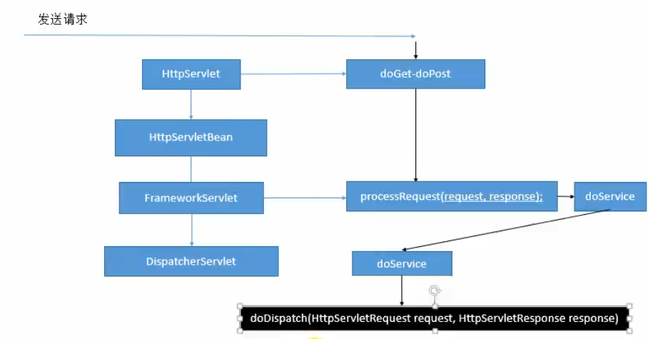

# SpringMVC学习笔记

## 第一章  请求与参数

### 1.1  @RequestMapping 请求映射

* @RequestMapping：用于建立请求URL和处理请求方法之间的对应关系

* 在控制器的**类定义**及**方法定义**处都可以标注

  * 类定义处：提供初步的请求映射信息。相当于WEB应用的根目录

  * 方法处：提供进一步的细分映射信息。相当于类定义出的URL。若类定义处未标注@RequestMapping，  

    则方发处标记的URL相对于WEB应用的根目录

  ```java
  @Target({ElementType.TYPE})
  @Retention(RetentionPolicy.RUNTIME)
  @Documented
  @Controller
  @ResponseBody
  public @interface RestController {
      @AliasFor(
          annotation = Controller.class
      )
      String value() default "";
  }
  ```

* @RequestMapping的其他属性

  * **value**：限定映射路径

  * **method**：限定请求方式：常用GET、POST

  * **params**：限定请求参数

    * param1：表示请求必须包含名为param1的请求参数

    * !param1：表示请求不能包含名为param1的请求参数

    * param1 != value1：表示请求包含名为param1的请求参数，但其值不能为value1

    * {"param1=value1", "param2"}：请求必须包含名为param1和param2的两个请求参数，且param1  

      参数的值必须为value1

      ```Java
      @RequestMapping(value = "/helloworld", params = {"!param1"})
      public String helloWorld(){
          return "";
      }
      ```

  * **heads**：限定请求头

  * **consumes**：只接受内容类型是哪种的请求，规定请求头中的Content-Type

  * **produces**：告诉浏览器返回的内容类型是什么，如响应头中加上Content-Type:text/html;charset=utf-8

* @RequestMapping支持Ant通配符映射

  * ?：问号匹配文件名中的一个字符
  * *：匹配文件名中的多个字符、或者匹配一层路径
  * **：匹配多层路径

### 1.2  获取Servlet原生API

* **直接在controller层的方法形参上加上下面的参数即可**

  * **HttpServletRequest**

  * **HttpServletResponse**

  * **HttpSession**

  * **java.security.Principal**：安全协议相关的

  * **Locale**：国际化有关的区域信息对象

  * **InpusStream**：httpServletRequest.getInputStream()

  * **OutputStream**：httpServletResponse.getOutputStream()

  * **Reader**：httpServletRequest.getReader()

  * **Writer**：httpServletResponse.getWriter()

    ```java
    @RequestMapping("/helloworld")
    public String getServletAPI(HttpServletRequest request, HttpServletResponse 	response){
        return "";
    }
    ```

### 1.3  绑定参数常用注解

* **@RequestParam**：将请求参数中的某个参数注入到指定属性中

  * value：请求参数中的名称

  * required：请求参数中是否必须提供此参数，默认true，不提供将报错

    ```java
    @RequestMapping("/hello")
    public String hello(@RequestParam(value="userName", required=false)String userName,
    @RequestParam("age")int age){
        System.out.println(userName + "---" + age)
    	return "";
    }
    ```

* **@PathVariable**：可以将URL中占位符参数绑定到控制器处理方法的入参中：URL中的{xxx}占位符可以通过  

  @PathVariable("xxx")绑定到操作方法的入参中

  ```java
  @RequestMapping(/delete/{id})
  public String delete(@PathVariable("id")Integer id){
      userService.delete(id);
      return "";
  }
  ```

* **@RequestBody**：用于获取请求体内容，直接使用得到的是k-v&k-v...结构的数据，不能用于get方法

  * required：是否必须有请求体，默认值true

    ```java
    @RequestMapping("/helloworld")
    public String helloWorld(@RequestBody Employee employee){
        System.out.println(employee);
        return "";
    }
    ```

* **@RequestHeader**：获取请求头中某个key的值，如果请求头中没有这个值就报错

  ```java
  @RequestMapping("/hello2")
  public String hello(@RequestHeader(value="Accept-Language")String language){
      System.out.println(language)
  	return "";
  }
  ```

* **@CookieValue**：获得Cookie的值

  ```java
  @RequestMapping("/hello3")
  public String hello(@CookieValue("JSESSIONID")String jsessionId){
      System.out.println(jsessionId)
  	return "";
  }
  ```


### 1.4  乱码解决方法

* **请求乱码**

  * **GET请求**：修改tomcat的server.xml，在8080端口处加入  URIEncoding=UTF-8

  * **POST请求**：原理是设置过滤器解决

    * **xml配置文件方式**

      ```xml
      <filter>
          <filter-name>CharacterEncodingFilter</filter-name>
          <filter-class>org.springframework.web.filter.CharacterEncodingFilter
          </filter-class>
          <init-param>
          	<param-name>encoding</param-name>
              <param-value>UTF-8</param-value>
          </init-param>
          <init-param>
              <param-name>forceRequestEncoding</param-name>
              <param-value>true</param-value>
          </init-param>
          <init-param>
              <param-name>forceResponseEncoding</param-name>
              <param-value>true</param-value>
          </init-param>
      </filter>
      <filter-mapping>
      	<filter-name>CharacterEncodingFilter</filter-name>
          <url-pattern>/*</url-pattern>
      </filter-mapping>
      ```

    * **springboot配置文件方式**

      ```properties
      spring.http.encoding.force=true
      spring.http.encoding.charset=UTF-8
      spring.http.encoding.enabled=true
      server.tomcat.uri-encoding=UTF-8
      ```

* **响应乱码**

  ```java
  response.setContentType("text/html;charset=utf-8");
  ```

### 1.5  REST风格

* **REST**：即Representaional  State  Transfer。（资源）表现层状态转化，目前最流行的一种互联网软件架  

  构。它结构清晰、符合标准、易于理解、扩展方便。

* **资源**（Resources）：网络上的一个实体，或者说是网络上的一个具体信息。它可以使一段文本、一张图片、  

  一首歌曲、一种服务，总之就是一个具体的存在。可以用一个URI（统一资源定位符）指向它，每种资源对应  

  一个特定的URI。要获取这个资源，访问它的URI就可以，因此URO即为每一个资源的独一无二的标识符

* **表现层**（Representation）：把资源具体呈现出来的形式，叫做它的表现层。比如，文本可以使用txt格式表  

  现，也可以用HTML格式、XML格式、JSON格式，甚至可以采用二进制格式

* **状态转化**（State Transfer）：每发出一个请求，就代表了客户端和服务器的一次交互过程。HTTP协议，是  

  一个无状态协议，即所有的状态都保存在服务器端。因此，如果客户端想要操作服务器，必须通过某种手段，  

  让服务器端发生“状态转化”。而这种转化是建立在表现层之上的，所以就是“表现层状态转化”。具体说，就是  

  HTTP协议里面，4个代表操作方式的动词：GET、POST、PUT、DELETE。他们分别对应四种基本操作

## 第二章  数据输出

### 2.1 传入Map、Model、ModelMap

* **传入Map**：对应的值只存在request域中

  ```java
  @RequestMapping("/helloworld")
  public String helloworld(Map<String, Object> map){
      map.put("msg", "你好");
      return "success";
  }
  ```

* **传入Model**：对应的值只存在request域中

  ```java
  @RequestMapping("/helloworld")
  public String helloworld(Model model){
      model.addAttribute("msg", "你好坏");
      return "success";
  }
  ```

* **传入ModelMap**：对应的值只存在request域中

  ```java
  @RequestMapping("/helloworld")
  public String helloworld(ModelMap modelMap){
      modelMap.addAttribute("msg", "你好棒");
      return "success";
  }
  ```

* **三者关系**：无论是Map、Model还是ModelMap，最终都是BindingAwareModelMap在工作，相当于给  

  BindingAwareModelMap中保存的东西都会被保存在请求域中

  ​					Map(interface(jdk))											Model(interface(spring))

  ​								||														            //							

  ​								||																 //

  ​							     \/															   //	

  ​						ModelMap(class)										  //

  ​									\\\\													   //

  ​										\\\\												//	

  ​													ExtendedModelMap

  ​																	||

  ​																	 \/

  ​													BindingAwareModelMap

### 2.2 返回值是ModelAndView

* 既包含视图信息（页面地址）也包含模型数据（页面数据），数据也放在请求域中

  ```java
  @RequestMapping("/helloworld")
  public ModelAndView helloWorld(){
      ModelAndView mv = new ModelAndView();
      Employee employee = new Employee(1, "xianCan", 1, "xianCan@qq.com", 1);
      mv.addObject("employee", employee);
      mv.setViewName("success");
      return mv;
  }
  ```

### 2.3 将数据存到Session中

* **@SessionAttributes**：若希望在多个请求之间共用某个模型属性数据，将模型中的某个属性暂存  

  到HttpSession中，一边多个请求之间可以共享这个属性

  ```java
  @RestController
  //这个注解只能放在类上面，可通过指定属性名放到会话中的属性外，也可以通过指定对象类型
  @SessionAttributes(value = {"employee"}, types = {String.class})
  public class SpringMVCTest {
  
      @RequestMapping("/helloworld")
      public String helloWorld(Map<String, Object> map){
          Employee employee = new Employee(1, "xianCan", 1, "xianCan@qq.com", 1);
          map.put("employee", employee);
          map.put("name", "caizw");
          return "";
      }
  }
  ```

### 2.4 @ModelAttribute

* **@ModelAttribute**：方法入参标注该注解后，入参的对象就会放到数据模型中，有点像拦截器。如果某  

  个方法被@ModelAttribute注解修饰了，会先执行被@ModelAttribute注解修饰的方法，再执行被  

  @RequestMapping注解修饰的方法，而且@ModelAttribute注解修饰的方法的参数值可以传递到  

  @RequestMapping注解修饰的方法

  ```java
  @RestController
  public class SpringMVCTest {
  
      @ModelAttribute
      public void getModelAttribute(@RequestParam(value = "id", required = false)Integer id, Map<String, Object> map){
          //模拟从数据库拿数据
          Employee employee = new Employee(1, "xianCan", 1, "xianCan@qq.com", 1);
          map.put("employee", employee);
  
      }
  
      @RequestMapping("/helloworld")
      //上述方法的employee可以传递到本方法的employee形参
      public String helloWorld(Employee employee){
          System.out.println(employee);
          return "";
      }
  }
  ```

### 2.5  返回值是字符串

* 返回字符串可以指定逻辑视图名，通过视图解析器解析为物理视图地址

  ```java
  //指定逻辑视图名，经过视图解析器解析为jsp，物理路径为resources下的success.jsp
  @RequestMapping("/helloworld")
  public String helloWorld(Model model){
      System.out.println(model);
      return "success";
  }
  ```

### 2.6  返回值为void

* 一般需要自己跳转页面

  ```java
  @RequestMapping("/helloworld")
  public void helloWorld(HttpServletRequest request, HttpServletResponse response) throws ServletException, IOException {
      //跳转
      request.getRequestDispatcher("/success.jsp").forward(request, response);
      //重定向
      response.sendRedirect("/success.jsp");
  }
  ```

### 2.7  使用forward和redirect进行页面跳转

* 使用关键字的方法进行转发

  ```java
  @RequestMapping("/helloworld")
  public String helloWorld(){
      //请求的转发
      return "forward:/success.jsp";
  }
  ```

* 使用关键字的方法进行重定向

  ```java
  @RequestMapping("/helloworld")
  public String helloWorld(){
      //重定向
      return "redirect:/success.jsp";
  }
  ```

### 2.8  @ResponseBody响应json数据

* 加入@ResponseBody或者@RestController注解后，会自动把返回值转为json字符串，并且不再使用视图解  

  析器，单纯的返回数据

### 2.9  SpringMVC实现文件上传

* **文件上传的必要前提**

  * form表单的enctype取值必须是**multipart/form-data**，enctype是表单请求时正文的类型，enctype的  

    默认值是**application/x-www-form-urlencoded**

  * method属性取值必须是POST

  * 提供一个文件选择域<input type="file" />

* **文件上传的原理分析**

  * 当form表单的enctype不是默认值后，request.getParameter()将失效，enctype的取值是默认值时，表  

    单的正文内容是：key=value&key=value&key=value...

  * 当form表单的enctype取值是Multipart/form-data时，请求正文内容将变成每一部分都是MIME类型描述  

    的正文

    --------------------------------------------------------7de1a433602ac				分隔符

    Content-Disposition:form-data;name="userName"						协议头

    aaa																											协议的正文

    --------------------------------------------------------7de1a433602ac

    Content-Disposition:form-data;name=file;filename="C:\a.txt"

    Content-Type:text/plain																		协议的类型（MIME类型）

    bbbbbbbbbbbbbbbbbbbbbbbbb

    --------------------------------------------------------7de1a433602ac--

* **引入第三方组件实现文件上传**

  ```xml
  <dependency>
      <groupId>commons-fileupload</groupId>
      <artifactId>commons-fileupload</artifactId>
      <version>1.3.1</version>
  </dependency>
  <dependency>
      <groupId>commons-io</groupId>
      <artifactId>commons-io</artifactId>
      <version>2.4</version>
  </dependency>
  ```

* **SpringMVC上传文件**

  * SpringMVC框架提供了MultipartFile对象，该对象表示上传的文件，要求变量名称必须和表单file标签  

     的name属性名称相同

    ```java
    @RequestMapping("/upload")
    public String upload(@RequestParam("file") MultipartFile file){
        //获取原始文件名
        String fileName = file.getOriginalFilename();
        //获取文件后缀
        String suffixName = fileName.substring(fileName.lastIndexOf("."));
        //文件保存路径
        String filePath = "H:/upload/";
        //文件重命名，防止重复
        fileName = filePath + UUID.randomUUID() + fileName;
        //文件对象
        File dest = new File(fileName);
        //判断路径是否存在，如果不存在则创建
        if (!dest.getParentFile().exists()){
            dest.getParentFile().mkdirs();
        }
    	file.transferTo(dest);
        return "fail";
    }
    ```

## 第三章  DispatcherServlet结构与源码分析

### 3.1  DispatcherServlet结构分析



### 3.2  请求处理的大致流程

* 所有请求过来DispatcherServlet收到请求
* 调用doDispatch()方法进行处理
  * **getHandler()**：根据当前请求地址找到能处理这个请求的目标处理器类（处理器）
    * **根据当前请求在HandlerMapping中找到这个请求的映射信息，获取目标处理器类**
  * **getHandlerAdapter()**：根据当前处理器类获取到能执行这个处理器方法的适配器（适配器）
    * **根据当前处理器类，找到当前类的HandlerAdapter（适配器）**
  * 使用刚才获取到的适配器（AnnotationMethodHandlerAdapter）执行目标方法
  * 目标方法执行后会返回一个ModelAndView对象
  * 根据ModelAndView的信息转发到具体的页面，并可以再请求域中取出ModelAndView中的模型数据

```java
protected void doDispatch(HttpServletRequest request, HttpServletResponse response) throws Exception {
        HttpServletRequest processedRequest = request;
        HandlerExecutionChain mappedHandler = null;
        boolean multipartRequestParsed = false;
        WebAsyncManager asyncManager = WebAsyncUtils.getAsyncManager(request);

        try {
            try {
                ModelAndView mv = null;
                Object dispatchException = null;

                try {
                    //1.检查是否文件上传请求
                    processedRequest = this.checkMultipart(request);
                    multipartRequestParsed = processedRequest != request;
                    //2.根据当前的请求地址找到哪个controller类来处理请求
                    mappedHandler = this.getHandler(processedRequest);
                    //3.如果没有找到对应的controller，则抛出404异常
                    if (mappedHandler == null) {
                        this.noHandlerFound(processedRequest, response);
                        return;
                    }
					//4.拿到能执行这个类的所有方法的适配器（反射工具）
                    HandlerAdapter ha = this.getHandlerAdapter(mappedHandler.getHandler());
                    String method = request.getMethod();
                    boolean isGet = "GET".equals(method);
                    if (isGet || "HEAD".equals(method)) {
                        long lastModified = ha.getLastModified(request, mappedHandler.getHandler());
                        if ((new ServletWebRequest(request, response)).checkNotModified(lastModified) && isGet) {
                            return;
                        }
                    }

                    if (!mappedHandler.applyPreHandle(processedRequest, response)) {
                        return;
                    }
                    //控制器（Controller），处理器（Handler）
					//5.适配器来执行目标方法，将目标方法执行完成后的返回值作为视图名，设置保存到
                    //ModelAndView中
                    //目标方法的返回值无论是什么，最终适配器执行完成后都会将结果封装到ModelAndView
                    mv = ha.handle(processedRequest, response, mappedHandler.getHandler());
                    if (asyncManager.isConcurrentHandlingStarted()) {
                        return;
                    }

                    this.applyDefaultViewName(processedRequest, mv);
                    mappedHandler.applyPostHandle(processedRequest, response, mv);
                } catch (Exception var20) {
                    dispatchException = var20;
                } catch (Throwable var21) {
                    dispatchException = new NestedServletException("Handler dispatch failed", var21);
                }
				//6.根据方法最终执行完成后封装的ModelAndView，转发到对应页面，并把ModelAndView中的数据可以从请求域中获取
                this.processDispatchResult(processedRequest, response, mappedHandler, mv, (Exception)dispatchException);
            } catch (Exception var22) {
                this.triggerAfterCompletion(processedRequest, response, mappedHandler, var22);
            } catch (Throwable var23) {
                this.triggerAfterCompletion(processedRequest, response, mappedHandler, new NestedServletException("Handler processing failed", var23));
            }

        } finally {
            if (asyncManager.isConcurrentHandlingStarted()) {
                if (mappedHandler != null) {
                    mappedHandler.applyAfterConcurrentHandlingStarted(processedRequest, response);
                }
            } else if (multipartRequestParsed) {
                this.cleanupMultipart(processedRequest);
            }

        }
    }
```

### 3.3  getHandler()获取对应的处理器

* getHandler()会返回目标处理器的执行链

* handlerMap：ioc容器启动创建Controller对象的时候扫描每个处理器都能处理什么请求，保存在  

  HandlerMapping的handlerMap属性中，下一次请求过来，就来看哪个HandlerMapping中有这个请求映射  

  信息就行了

  ```java
  mappedHandler = this.getHandler(processedRequest);
  
  @Nullable
  protected HandlerExecutionChain getHandler(HttpServletRequest request) throws Exception {
      if (this.handlerMappings != null) {
          Iterator var2 = this.handlerMappings.iterator();
  
          while(var2.hasNext()) {
              HandlerMapping mapping = (HandlerMapping)var2.next();
              HandlerExecutionChain handler = mapping.getHandler(request);
              if (handler != null) {
                  return handler;
              }
          }
      }
  
      return null;
  }
  ```

### 3.4  getHandlerAdapter()获取对应的适配器

* 最终会返回一个RequestMappingHandlerAdapter

  ```java
  protected HandlerAdapter getHandlerAdapter(Object handler) throws ServletException {
      if (this.handlerAdapters != null) {
          Iterator var2 = this.handlerAdapters.iterator();
  
          while(var2.hasNext()) {
              HandlerAdapter adapter = (HandlerAdapter)var2.next();
              if (adapter.supports(handler)) {
                  return adapter;
              }
          }
      }
  
      throw new ServletException("No adapter for handler [" + handler + "]: The DispatcherServlet configuration needs to include a HandlerAdapter that supports this handler");
  }
  ```

### 3.5  SpringMVC的九大组件

```java
/*文件上传解析器*/
private MultipartResolver multipartResolver;

/*区域信息解析器，和国际化有关*/
private LocaleResolver localeResolver;

/*主题解析器，强大的主题效果更换，少人用*/
private ThemeResolver themeResolver;

/*Handler映射信息*/
private List<HandlerMapping> handlerMappings;

/*Handler的适配器*/
private List<HandlerAdapter> handlerAdapters;

/*SpringMVC强大的异常解析功能：异常解析器*/
private List<HandlerExceptionResolver> handlerExceptionResolvers;

/*视图转换器*/
private RequestToViewNameTranslator viewNameTranslator;

/*SpringMVC中运行重定向携带数据的功能*/
private FlashMapManager flashMapManager;

/*视图解析器*/
private List<ViewResolver> viewResolvers;
```

### 3.6  九大组件初始化

* **在DispatcherServlet类中的onRefresh()方法中进行初始化**

  ```java
  protected void onRefresh(ApplicationContext context) {
      this.initStrategies(context);
  }
  
  protected void initStrategies(ApplicationContext context) {
      this.initMultipartResolver(context);
      this.initLocaleResolver(context);
      this.initThemeResolver(context);
      this.initHandlerMappings(context);
      this.initHandlerAdapters(context);
      this.initHandlerExceptionResolvers(context);
      this.initRequestToViewNameTranslator(context);
      this.initViewResolvers(context);
      this.initFlashMapManager(context);
  }
  ```

* **组件的初始化**

  * 有些组件在容器中是使用类型找的，有些组件是使用id找的
  * 去容器中找到这个组件，如果没有找到就是用默认的配置

* **以initHandlerMappings为例**

  ```java
  private void initHandlerMappings(ApplicationContext context) {
      this.handlerMappings = null;
      if (this.detectAllHandlerMappings) {
          Map<String, HandlerMapping> matchingBeans = BeanFactoryUtils.beansOfTypeIncludingAncestors(context, HandlerMapping.class, true, false);
          if (!matchingBeans.isEmpty()) {
              this.handlerMappings = new ArrayList(matchingBeans.values());
              AnnotationAwareOrderComparator.sort(this.handlerMappings);
          }
      } else {
          try {
              //根据id获取对应的组件
              HandlerMapping hm = (HandlerMapping)context.getBean("handlerMapping", HandlerMapping.class);
              this.handlerMappings = Collections.singletonList(hm);
          } catch (NoSuchBeanDefinitionException var3) {
              ;
          }
      }
  
      if (this.handlerMappings == null) {
          //如果获取不到，则使用默认的策略
          this.handlerMappings = this.getDefaultStrategies(context, HandlerMapping.class);
          if (this.logger.isTraceEnabled()) {
              this.logger.trace("No HandlerMappings declared for servlet '" + this.getServletName() + "': using default strategies from DispatcherServlet.properties");
          }
      }
  }
  ```

## 第四章  常用注解对比

|                     注解                     |                             备注                             |
| :------------------------------------------: | :----------------------------------------------------------: |
|                   @Service                   |                           bean注册                           |
|                  @Component                  |                           bean注册                           |
| @Autowired、@Resource、@Autowired+@Qualifier | @Resource=@Autowired+@Qualifier。如果接口实现只有一个，那么用@Autowired就可以了，也不需要指定名字。如果接口有多个实现，那么用@Resource并指定name（建议）。或者使用@Autowired+@Qualifier的value值 |
|             @Configuration+@Bean             |                           ben注册                            |
|                   @Values                    |                      从配置文件中取参数                      |

